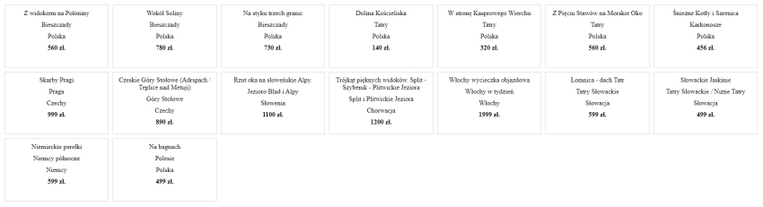

# Materials about markup and scripting languages
# Table of contents
1. [Markup and scripting languages](#introduction)
2. [HTML](#paragraph1)
3. [CSS](#paragraph2)
4. [Javascript](#paragraph3)
5. [Markdown and Github](#paragraph4)
5. [XML and JSON](#paragraph5)
6. [React](#paragraph6)
7. [Laboratories](#labs)

## I. Markup and scripting languages <a id="introduction"></a>
  - What is a [markup language](https://www.semrush.com/blog/markup-language/)?
  - What is a [scripting language](https://www.techtarget.com/whatis/definition/scripting-language)? 
  - [Client-side vs server-side](https://codeinstitute.net/global/blog/client-side-vs-server-side/) development,  
  - [Client-server](https://developer.mozilla.org/en-US/docs/Learn_web_development/Extensions/Server-side/First_steps/Client-Server_overview) overview on MDN,  
  - Useful [links](https://zacniewski.github.io/old/useful-links/). 

## II. HTML <a id="paragraph1"></a>
  - HTML on the [MDN](https://developer.mozilla.org/en-US/docs/Web/HTML),  
  - HTML on the [W3Schools](https://www.w3schools.com/html/default.asp),
  - HTML tutorial on [Ryan's tutorials](https://ryanstutorials.net/html-tutorial/),
  - HTML and [math symbols](https://www.toptal.com/designers/htmlarrows/math/) from Toptal.  

## III. CSS <a id="paragraph2"></a>
  - CSS on the [W3Schools](https://www.w3schools.com/css/default.asp),  
  - CSS on the [MDN](https://developer.mozilla.org/en-US/docs/Web/CSS).
  - CSS tutorial on [Ryan's tutorials](https://ryanstutorials.net/css-tutorial/),  
  - CSS [selectors](https://www.w3schools.com/cssref/css_selectors.php) on W3Schools.  

## IV. Javascript <a id="paragraph3"></a>
  - Javascript on the [W3Schools](https://www.w3schools.com/js/default.asp),  
  - Javascript and [HTML DOM](https://www.w3schools.com/jsref/default.asp),  
  - Kurs [Javascript](https://kursjs.pl/) po polsku, 
  - Sprawdzenie możliwości [użycia](https://caniuse.com/) wybranych właściwości CSS i metod JS w przeglądarkach.  

## V. Markdown and Github <a id="paragraph4"></a>
  - Markdown w [pigułce](https://www.markdownguide.org/basic-syntax/),  
  - Początki z [GitHub'em](https://www.flynerd.pl/2018/02/github-dla-zielonych-pierwsze-repozytorium.html),  
  - Github [Pages](https://pages.github.com/),  
  - Książka [GitHub Pro](https://git-scm.com/book/pl/v2) po polsku,  
  - Podstawy [Markdown](https://docs.github.com/en/get-started/writing-on-github/getting-started-with-writing-and-formatting-on-github/basic-writing-and-formatting-syntax) na Githubie.  

## VI. XML, YAML and JSON <a id="paragraph5"></a>
  - XML on the [W3Schools](https://www.w3schools.com/xml/default.asp),  
  - XML [tutorial](https://www.guru99.com/xml-tutorials.html).
  - Oficjalna strona [JSON](https://www.json.org/json-pl.html),    
  - Working with [JSON](https://developer.mozilla.org/en-US/docs/Learn_web_development/Core/Scripting/JSON) on the MDN,  
  - Pobieranie danych za pomocą metody [fetch()](https://www.w3schools.com/jsref/api_fetch.asp).  
  - Kilka słów o [XML](https://www.samouczekprogramisty.pl/xml-dla-poczatkujacych/),  
  - YAML [tutorial](https://spacelift.io/blog/yaml),  
  - Jeszcze jeden [YAML](https://www.cloudbees.com/blog/yaml-tutorial-everything-you-need-get-started) tutorial,  
  - I jeszcze jeden [YAML tutorial](https://spacelift.io/blog/yaml),  
  - Formaty danch dla [programistów](https://mmazurek.dev/formaty-danych-ktore-powinien-znac-kazdy-programista/).  

## VII. React <a id="paragraph6"></a>
  - Quick [start](https://react.dev/learn) with React,  
  - Kurs [React](https://www.youtube.com/playlist?list=PL4cUxeGkcC9gZD-Tvwfod2gaISzfRiP9d) na YouTube.  

<hr><a id="labs"></a>

## Lab. nr 1 - "Podstawy WWW"
  - cel: stworzyć prostą stronę WWW, nie wymagającą użycia serwera webowego,
  - strona powinna zawierać linki do trzech podstron, które należy utworzyć: 
    - strona z listem (odpowiednio sformatowany tekst, przypominający list),
    - strona z podręcznika technicznego, np. do informatyki (rysunki, tabele, wzory itp.),
    - strona z formularzem (inputy, pola tekstowe, checkboxy itp.), bez walidacji wartości pól,  
  - na stronie startowej należy umieścić informację o autorze oraz opcjonalnie np. logo, informacje o użytych technologiach itp.,
  - do ww. zadania należy użyć HTML, CSS i ewentualnie JS, bez użycia dodatkowych bibliotek i frameworków,  
  - można wykorzystać informacje z <a href="https://ryanstutorials.net/html-tutorial/" target="_blank">kursu o HTML</a> i z <a href="https://ryanstutorials.net/css-tutorial/" target="_blank">kursu o CSS</a>,
  - co do JS, to można wykorzystać materiały z <a href="https://kursjs.pl/" target="_blank">kursu JS</a>,
  - należy utworzyć plik <a href="https://www.markdownguide.org/basic-syntax/" target="_blank">README.md</a>, który będzie zawierał opis zadania (można będzie go użyć w repozytorium w razie potrzeby),  
  - zrzut każdej z czterech utworzonych stron należy umieścić w pliku `README.md` jako obrazek i krótko opisać; jak to zrobić opisane jest w ww. linku o Markdown w sekcji 'Images',  
> Przewidywany czas: 4 x 2 godz. laboratoryjne.

## Lab. nr 2 - "Praca z Javascript, wykorzystanie modelu DOM"
  - zadanie polega na wykorzystaniu języka JavaScript do wyświetlania, modyfikowania, tworzenia (itp.) elementów strony związanych z HTML i CSS, 
  - należy użyć wybrany (dowolny) framework front-endowy do tego zadania, jeden z najpopularniejszych to <a href="https://getbootstrap.com/docs/5.0/getting-started/introduction/" target="_blank">Bootstrap </a>,
  - można wykorzystać darmowy szablon, np. <a href="https://startbootstrap.com/template/bare/" target="_blank">Bare</a>, bazujący na Bootstrapie,  
  - należy zapoznać się z modelem DOM: <a href="https://kursjs.pl/kurs/dom/dom.php" target="_blank">tutaj</a> lub <a href="https://www.w3schools.com/whatis/whatis_htmldom.asp" target="_blank">tutaj</a>,
  - przydatna może być <a href="https://www.w3schools.com/jsref/default.asp" target="_blank">strona </a>o Javascript + DOM,
  - np. korzystając z ww. szablonu Bootstrap, można dodać przycisk z klasą <code>badge-light</code> do strony (np. pod nagłówkiem 'Hello world'):  
```html
      <button type="button" class="btn btn-primary">
    Notifications <span class="badge badge-light"></span>
      </button>
```
  Poniżej, np. przed końcem sekcji <code>body</code> wrzucamy skrypt, który szuka elementu z klasą <code>badge-light</code> i ustawia jego wartość (innerHTML) na liczbę 6:
```javascript
      <script>
          let x = document.getElementsByClassName("badge-light");
          x[0].innerHTML = 6; // x[0] to pierwszy znaleziony element
      </script>
```      
  - w podobny sposób należy wykorzystać inne dostępne metody i właściwości Java Script do modyfikacji elementów strony,
  -  wskazane użycie 20 różnych metod i właściwości Java Script do ww. modyfikacji, np.:  
```
  document.body.style.backgroundColor = "red"; // właściwość 'backgroundColor'
```
lub  
```
      var node = document.createElement("LI");                 // Create a <li> node
      var textnode = document.createTextNode("Water");         // Create a text node
      node.appendChild(textnode);                              // Append the text to <li>;
      document.getElementById("myList").appendChild(node);     // Append <li>; to <ul> with id="myList"
  ```
  - w powyższym przykładzie użyte zostały trzy metody, ale całość traktujemy jako jeden przypadek z 20 wymaganych,
> Przewidywany czas: 3 x 2 godz. laboratoryjne.  

## Lab. nr 3 - "Obsługa zdarzeń za pomocą Javascript"

- za pomocą metody [addEventListener](https://www.w3schools.com/js/js_htmldom_eventlistener.asp) należy obsłużyć 10 różnych wybranych zdarzeń,
- lista zdarzeń HTML DOM do użycia <a href="https://www.w3schools.com/jsref/dom_obj_event.asp" target="_blank">tutaj</a>,
- przykłady Keyboard Event na stronie <a href="https://kursjs.pl/kurs/events/events-keys" target="_blank">naszego kursu JS</a>,
- kody dla <a href="http://keycode.info/" target="_blank">klawiszy</a>,
- trochę przykładów: <a href="https://github.com/zacniewski/materials-about-internet-apps-and-www-websites/blob/main/zastosowania-java-script/scripts/3-event-handling.js" target="_blank">plik JS z teorią i kodem</a> oraz odpowiadający mu <a href="https://github.com/zacniewski/materials-about-internet-apps-and-www-websites/blob/main/zastosowania-java-script/event-handling.html" target="_blank">plik HTML</a>,
- plusy za zróżnicowanie elementów za pomocą których realizowana będzie obsługa zdarzeń (elementy HTML, obiekt 'document', obiekt 'window') oraz za użycie metody removeEventListener().
> Przewidywany czas: 3 x 2 godz. laboratoryjne.  

## Lab. nr 4 - "Praca z danymi w formacie JSON"
  
  - korzystamy z pliku `lab4/assets/wycieczki.js`, zawierającego dane w formacie JSON,  
  - wyświetl w konsoli przeglądarki:  
    - całą tablicę `wycieczki`, 
    - poszczególne jej elementy, korzystając z pętli `for/in`,  
    - nazwy wszystkich wycieczek, korzystając z dowolnej wersji pętli for.  
  - w kodzie HTML umieść diva z `id="oferty"`:  
    - napisz funkcję `wyswietlOferte`, która jako argument otrzymuje pojedynczy obiekt (ofertę wycieczki) i zwraca kod HTML,  
    - zwrócony kod HTML wyświetla: div-a z klasą "oferta" o wymiarach 250px x 150px (lub innych pasujących użytkownikowi) oraz informacje o wycieczce: nazwę, kraj, rejon, cenę (patrz rysunek poniżej):  
      
  - wyświetl wycieczki, które odbywają się w Polsce za pomocą funkcji `wyswietlOfertePolska`. Skorzystaj z przygotowanej wcześniej funkcji `wyswietlOferte` i nieco ją zmodyfikuj,  
  - z pliku `wycieczki.js` usuń wycieczkę z ido = 5 i zapisz dane jako nowy plik `wycieczki-2.js`. Wyświetl wycieczki. Skorzystaj z przygotowanej funkcji `wyswietlOferte`,  
  - do tablicy `wycieczki` (z pliku `wycieczki-2.js`) dodaj nową ofertę o następujących parametrach:  
  ```javascript
  const nowaWycieczka = {
       "ido":"20",
       "potwierdzenie":"1",
       "kraj":"Polska",
       "rejon":"Wybrzeże",
       "nazwa":"Gdańsk i ptasie zakątki",
       "cena":"499"
  } 
  ```
   - wyświetl wycieczki. Skorzystaj z przygotowanej funkcji `wyswietlOferte`,  
   - do każdej oferty (każdego obiektu) dodaj nowy klucz o nazwie `rok` i wartości 2025. Wyświetl w konsoli przeglądarki zbiór po modyfikacji. 
> Przewidywany czas: 2 x 2 godz. laboratoryjne.  

## Lab. nr 5 - "XML i inne formaty wymiany danych"  
  - sami tworzymy dane w formacie JSON,  mogą to być informacje dotyczące np. samochodu:  
    - rocznik, 
    - marka, 
    - model, 
    - przebieg, 
    - strona producenta,
    - moc,
    - itp. itd.

  - w naszych danych startowych możemy stosować tablice, zagnieżdżenia itp.

  - ręcznie lub za pomocą kodu (Python) z folderu `Data-formats-exercises` zamieniamy dane w formacie JSON na dane w następujących formatach:  
    - XML,  
    - YAML,
    - INI.  

  - dla każdej transformacji formatu tworzymy plik z odpowiednim rozszerzeniem, np. `car.xml` dla zamiany JSON -> XML,  
  - wyświetlamy dane na stronie HTML (za pomocą znacznika `<pre>`) lub w konsoli przeglądarki,  
  - umieszczamy dane dla wszystkich czterech formatów (JSON, XML, YAML i INI) w dokumentacji laboratorium nr 5,  
  - aby wyświetlić dane w formacie XML wewnątrz pliku HTML, należy wewnątrz znacznika `<pre>` zastąpić każdy znak `<` znakiem specjalnym `&lt;` oraz każdy znak `>` znakiem specjalnym `&gt;`:  
    ```
    <pre>
       &lt;?xml version="1.0" ?&gt;
        &lt;blog&gt;
            &lt;blog_url type="str"&gt;https://mmazurek.dev&lt;/blog_url&gt;
            &lt;blog_rate type="int"&gt;10&lt;/blog_rate&gt;
            &lt;blog_max_rate type="int"&gt;10&lt;/blog_max_rate&gt;
            &lt;blog_keywords type="list"&gt;
                &lt;item type="str"&gt;programowanie&lt;/item&gt;
                &lt;item type="str"&gt;python&lt;/item&gt;
                &lt;item type="str"&gt;proces&lt;/item&gt;
                &lt;item type="str"&gt;tworzenia&lt;/item&gt;
                &lt;item type="str"&gt;programowania&lt;/item&gt;
            &lt;/blog_keywords&gt;
        &lt;/blog&gt;
    </pre>
    ```
  - aby uruchomić skrypty Pythona z folderu `Data-formats-exercises` należy zainstalować dwa dodatkowe pakiety:  

```bash
pip install dicttoxml pyyaml
```
> Przewidywany czas: 3 x 2 godz. laboratoryjne.  

