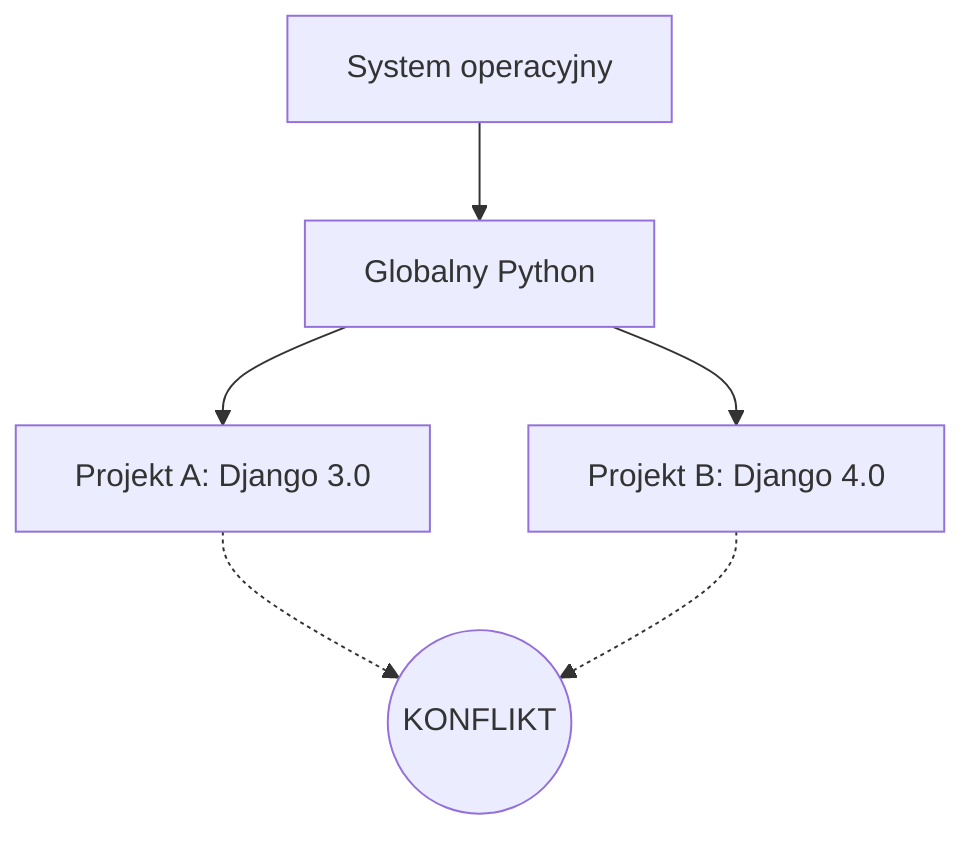
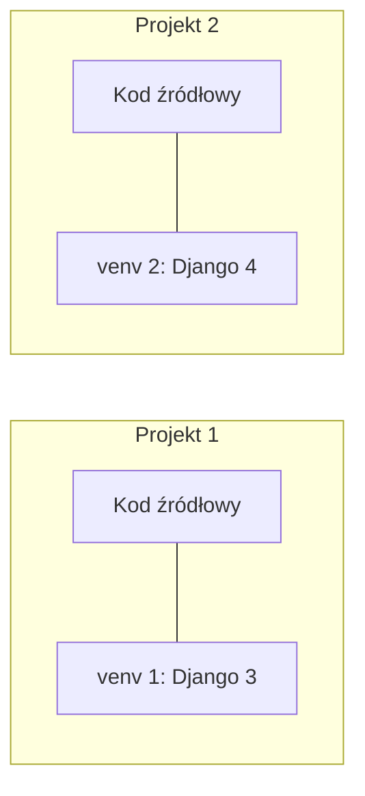

# Laboratorium 1: Środowisko pracy i podstawy Pythona

## 1. Wirtualne środowiska w Pythonie (`venv`)
Wirtualne środowisko to izolowany folder, który zawiera własną kopię interpretera Pythona oraz bibliotek. Dzięki temu projekty nie kolidują ze sobą wersjami pakietów.

### Dlaczego używamy `venv`?
Bez wirtualnego środowiska wszystkie biblioteki instalowane są globalnie w systemie. Może to prowadzić do problemów, gdy dwa projekty wymagają różnych wersji tej samej biblioteki.



Dzięki `venv` każdy projekt ma swoją "bańkę":



### Tworzenie wirtualnego środowiska:
Otwórz terminal w folderze projektu i wpisz:
```bash
# Windows
python -m venv venv

# Linux / macOS
python3 -m venv venv
```

### Aktywacja środowiska:
```bash
# Windows (PowerShell)
.\venv\Scripts\Activate.ps1

# Linux / macOS
source venv/bin/activate
```
Po aktywacji w terminalu zobaczysz przedrostek `(venv)`.

### Wyłączanie środowiska:
```bash
deactivate
```

---

## 2. Menadżer pakietów `pip`
`pip` (Package Installer for Python) służy do instalowania i zarządzania bibliotekami zewnętrznymi dostępnymi w [PyPI](https://pypi.org/).

### Podstawowe komendy:
- **Instalacja biblioteki:** `pip install nazwa_pakietu`
- **Lista zainstalowanych:** `pip list`
- **Zapisywanie zależności do pliku:** `pip freeze > requirements.txt`
- **Instalacja z pliku:** `pip install -r requirements.txt`

### Plik `requirements.txt` i `.gitignore`
Dobrą praktyką jest nieprzesyłanie folderu `venv` do repozytorium Git. Zamiast tego przesyłamy plik `requirements.txt`, który pozwala innym odtworzyć nasze środowisko. Folder `venv` należy dodać do pliku `.gitignore`.

---

## 3. Zadania do wykonania
*Poniższe zadania są zadaniami sugerowanymi i mogą ulec modyfikacji przez prowadzącego zajęcia.*

1. Utwórz wirtualne środowisko w nowym folderze.
2. Aktywuj je i zainstaluj bibliotekę `requests` (`pip install requests`).
3. Stwórz plik `hello.py`, który wypisze w konsoli "Witaj w Pythonie".
4. Uruchom skrypt komendą `python hello.py`.
5. Wygeneruj plik `requirements.txt`.
6. Sprawdź wersję zainstalowanego Pythona i biblioteki `requests` za pomocą odpowiednich poleceń w terminalu.
7. Zdezaktywuj środowisko wirtualne i spróbuj uruchomić skrypt `hello.py` ponownie, obserwując czy coś się zmieniło.
8. Usuń folder `venv` i spróbuj go ponownie utworzyć z inną nazwą, np. `.my_env`.
9. Zainstaluj bibliotekę `pandas` w nowym środowisku i sprawdź czas instalacji.
10. Stwórz prosty skrypt, który pobierze dane od użytkownika (imię) i wyświetli powitanie "Cześć [imię], gratulacje z okazji konfiguracji środowiska!".
