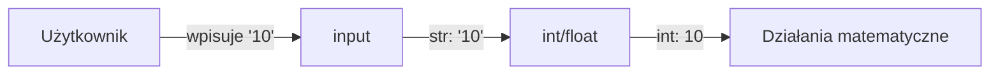

# Laboratorium 2: Podstawy składni – przetwarzanie danych liczbowych i tekstowych

## Cel zajęć
Celem zajęć jest zapoznanie się z podstawami składni języka Python, w tym z obsługą różnych typów danych (liczbowych i tekstowych), wykonywaniem operacji arytmetycznych, konwersją typów oraz podstawową manipulacją łańcuchami znaków.

## Zakres tematyczny
- Typy danych liczbowych (`int`, `float`, `complex`) oraz ich zastosowanie.
- Podstawowe operacje arytmetyczne (`+`, `-`, `*`, `/`, `//`, `%`, `**`).
- Kolejność wykonywania operacji i użycie nawiasów.
- Zmienne i przypisywanie wartości.
- Konwersje typów (jawne i niejawne).
- Wczytywanie danych liczbowych z wejścia standardowego (`input()`).
- Formatowanie i wyświetlanie wyników obliczeń (f-stringi, `format()`).
- Typ danych tekstowych (`string`) i jego reprezentacja.
- Tworzenie i inicjalizacja łańcuchów znaków.
- Podstawowe operacje na stringach (łączenie, porównywanie).
- Dostęp do pojedynczych znaków w łańcuchu (indeksowanie).
- Długość tekstu (`len()`) i iteracja po znakach.
- Metody przetwarzania tekstu (np. `upper()`, `lower()`, `find()`, `replace()`).
- Wczytywanie danych tekstowych (linia tekstu vs pojedyncze słowo).
- Podstawowe błędy składniowe i logiczne związane z typami danych.

## 1. Typy danych i konwersja
W Pythonie funkcja `input()` zawsze zwraca tekst (`str`). Aby wykonywać operacje matematyczne, musimy dokonać jawnej konwersji typów (rzutowania).



### Przykład rzutowania:
```python
wiek_str = input("Ile masz lat? ")
wiek_int = int(wiek_str)  # Konwersja na liczbę całkowitą
```

## 2. Operacje na tekstach (String slicing)
Python umożliwia łatwe wycinanie fragmentów tekstu za pomocą notacji `[start:stop:step]`.

```python
tekst = "Python"
# Indeksy:  P  y  t  h  o  n
#           0  1  2  3  4  5
#          -6 -5 -4 -3 -2 -1

print(tekst[0:2])   # "Py" (od 0 do 1, bez 2)
print(tekst[::-1])  # "nohtyP" (odwrócenie tekstu)
```

---

## Zadania
*Poniższe zadania są zadaniami sugerowanymi i mogą ulec modyfikacji przez prowadzącego zajęcia.*

### Część 1: Dane liczbowe i operacje arytmetyczne
1. **Kalkulator podstawowy:** Napisz program, który prosi użytkownika o podanie dwóch liczb zmiennoprzecinkowych. Wyświetl wynik ich sumy, różnicy, iloczynu oraz ilorazu. Pamiętaj o obsłudze dzielenia przez zero (wyświetl odpowiedni komunikat).
2. **Pole i obwód koła:** Napisz program do obliczania pola i obwodu koła. Użytkownik podaje promień. Użyj przybliżenia liczby Pi (3.14159) lub zaimportuj ją z modułu `math`. Sformatuj wynik do dwóch miejsc po przecinku.
3. **Konwerter temperatur:** Napisz program, który zamienia temperaturę w stopniach Celsjusza na stopnie Fahrenheita (wzór: `F = C * 1.8 + 32`) oraz Kelvina (`K = C + 273.15`).
4. **Operacje całkowitoliczbowe:** Pobierz od użytkownika dwie liczby całkowite. Wyświetl wynik dzielenia całkowitego oraz resztę z dzielenia (operator `%`).
5. **Kolejność działań:** Napisz program, który oblicza wynik wyrażenia: `a + b * c / (d - e)`. Wartości `a, b, c, d, e` pobierz od użytkownika. Zwróć uwagę na typy danych podczas wczytywania.

### Część 2: Dane tekstowe (Stringi)
6. **Manipulacja imieniem:** Stwórz zmienną zawierającą Twoje imię i nazwisko (pobrane od użytkownika jako jedna linia). Wypisz:
    - Całkowitą liczbę znaków (wliczając spację).
    - Imię i nazwisko wielkimi literami.
    - Imię i nazwisko małymi literami.
    - Tylko nazwisko (użyj wycinania/slicingu lub metody `split()`).
7. **Analiza tekstu:** Pobierz od użytkownika dowolne zdanie.
    - Sprawdź, czy zdanie kończy się kropką.
    - Policz, ile razy w zdaniu występuje litera "a".
    - Zamień wszystkie spacje na podkreślniki (`_`).
    - Wypisz zdanie w odwrotnej kolejności (od tyłu).
8. **Łączenie słów:** Pobierz od użytkownika trzy oddzielne słowa. Połącz je w jedno zdanie, oddzielając je przecinkami, a na końcu postaw kropkę. Skorzystaj z metody `join()` lub f-stringa.
9. **Indeksowanie:** Pobierz od użytkownika słowo i wypisz jego pierwszy, środkowy oraz ostatni znak.

### Część 3: Zadania łączone
10. **Paragon:** Napisz prosty program generujący "paragon". Pobierz nazwę produktu, jego cenę jednostkową oraz ilość. Oblicz wartość brutto. Wyświetl wynik w czytelnej formie, np.:
    ```
    Produkt: [Nazwa]
    Cena: [Cena] zł
    Ilość: [Ilość]
    --------------------
    Suma: [Wynik] zł
    ```
11. **Konwersja typów:** Napisz skrypt, który prosi o podanie liczby. Wyświetl tę liczbę pomnożoną przez 2 jako liczbę całkowitą, jako liczbę zmiennoprzecinkową oraz jako tekst (string) powtórzony dwukrotnie (np. dla wejścia `5` wynik to `10`, `10.0`, `55`).
