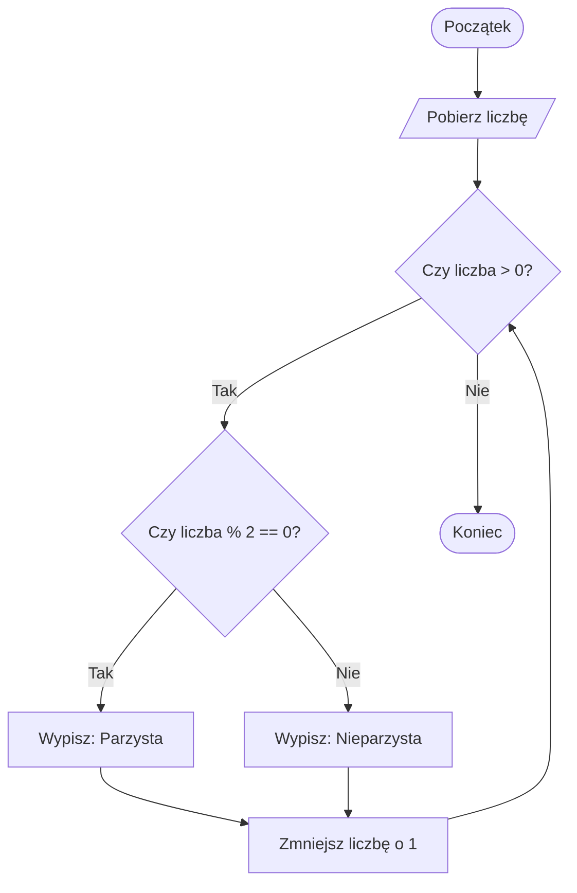

# Laboratorium 3: Logika programu (if, while, for)

## Cel zajęć
Wykorzystanie instrukcji warunkowych i pętli do sterowania przepływem programu.

## 1. Pętle i warunki w pigułce
W Pythonie pętle i instrukcje warunkowe opierają się na wcięciach. Pętla `for` najlepiej sprawdza się przy iteracji po zbiorach danych, natomiast `while` gdy czekamy na spełnienie konkretnego warunku.

### Przykład: Sprawdzanie parzystości w pętli


## 2. Losowanie liczb
Do zadań z losowaniem (np. gra w zgadywanie) wykorzystujemy moduł `random`:
```python
import random
liczba = random.randint(1, 100)  # losuje liczbę od 1 do 100 włącznie
```

---

## Zadania
*Poniższe zadania są zadaniami sugerowanymi i mogą ulec modyfikacji przez prowadzącego zajęcia.*

1. Napisz program, który sprawdza, czy podana przez użytkownika liczba jest parzysta.
2. Napisz program, który prosi o podanie roku i sprawdza, czy jest on przestępny.
3. Napisz prostą grę "Zgadnij liczbę". Komputer losuje liczbę z zakresu 1-100, a użytkownik próbuje ją odgadnąć. Po każdej próbie program podaje informację "za mało" lub "za dużo".
4. Wypisz wszystkie liczby pierwsze z zakresu od 2 do 100 za pomocą pętli `for`.
5. Napisz program wyświetlający tabliczkę mnożenia 10x10.
6. Napisz program, który pobiera od użytkownika liczbę całkowitą dodatnią, a następnie rysuje w konsoli trójkąt o wysokości podanej liczby (używając np. znaku `*`).
7. Napisz skrypt, który oblicza sumę cyfr podanej przez użytkownika liczby całkowitej.
8. Napisz program, który wyświetla liczby od 1 do 100, ale dla wielokrotności 3 wypisuje "Fizz", dla wielokrotności 5 wypisuje "Buzz", a dla wielokrotności obu wypisuje "FizzBuzz".
9. Napisz program, który pobiera od użytkownika ciąg znaków i wypisuje go w odwrotnej kolejności bez użycia slicingu (używając pętli).
10. Napisz program, który oblicza silnię podanej przez użytkownika liczby za pomocą pętli `while`.
