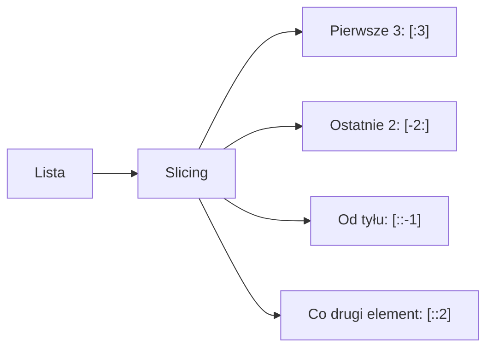
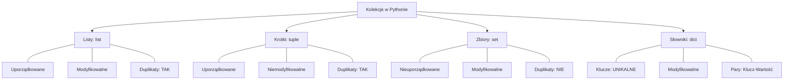

# Laboratorium 4: Praca z kolekcjami

## Cel zajęć
Zarządzanie danymi w listach, krotkach, zbiorach i słownikach.

## 1. Listy (`list`)
Uporządkowane, modyfikowalne kolekcje elementów. Pozwalają na przechowywanie różnych typów danych oraz duplikatów.

### Najważniejsze metody:
- `append(x)`: Dodaje element `x` na koniec listy.
- `extend(iterable)`: Rozszerza listę o elementy z innego obiektu (np. innej listy).
- `insert(i, x)`: Wstawia element `x` na podaną pozycję `i`.
- `remove(x)`: Usuwa pierwszy napotkany element o wartości `x`.
- `pop([i])`: Usuwa i zwraca element z pozycji `i` (domyślnie ostatni).
- `count(x)`: Zwraca liczbę wystąpień wartości `x`.

### Wycinanie list (Slicing)
Slicing pozwala na szybki dostęp do podzbiorów kolekcji. Składnia to `lista[start:stop:krok]`.
- `start`: Indeks początkowy (włącznie).
- `stop`: Indeks końcowy (wyłącznie).
- `krok`: Co ile elementów wybierać (np. `2` co drugi, `-1` od tyłu).



## 2. Krotki (`tuple`) i Zbiory (`set`)
**Krotki** są niemodyfikowalne (immutable). Używamy ich do przechowywania danych, które nie powinny się zmienić.
```python
wymiary = (1920, 1080)
szerokosc, wysokosc = wymiary # Rozpakowywanie krotki
```

**Zbiory** przechowują tylko unikalne elementy. Są idealne do usuwania duplikatów i operacji matematycznych.
- `add(x)`: Dodaje element.
- `union(other)` lub `|`: Suma zbiorów.
- `intersection(other)` lub `&`: Część wspólna.
- `difference(other)` lub `-`: Różnica zbiorów.

## 3. Słowniki (`dict`)
Słowniki przechowują pary `klucz: wartość`. Są bardzo wydajne przy wyszukiwaniu danych.

### Przydatne metody:
- `.get(key, default)`: Bezpieczne pobranie wartości (zapobiega `KeyError`).
- `.keys()`: Zwraca listę wszystkich kluczy.
- `.values()`: Zwraca listę wszystkich wartości.
- `.items()`: Zwraca pary (klucz, wartość).
- `.update(other)`: Aktualizuje słownik o dane z innego słownika.

```python
ceny = {"chleb": 4.50, "mleko": 3.20}
# Bezpieczne pobranie ceny
cena = ceny.get("jajka", 0.00) # Jeśli nie ma jajek, zwróci 0.00
```

## 4. Sortowanie: `sort()` vs `sorted()`
W Pythonie mamy dwie główne metody sortowania:
1. **`lista.sort()`**: Sortuje listę **w miejscu** (zmienia oryginał) i zwraca `None`. Działa tylko na listach.
2. **`sorted(iterable)`**: Tworzy **nową, posortowaną listę** z dowolnego obiektu iterowalnego (lista, krotka, słownik). Oryginał pozostaje bez zmian.

```python
liczby = [5, 2, 8, 1]
posortowane = sorted(liczby) # liczby: [5, 2, 8, 1], posortowane: [1, 2, 5, 8]
liczby.sort()                # liczby: [1, 2, 5, 8]
```

## 5. Funkcje anonimowe (Lambda)
Lambda to krótka, jednolinijkowa funkcja bez nazwy. Składnia: `lambda argumenty: wyrażenie`.
Często używana jako klucz do sortowania skomplikowanych struktur.

```python
# Sortowanie listy krotek według drugiego elementu (wieku)
osoby = [("Anna", 25), ("Piotr", 20), ("Jan", 30)]
osoby.sort(key=lambda x: x[1])
# Wynik: [('Piotr', 20), ('Anna', 25), ('Jan', 30)]
```

---

## Podsumowanie typów danych

Poniższy diagram przedstawia kluczowe cechy i różnice między omawianymi kolekcjami danych:



---

## Zadania
*Poniższe zadania są zadaniami sugerowanymi i mogą ulec modyfikacji przez prowadzącego zajęcia.*

1. Utwórz listę zakupów. Napisz program, który pozwala użytkownikowi dodawać elementy do listy, usuwać je oraz wyświetlać całą listę.
2. Napisz skrypt, który pobiera od użytkownika 5 liczb, zapisuje je w liście, a następnie wypisuje średnią arytmetyczną tych liczb.
3. Mając słownik: `ceny = {"chleb": 4.50, "mleko": 3.20, "jajka": 10.00}`, oblicz sumę zakupów na podstawie listy produktów podanych przez użytkownika.
4. Napisz program, który usunie duplikaty z listy: `[1, 2, 2, 3, 4, 4, 5, 1]` przy użyciu zbioru (`set`).
5. Napisz program zliczający wystąpienia każdego słowa w podanym zdaniu.
6. Stwórz listę krotek, gdzie każda krotka zawiera imię i wiek osoby. Napisz program, który posortuje tę listę według wieku.
7. Napisz program, który łączy dwa słowniki w jeden, przy czym w przypadku powtarzających się kluczy, wartości powinny zostać zsumowane.
8. Napisz program, który znajduje największy i najmniejszy element w liście liczb bez użycia funkcji `max()` i `min()`.
9. Stwórz słownik, w którym kluczami są numery indeksów studentów, a wartościami ich oceny. Napisz program, który wyliczy średnią ocen wszystkich studentów.
10. Napisz program, który pobiera od użytkownika dwa zbiory liczb i wypisuje ich część wspólną oraz różnicę symetryczną.
11. Stwórz listę słowników reprezentujących pracowników (imię, nazwisko, pensja). Napisz program, który przy użyciu funkcji `sorted()` i `lambda` posortuje tę listę według pensji malejąco.
12. **Analiza tekstu (Indeksy słów):** Napisz program, który na podstawie tekstu wprowadzonego przez użytkownika (np. `"kot pije mleko i kot pije wodę"`) stworzy słownik, gdzie kluczem będzie słowo, a wartością lista pozycji (indeksów), na których to słowo wystąpiło w tekście.
    *   **Przykład:** Dla tekstu `"kot pije mleko i kot pije wodę"`, wynikiem powinno być: `{'kot': [0, 4], 'pije': [1, 5], 'mleko': [2], 'i': [3], 'wodę': [6]}`.
    *   **Wskazówka:** Użyj metody `.split()` do podzielenia tekstu na listę słów oraz `enumerate()`, aby śledzić ich pozycję.
