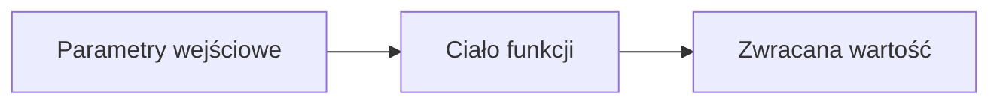

# Laboratorium 5: Funkcje i moduły

## Cel zajęć
Organizacja kodu w funkcje oraz korzystanie z biblioteki standardowej.

## 1. Struktura funkcji
Funkcja to wydzielony blok kodu, który można wywoływać wielokrotnie.



### Docstringi
Zawsze opisuj swoje funkcje używając potrójnych cudzysłowów tuż pod nagłówkiem `def`.
```python
def pole_kola(r):
    """Oblicza pole koła na podstawie promienia r."""
    import math
    return math.pi * r**2
```

## 2. Importowanie własnych modułów
Aby zaimportować własny plik (np. `moj_modul.py`), musi on znajdować się w tym samym folderze co skrypt uruchamiający.

```python
import moj_modul
moj_modul.funkcja()
```

---

## Zadania
*Poniższe zadania są zadaniami sugerowanymi i mogą ulec modyfikacji przez prowadzącego zajęcia.*

1. Napisz funkcję `pole_trojkata(a, h)`, która zwraca pole trójkąta.
2. Napisz funkcję, która sprawdza, czy podane słowo jest palindromem (czyta się tak samo od przodu i od tyłu).
3. Stwórz własny moduł `geometria.py` zawierający funkcje do obliczania pól kwadratu i koła. Zaimportuj go w innym pliku i użyj tych funkcji.
4. Użyj modułu `random`, aby napisać funkcję losującą 6 liczb z zakresu 1-49 (symulator Lotto).
5. Użyj modułu `math`, aby obliczyć silnię z liczby podanej przez użytkownika.
6. Napisz funkcję, która przyjmuje listę liczb i zwraca nową listę zawierającą tylko liczby parzyste.
7. Stwórz funkcję, która przyjmuje dowolną liczbę argumentów pozycyjnych (`*args`) i zwraca ich iloczyn.
8. Napisz funkcję, która przyjmuje słownik i wypisuje wszystkie klucze i wartości w formacie "Klucz: [klucz], Wartość: [wartosc]".
9. Napisz funkcję rekurencyjną obliczającą n-ty wyraz ciągu Fibonacciego.
10. Napisz funkcję, która przyjmuje napis i zwraca liczbę samogłosek w nim zawartych.
