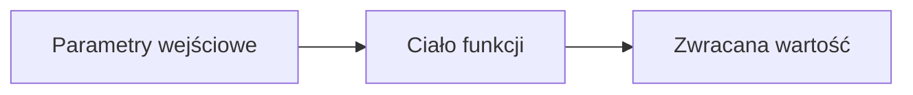

# Laboratorium 5: Funkcje i moduły

## Cel zajęć
Organizacja kodu w funkcje oraz korzystanie z biblioteki standardowej.

## 1. Struktura funkcji
Funkcja to wydzielony blok kodu, który można wywoływać wielokrotnie.


```mermaid
graph LR
    Args[Parametry wejściowe] --> Func[Ciało funkcji]
    Func --> Return[Zwracana wartość]
```

### Definiowanie funkcji i Docstringi
Zawsze opisuj swoje funkcje używając potrójnych cudzysłowów tuż pod nagłówkiem `def`. To tzw. *docstring*, który ułatwia innym (i Tobie) zrozumienie działania funkcji.

```python
def pole_kola(r):
    """Oblicza pole koła na podstawie promienia r."""
    import math
    return math.pi * r**2

print(pole_kola(5))
```

### Parametry domyślne
Możesz ustawić domyślne wartości dla argumentów funkcji. Jeśli wywołasz funkcję bez tych argumentów, zostaną użyte wartości domyślne.

```python
def powitanie(imie="Gościu", tekst="Witaj"):
    print(f"{tekst}, {imie}!")

powitanie()             # Witaj, Gościu!
powitanie("Jan", "Hej") # Hej, Jan!
```

### Zasięg zmiennych (Scope)
Zmienne zdefiniowane wewnątrz funkcji są **lokalne** – nie są dostępne poza nią. Zmienne zdefiniowane na zewnątrz są **globalne**.

```python
x = 10 # Globalna

def moja_funkcja():
    x = 5 # Lokalna (nie zmienia globalnego x)
    print(f"W środku: {x}")

moja_funkcja()
print(f"Na zewnątrz: {x}")
```

## 2. Zaawansowane argumenty i Lambdy

### *args i **kwargs
Pozwalają na przekazywanie dowolnej liczby argumentów.
- `*args` – argumenty pozycyjne (trafiają jako krotka/tuple).
- `**kwargs` – argumenty nazwane (trafiają jako słownik/dictionary).

```python
def suma(*args):
    return sum(args)

print(suma(1, 2, 3, 4, 5)) # 15
```

### Funkcje anonimowe (Lambda)
Krótkie, jednolinijkowe funkcje bez nazwy.

```python
# lambda argumenty: wyrażenie
kwadrat = lambda x: x**2
print(kwadrat(4)) # 16

# Przykład użycia z filter()
liczby = [1, 2, 3, 4, 5, 6]
parzyste = list(filter(lambda x: x % 2 == 0, liczby))
print(parzyste) # [2, 4, 6]
```

## 3. Moduły biblioteki standardowej
Python posiada bogatą bibliotekę standardową. Przykładowe moduły:
- `math`: funkcje matematyczne (sqrt, pi, factorial, sin, cos).
- `random`: generowanie liczb pseudolosowych.
- `datetime`: obsługa dat i czasu.

```python
import math
import random

print(math.factorial(5))   # 120 (silnia)
print(random.randint(1, 10)) # losowa liczba od 1 do 10
```

## 4. Importowanie własnych modułów i `__main__`
Aby zaimportować własny plik (np. `moj_modul.py`), musi on znajdować się w tym samym folderze co skrypt uruchamiający.

Dobrą praktyką jest umieszczanie kodu wykonawczego w bloku `if __name__ == "__main__":`. Zapobiega to automatycznemu uruchamianiu skryptu podczas importu.

**Plik `geometria.py`:**
```python
def pole_kwadratu(a):
    return a * a

if __name__ == "__main__":
    # Ten kod wykona się tylko przy bezpośrednim uruchomieniu pliku
    print("Testuję funkcję:")
    print(pole_kwadratu(4))
```

**Plik `main.py`:**
```python
import geometria
print(geometria.pole_kwadratu(5)) # 25
```

---

## Zadania
*Poniższe zadania są zadaniami sugerowanymi i mogą ulec modyfikacji przez prowadzącego zajęcia.*

1. Napisz funkcję `pole_trojkata(a, h)`, która zwraca pole trójkąta.
2. Napisz funkcję, która sprawdza, czy podane słowo jest palindromem (czyta się tak samo od przodu i od tyłu).
3. Stwórz własny moduł `geometria.py` zawierający funkcje do obliczania pól kwadratu i koła. Zaimportuj go w innym pliku i użyj tych funkcji.
4. Użyj modułu `random`, aby napisać funkcję losującą 6 liczb z zakresu 1-49 (symulator Lotto).
5. Użyj pętli `while` w pierwszej wersji, a w drugiej modułu `math`, aby obliczyć silnię z liczby podanej przez użytkownika.
6. Napisz funkcję, która przyjmuje listę liczb i zwraca nową listę zawierającą tylko liczby parzyste.
7. Stwórz funkcję, która przyjmuje dowolną liczbę argumentów pozycyjnych (`*args`) i zwraca ich iloczyn.
8. Napisz funkcję, która przyjmuje słownik i wypisuje wszystkie klucze i wartości w formacie "Klucz: [klucz], Wartość: [wartosc]".
9. Napisz funkcję rekurencyjną obliczającą n-ty wyraz ciągu Fibonacciego oraz funkcję wykorzystującą zapamiętywanie (ang. `memoization`).
10. Napisz funkcję, która przyjmuje napis i zwraca liczbę samogłosek w nim zawartych.
