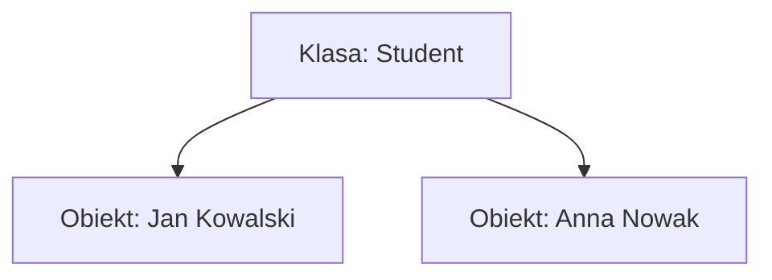
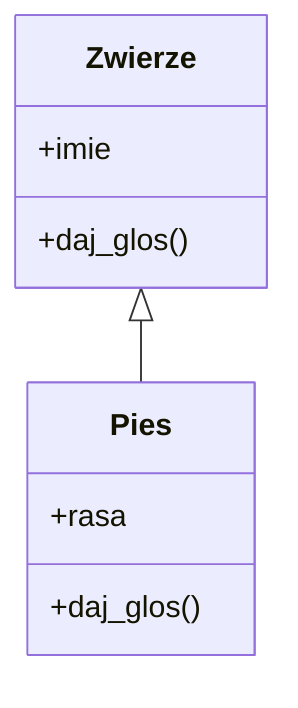

# Laboratorium 6: Programowanie obiektowe (OOP)

## Cel zajęć
Implementacja własnych klas, metod oraz wykorzystanie dziedziczenia.

## 1. Klasy i obiekty - koncepcja
Pamiętaj, że klasa to tylko schemat, a obiekt to konkretny byt w pamięci.



### Metoda `__init__`
To tutaj definiujesz początkowy stan obiektu.

```python
class Student:
    def __init__(self, imie, nazwisko):
        self.imie = imie
        self.nazwisko = nazwisko
```

## 2. Dziedziczenie
Umożliwia ponowne wykorzystanie kodu. Klasa potomna dziedziczy wszystkie atrybuty i metody klasy bazowej.



---

## Zadania
*Poniższe zadania są zadaniami sugerowanymi i mogą ulec modyfikacji przez prowadzącego zajęcia.*

1. Stwórz klasę `Student` z atrybutami `imie`, `nazwisko`, `nr_indeksu`. Dodaj metodę `przedstaw_sie()`.
2. Rozbuduj klasę `Student` o listę ocen. Dodaj metody `dodaj_ocene(ocena)` oraz `oblicz_srednia()`.
3. Stwórz klasę `KontoBankowe` z atrybutem `saldo`. Dodaj metody `wplata(kwota)` i `wyplata(kwota)`. Zadbaj o to, by saldo nie było ujemne.
4. Stwórz klasę bazową `Zwierze` z metodą `daj_glos()`. Stwórz klasy `Pies` i `Kot`, które dziedziczą po `Zwierze` i nadpisują metodę `daj_glos()`.
5. Stwórz prosty system zarządzania biblioteką: klasy `Ksiazka` i `Biblioteka`. `Biblioteka` powinna zawierać listę obiektów `Ksiazka`.
6. Dodaj do klasy `Samochod` atrybuty `marka`, `model` oraz `rok_produkcji`. Stwórz metodę, która oblicza wiek samochodu na podstawie aktualnego roku.
7. Zaimplementuj klasę `Prostokat` z atrybutami `dlugosc` i `szerokosc`. Dodaj metody obliczające pole oraz obwód prostokąta.
8. Stwórz klasę `Pracownik` z atrybutem `wynagrodzenie`. Stwórz klasę `Menadzer`, która dziedziczy po `Pracownik` i dodaje atrybut `premia`. Dodaj metodę obliczającą całkowite zarobki menadżera.
9. Zaimplementuj metodę specjalną `__str__` dla klasy `Ksiazka`, aby wypisywała informacje o książce w czytelny sposób.
10. Stwórz klasę `Punkt2D` z atrybutami `x` i `y`. Napisz metodę obliczającą odległość między dwoma punktami.
