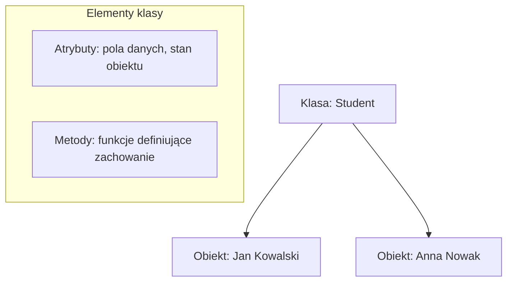

# Laboratorium 6: Programowanie obiektowe (OOP)

## Cel zajęć
Implementacja własnych klas, metod oraz wykorzystanie dziedziczenia.

## 1. Klasy i obiekty - koncepcja
Pamiętaj, że klasa to tylko schemat (jak projekt domu), a obiekt to konkretny byt w pamięci (zbudowany dom).


```mermaid
graph TD
    Klasa[Klasa: Student] --> Obiekt1[Obiekt: Jan Kowalski]
    Klasa --> Obiekt2[Obiekt: Anna Nowak]
    
    subgraph "Elementy klasy"
    Atrybuty[Atrybuty: pola danych, stan obiektu]
    Metody[Metody: funkcje definiujące zachowanie]
    end
```

### Metoda `__init__` i słowo `self`
- **`__init__`**: To specjalna metoda (konstruktor), wywoływana automatycznie podczas tworzenia obiektu. Służy do inicjalizacji jego atrybutów.
- **`self`**: Reprezentuje bieżącą instancję klasy. Musi być pierwszym argumentem każdej metody, aby Python wiedział, na którym konkretnym obiekcie operuje.

```python
class Student:
    def __init__(self, imie, nazwisko):
        self.imie = imie       # Atrybut instancji
        self.nazwisko = nazwisko
        self.oceny = []        # Domyślny atrybut dla każdego obiektu

    def przedstaw_sie(self):
        print(f"Cześć, jestem {self.imie} {self.nazwisko}!")

# Tworzenie obiektów (instancji)
s1 = Student("Jan", "Kowalski")
s1.przedstaw_sie()
```

### Metody specjalne (Magic Methods)
Pozwalają na definiowanie zachowań w specyficznych sytuacjach, np. przy wypisywaniu obiektu za pomocą `print()`. Najpopularniejszą jest `__str__`.

```python
class Ksiazka:
    def __init__(self, tytul, autor):
        self.tytul = tytul
        self.autor = autor

    def __str__(self):
        return f"'{self.tytul}' - {self.autor}"

k = Ksiazka("Wiedźmin", "Andrzej Sapkowski")
print(k) # Wypisze: 'Wiedźmin' - Andrzej Sapkowski
```

## 2. Dziedziczenie i Polimorfizm
Dziedziczenie umożliwia ponowne wykorzystanie kodu – klasa potomna przejmuje atrybuty i metody klasy bazowej.

### Funkcja `super()`
Używana w konstruktorze klasy potomnej do wywołania konstruktora klasy nadrzędnej.

```python
class Zwierze:
    def __init__(self, imie):
        self.imie = imie

    def daj_glos(self):
        pass

class Pies(Zwierze):
    def __init__(self, imie, rasa):
        super().__init__(imie) # Inicjalizacja atrybutu z klasy Zwierze
        self.rasa = rasa

    def daj_glos(self):
        return "Woof!"

class Kot(Zwierze):
    def daj_glos(self):
        return "Meow!"

# Polimorfizm: różne obiekty reagują na to samo wywołanie metody
zwierzeta = [Pies("Burek", "Kundel"), Kot("Mruczek")]
for z in zwierzeta:
    print(f"{z.imie} mówi: {z.daj_glos()}")
```

## 3. Hermetyzacja (Enkapsulacja)
Hermetyzacja to ukrywanie danych przed bezpośrednim dostępem z zewnątrz. W Pythonie używamy konwencji:
- `_atrybut`: chroniony (sygnał dla programisty).
- `__atrybut`: prywatny (trudniejszy dostęp z zewnątrz).

### Dekorator `@property`
Pozwala na bezpieczny dostęp i modyfikację atrybutów (gettery i settery).

```python
class KontoBankowe:
    def __init__(self, saldo):
        self.__saldo = saldo # Atrybut prywatny

    @property
    def saldo(self):
        return self.__saldo

    @saldo.setter
    def saldo(self, kwota):
        if kwota >= 0:
            self.__saldo = kwota
        else:
            print("Błąd: Saldo nie może być ujemne!")

konto = KontoBankowe(100)
konto.saldo = 150  # Używa settera
print(konto.saldo) # Używa gettera
```

---

## Zadania
*Poniższe zadania są zadaniami sugerowanymi i mogą ulec modyfikacji przez prowadzącego zajęcia.*

1. Stwórz klasę `Student` z atrybutami `imie`, `nazwisko`, `nr_indeksu`. Dodaj metodę `przedstaw_sie()`.
2. Rozbuduj klasę `Student` o listę ocen. Dodaj metody `dodaj_ocene(ocena)` oraz `oblicz_srednia()`.
3. Stwórz klasę `KontoBankowe` z atrybutem `saldo`. Dodaj metody `wplata(kwota)` i `wyplata(kwota)`. Zadbaj o to, by saldo nie było ujemne.
4. Stwórz klasę bazową `Zwierze` z metodą `daj_glos()`. Stwórz klasy `Pies` i `Kot`, które dziedziczą po `Zwierze` i nadpisują metodę `daj_glos()`.
5. Stwórz prosty system zarządzania biblioteką: klasy `Ksiazka` i `Biblioteka`. `Biblioteka` powinna zawierać listę obiektów `Ksiazka`.
6. Dodaj do klasy `Samochod` atrybuty `marka`, `model` oraz `rok_produkcji`. Stwórz metodę, która oblicza wiek samochodu na podstawie aktualnego roku.
7. Zaimplementuj klasę `Prostokat` z atrybutami `dlugosc` i `szerokosc`. Dodaj metody obliczające pole oraz obwód prostokąta.
8. Stwórz klasę `Pracownik` z atrybutem `wynagrodzenie`. Stwórz klasę `Menadzer`, która dziedziczy po `Pracownik` i dodaje atrybut `premia`. Dodaj metodę obliczającą całkowite zarobki menadżera.
9. Zaimplementuj metodę specjalną `__str__` dla klasy `Ksiazka`, aby wypisywała informacje o książce w formacie: "Tytuł: [tytuł], Autor: [autor]".
10. Stwórz klasę `Punkt2D` z atrybutami `x` i `y`. Napisz metodę obliczającą odległość między dwoma punktami.
11. Stwórz klasę `Kwadrat`, która dziedziczy po klasie `Prostokat`. Nadpisz konstruktor tak, aby przyjmował tylko jeden parametr `bok`.
12. Dodaj do klasy `Pracownik` atrybut prywatny `__pesel`. Stwórz właściwość (`@property`), która pozwoli na odczyt peselu, ale nie na jego zmianę.
13. Stwórz listę obiektów różnych klas (np. `Kolo`, `Prostokat`, `Kwadrat`), gdzie każda ma metodę `pole()`. W pętli wypisz pola wszystkich tych figur (demonstracja polimorfizmu).
14. Stwórz klasę `Produkt` (nazwa, cena) oraz `Koszyk`. `Koszyk` powinien umożliwiać dodawanie produktów i obliczać całkowitą wartość zamówienia.
15. Zaimplementuj klasę `Samochod` z atrybutami prywatnymi `__marka` i `__predkosc`. Dodaj metody `przyspiesz()` i `zwolnij()`, które modyfikują prędkość, ale nie pozwalają jej spaść poniżej 0. Wykorzystaj `@property` do odczytu prędkości.
