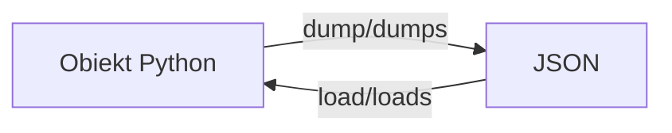

# Laboratorium 7: Przetwarzanie plików – Operacje na plikach (CSV i JSON)

## Cel zajęć

Celem zajęć jest zapoznanie się z przetwarzaniem danych w formatach strukturalnych (CSV, JSON) przy użyciu języka Python, nauką iteracji, filtrowania danych oraz obsługi błędów wejścia-wyjścia.

## Teoria

### Format CSV (Comma Separated Values)

Format CSV służy do przechowywania danych tabelarycznych. Każdy wiersz to jeden rekord, a kolumny oddzielone są separatorem (np. przecinkiem).

**Przykład odczytu (csv.reader):**

```python
import csv

with open("dane.csv", mode="r") as f:
    reader = csv.reader(f)
    for row in reader:
        print(row)  # row to lista stringów
```

**Przykład zapisu (csv.DictWriter):**

```python
import csv

pola = ["id", "nazwa"]
dane = [{"id": 1, "nazwa": "A"}, {"id": 2, "nazwa": "B"}]
with open("wyjscie.csv", "w", newline="") as f:
    writer = csv.DictWriter(f, fieldnames=pola)
    writer.writeheader()
    writer.writerows(dane)
```

### Format JSON (JavaScript Object Notation)

JSON to format oparty na parach klucz-wartość.



**Podstawowe funkcje:**

- `json.dump(obj, file)` – zapisuje obiekt do pliku.
- `json.load(file)` – odczytuje obiekt z pliku.
- `json.dumps(obj)` – zamienia obiekt na string JSON.
- `json.loads(string)` – zamienia string JSON na obiekt.

### Przydatne moduły systemowe

- `os.path.exists(path)` / `Path(path).exists()` – sprawdzenie czy plik istnieje.
- `shutil.copy(src, dst)` – kopiowanie plików.
- `glob.glob('*.json')` – pobieranie listy plików pasujących do wzorca.

## Zadania

*Poniższe zadania są zadaniami sugerowanymi i mogą ulec modyfikacji przez prowadzącego zajęcia.*

### Część 1: Format CSV

1. **Odczyt i iteracja:** Napisz program, który wczyta dane z pliku `produkty.csv` (stworzonego ręcznie, np. z kolumnami: `nazwa`, `cena`, `ilosc`) i wypisze każdy rekord w oddzielnej linii.
   *Podpowiedź: Użyj `csv.reader(f)` i pętli `for` do iteracji po wierszach.*
1. **Zapis danych:** Stwórz skrypt, który pobierze od użytkownika dane o 3 nowych produktach i dopisze je do pliku `produkty.csv`.
   *Podpowiedź: Otwórz plik w trybie dopisywania `'a'` (append).*
1. **Filtrowanie:** Napisz program, który wyświetli z pliku `produkty.csv` tylko te produkty, których cena jest wyższa niż 50 zł.
   *Podpowiedź: Pamiętaj o konwersji ceny (string) na typ liczbowy przed porównaniem.*
1. **Selekcja kolumn:** Napisz skrypt, który wczyta `produkty.csv` i zapisze do nowego pliku `cennik.csv` tylko dwie kolumny: `nazwa` i `cena`.
   *Podpowiedź: Możesz użyć `csv.DictReader` i `csv.DictWriter` dla wygody operowania na nazwach kolumn.*

### Część 2: Format JSON

5. **Mapowanie JSON:** Stwórz plik `konfiguracja.json` zawierający ustawienia aplikacji (np. `motyw`, `powiadomienia` (bool), `jezyk`, `skróty_klawiszowe` (lista)). Napisz program, który wczyta ten plik i wyświetli wartości poszczególnych kluczy.
   *Podpowiedź: Wykorzystaj `json.load(f)`, aby otrzymać słownik Python.*
1. **Zapis strukturalny:** Napisz program, który stworzy listę słowników (np. lista studentów: imię, nazwisko, oceny) i zapisze ją do pliku `studenci.json` w formacie czytelnym dla człowieka (użyj parametru `indent`).
   *Podpowiedź: Parametr `indent=4` w `json.dump` sprawi, że plik będzie ładnie sformatowany.*
1. **Aktualizacja danych:** Napisz skrypt, który wczyta plik `studenci.json`, doda nowego studenta do listy i zapisze zaktualizowaną listę z powrotem do pliku.
   *Podpowiedź: Wczytaj całość do listy, dodaj element metodą `.append()` i nadpisz plik.*

### Część 3: Zadania zaawansowane i obsługa błędów

8. **Obsługa błędów:** Zmodyfikuj dowolny z powyższych programów tak, aby bezpiecznie obsługiwał brak pliku (`FileNotFoundError`) oraz nieprawidłowy format danych (np. błąd podczas konwersji ceny na liczbę).
   *Podpowiedź: Użyj bloku `try...except`, aby przechwycić konkretne wyjątki.*
1. **Integracja formatów (Konwerter):** Napisz program, który wczyta dane z pliku CSV (`produkty.csv`) i zapisze je do pliku JSON (`produkty.json`), dbając o to, aby liczby (cena, ilość) były zapisane w JSON jako typy numeryczne, a nie tekst.
   *Podpowiedź: Odczytaj CSV jako listę słowników, zmień typy wartości w pętli i użyj `json.dump`.*
1. **Raport końcowy:** Napisz skrypt, który odczyta dane z pliku JSON (`studenci.json`), obliczy średnią ocen dla każdego studenta, a następnie wygeneruje raport tekstowy `raport.txt` z wynikami.
   *Podpowiedź: Średnią obliczysz dzieląc `sum(oceny)` przez `len(oceny)`.*

### Część 4: Operacje na systemie plików (Moduły systemowe)

11. **Kopia zapasowa:** Napisz program, który wykorzystując moduł `shutil`, utworzy folder `backup` i skopiuje do niego wszystkie pliki `.csv` z bieżącego katalogu.
    *Podpowiedź: Użyj `os.mkdir()` lub `Path.mkdir()` do stworzenia folderu oraz `shutil.copy()` do kopiowania.*
01. **Masowa zmiana nazw:** Napisz skrypt, który znajdzie wszystkie pliki `.json` w folderze (użyj `glob`) i zmieni ich nazwę, dodając przedrostek `data_` (użyj `os.rename` lub `Path.rename`).
    *Podpowiedź: `glob.glob('*.json')` zwróci listę plików. Iteruj po niej i zmieniaj nazwy.*
01. **Inwentaryzacja:** Napisz program, który przejdzie przez wszystkie pliki w bieżącym folderze i zapisze do pliku `struktura.json` informację o każdym pliku: nazwę, rozmiar w KB oraz datę ostatniej modyfikacji.
    *Podpowiedź: Wykorzystaj `os.listdir('.')` lub `Path('.').iterdir()` oraz funkcje z `os.path` lub `Path.stat()`.*
