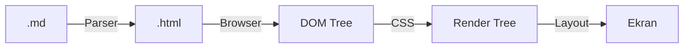

# Laboratorium 8: Markdown i HTML

## Cel zajęć

Praktyczne tworzenie dokumentów przy użyciu języków znaczników.

## Teoria w pigułce

- **Markdown** to lekki język do formatowania treści (README, dokumentacja).
- **HTML** definiuje strukturę strony; wygląd nadaje CSS (Cascading Style Sheets).
- **Semantyczne tagi HTML5** (`header`, `nav`, `main`, `section`, `footer`) poprawiają dostępność i SEO.
- **Atrybuty** (`src`, `href`, `alt`, `id`, `class`) dostarczają dodatkowych informacji o elementach.
- **Formularze** pozwalają na interakcję z użytkownikiem (`input`, `select`, `button`).

### Proces renderowania:

## Zadania

*Poniższe zadania są zadaniami sugerowanymi i mogą ulec modyfikacji przez prowadzącego zajęcia.*

1. Stwórz plik `O_mnie.md` w formacie Markdown. Powinien zawierać:
   - Nagłówek z Twoim imieniem.
   - Krótki opis Twoich zainteresowań (pogrubienie).
   - Tabelę z listą Twoich ulubionych języków programowania i ich oceną.
   - Link do Twojego profilu na GitHub (lub dowolnej innej strony).
1. Stwórz prostą stronę HTML (`index.html`), która będzie zawierać:
   - Tytuł strony.
   - Nagłówek `<h1>`.
   - Listę numerowaną (`<ol>`) z krokami instalacji Pythona.
   - Obrazek (może być link z internetu).
1. Dodaj do strony HTML tabelę prezentującą plan Twoich zajęć.
1. Wykorzystaj walidator [W3C HTML Validator](https://validator.w3.org/), aby sprawdzić poprawność swojego kodu HTML.
1. W pliku Markdown dodaj blok kodu z przykładem prostego skryptu w języku Python oraz listę zadań (task list) do wykonania w tym tygodniu.
1. Stwórz w HTML formularz kontaktowy zawierający pola: Imię (text), Email (email), Temat (select) oraz Wiadomość (textarea).
1. Dodaj do dokumentu Markdown cytat oraz linię poziomą oddzielającą sekcje.
1. W HTML zaimplementuj menu nawigacyjne (`<nav>`) z linkami do różnych sekcji strony (użyj kotwic `#id`).
1. Dodaj do strony HTML stopkę (`<footer>`) z informacją o prawach autorskich oraz aktualnym rokiem.
1. Stwórz prosty diagram Mermaid w Markdown, przedstawiający hierarchię plików w Twoim projekcie.
1. **[ZADANIE DODATKOWE]** W pliku Markdown wykorzystaj składnię LaTeX do zapisania twierdzenia Pitagorasa oraz wzoru na deltę w równaniu kwadratowym.
1. **[ZADANIE DODATKOWE]** Na stronie HTML osadź wideo z serwisu YouTube (używając `<iframe>`) oraz dodaj element `<audio>` z dowolnym plikiem dźwiękowym (lub linkiem).
1. **[ZADANIE DODATKOWE]** Stwórz złożoną tabelę HTML z użyciem atrybutów `colspan` oraz `rowspan` (np. plan lekcji z łączonymi godzinami).
