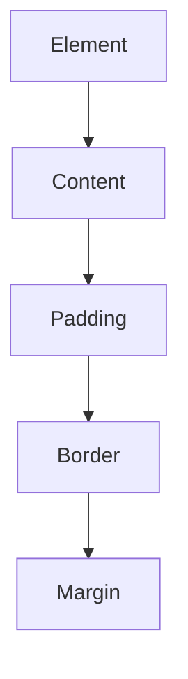

# Laboratorium 9: Stylowanie stron w CSS

## Cel zajęć
Wykorzystanie CSS do zmiany wyglądu strony HTML.

## Teoria w pigułce
- Specyficzność: `#id` > `.klasa` > `tag` > `*`.
- Box model: element = content + padding + border + margin.
- RWD: Media Queries pozwalają dostosować styl do szerokości ekranu.

## Zadania
*Poniższe zadania są zadaniami sugerowanymi i mogą ulec modyfikacji przez prowadzącego zajęcia.*

1. Stwórz plik `style.css` i podłącz go do swojej strony `index.html` z poprzednich zajęć.
2. Zmień czcionkę na całej stronie na bezszeryfową (np. `Arial`).
3. Wyśrodkuj nagłówek `<h1>` i zmień jego kolor na ciemnozielony.
4. Ustaw kolor tła strony na jasnoszary.
5. Użyj klasy (`class`), aby nadać specyficzny styl wybranemu akapitowi (np. ramka, wewnętrzny margines `padding`, kolor tekstu).
6. Wykorzystaj model pudełkowy: nadaj elementom listy `<li>` marginesy zewnętrzne i obramowanie.
7. Stwórz prosty przycisk przy użyciu tagu `<a>` i ostyluj go tak, aby zmieniał kolor po najechaniu myszką (`:hover`).
8. Zaimplementuj prosty układ strony typu "Two-column layout" przy użyciu Flexboxa (np. boczny pasek nawigacyjny i główna treść).
9. Dodaj reguły Media Queries, aby na urządzeniach mobilnych (szerokość poniżej 600px) tło strony zmieniało kolor, a rozmiar czcionki był mniejszy.
10. Użyj CSS Grid do stworzenia galerii zdjęć (min. 4 zdjęcia w układzie kafelkowym).
