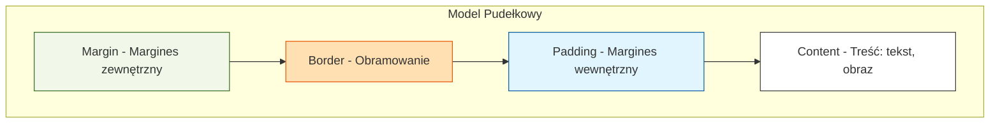
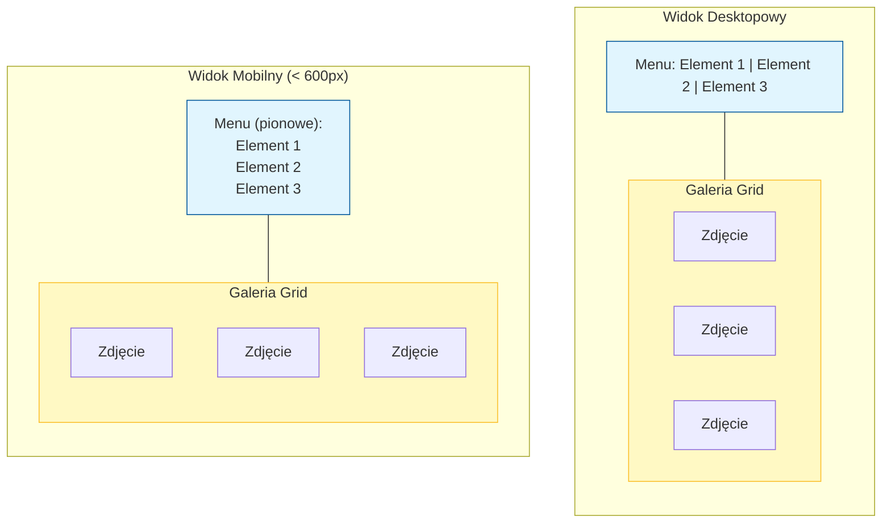

# Laboratorium 9: Stylowanie stron w CSS

## Cel zajęć

Wykorzystanie CSS do zmiany wyglądu strony HTML.

## Teoria w pigułce

### Metody dołączania stylów

1. **Zewnętrzny plik:** `<link rel="stylesheet" href="style.css">`
1. **Tag style:** `<style> ... </style>`
1. **Atrybut style:** `<div style="...">`

### Selektory i specyficzność

- `#id` (100) > `.klasa` (10) > `tag` (1) > `*` (0).

### Box Model (Model Pudełkowy)

Każdy element HTML jest traktowany jako prostokątne pudełko.


```mermaid
graph TD
    subgraph "Model Pudełkowy"
    M[Margin - Margines zewnętrzny] --> B[Border - Obramowanie]
    B --> P[Padding - Margines wewnętrzny]
    P --> C[Content - Treść: tekst, obraz]
    end
    style C fill:#fff,stroke:#333
    style P fill:#e1f5fe,stroke:#01579b
    style B fill:#ffe0b2,stroke:#e65100
    style M fill:#f1f8e9,stroke:#33691e
```

### Flexbox vs Grid

- **Flexbox:** Układ jednowymiarowy (rzędy LUB kolumny). Świetny do nawigacji.
- **Grid:** Układ dwuwymiarowy (rzędy I kolumny). Idealny do całego layoutu strony.

### Wizualizacja docelowego układu

Poniższy schemat przedstawia, jak może wyglądać gotowa strona po wykonaniu zadań z Części 3 i 4:


```mermaid
graph TD
    subgraph "Widok Desktopowy"
    direction TB
    D_NAV["Menu: Element 1 | Element 2 | Element 3"]
    subgraph D_GALLERY [Galeria Grid]
        direction LR
        D_G1[Zdjęcie]
        D_G2[Zdjęcie]
        D_G3[Zdjęcie]
    end
    D_NAV --- D_GALLERY
    end

    subgraph "Widok Mobilny (< 600px)"
    direction TB
    M_NAV["Menu (pionowe):<br/>Element 1<br/>Element 2<br/>Element 3"]
    subgraph M_GALLERY [Galeria Grid]
        direction TB
        M_G1[Zdjęcie]
        M_G2[Zdjęcie]
        M_G3[Zdjęcie]
    end
    M_NAV --- M_GALLERY
    end

    style D_NAV fill:#e1f5fe,stroke:#01579b
    style M_NAV fill:#e1f5fe,stroke:#01579b
    style D_GALLERY fill:#fff9c4,stroke:#fbc02d
    style M_GALLERY fill:#fff9c4,stroke:#fbc02d
```

## Zadania

*Poniższe zadania są zadaniami sugerowanymi i mogą ulec modyfikacji przez prowadzącego zajęcia.*

### Część 1: Podstawy i Typografia

1. **Podłączenie stylów:** Stwórz plik `style.css` i podłącz go do swojej strony `index.html` z poprzednich zajęć za pomocą tagu `<link>`.
1. **Czcionki:** Zmień czcionkę na całej stronie na bezszeryfową (np. `Arial, sans-serif`).
1. **Nagłówek:** Wyśrodkuj nagłówek `<h1>`, zmień jego kolor na ciemnozielony i dodaj cień tekstu (`text-shadow`).
1. **Tło:** Ustaw kolor tła strony na jasnoszary, a kolor tekstu głównego na ciemnoszary.

### Część 2: Model Pudełkowy (Box Model)

1. **Klasy i ramki:** Stwórz klasę `.card` i nadaj jej:
   - Obramowanie (`border: 1px solid #ccc`).
   - Wewnętrzny margines (`padding: 20px`).
   - Zewnętrzny margines (`margin: 10px`).
   - Zaokrąglone rogi (`border-radius: 8px`).
1. **Przyciski:** Stwórz przycisk z tagu `<a>` i ostyluj go:
   - Usuń podkreślenie (`text-decoration: none`).
   - Dodaj tło i kolor tekstu.
   - Wykorzystaj `:hover`, aby zmienić kolor tła po najechaniu myszką.

### Część 3: Layout (Flexbox i Grid)

1. **Flexbox Nawigacja:** Stwórz menu nawigacyjne (`<nav>` i `<ul>`). Użyj `display: flex`, aby ułożyć elementy listy w poziomie i `justify-content: space-around`, aby je rozmieścić.
1. **Grid Galeria:** Stwórz sekcję z 4-6 obrazkami (lub kolorowymi `div`). Użyj `display: grid`:
   ```css
   .gallery {
     display: grid;
     grid-template-columns: repeat(auto-fit, minmax(200px, 1fr));
     gap: 15px;
   }
   ```

### Część 4: RWD (Media Queries)

1. **Adaptacja:** Dodaj reguły Media Queries, aby:
   - Na urządzeniach mobilnych (poniżej 600px) menu nawigacyjne zmieniało orientację na pionową (`flex-direction: column`).
   - Zmieniał się kolor tła strony, aby zasygnalizować zmianę trybu.
   - Nagłówki stawały się mniejsze.
