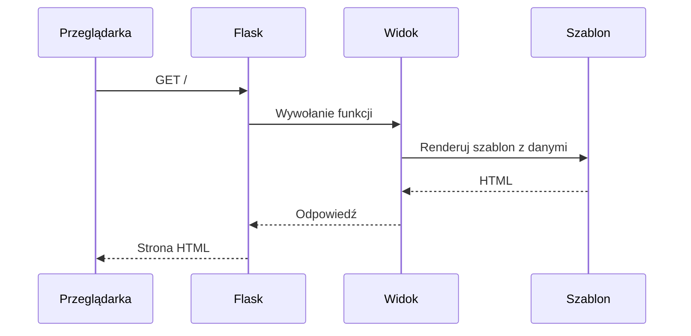

# Laboratorium 10: Flask – Tworzenie dynamicznych stron

## Cel zajęć
Uruchomienie lokalnego serwera WWW i renderowanie szablonów HTML.

## Teoria w pigułce
- Routing mapuje URL na funkcję (widok) w Pythonie.
- Szablony Jinja2 pozwalają generować HTML z danymi.
- Metody HTTP: GET (pobierz), POST (wyślij dane formularza).

## Zadania
*Poniższe zadania są zadaniami sugerowanymi i mogą ulec modyfikacji przez prowadzącego zajęcia.*

1. Zainstaluj bibliotekę Flask: `pip install flask`.
2. Stwórz minimalną aplikację `app.py`, która wyświetla "Witaj w aplikacji Flask" na stronie głównej.
3. Stwórz folder `templates` i plik `index.html`. Użyj funkcji `render_template`, aby wyświetlić ten plik we Flasku.
4. Przekaż do szablonu zmienną `tytul` i wyświetl ją za pomocą składni Jinja2: `{{ tytul }}`.
5. Stwórz listę swoich ulubionych filmów w Pythonie i przekaż ją do szablonu. Wyświetl listę za pomocą pętli `` w HTML.
6. Dodaj drugi widok pod adresem `/kontakt`, który wyświetli prosty formularz HTML.
7. Dodaj do aplikacji obsługę metody `POST` dla widoku `/kontakt`. Po przesłaniu formularza, aplikacja powinna wyświetlić komunikat: "Dziękujemy za kontakt, [imię]!".
8. Stwórz bazowy szablon `base.html` z blokami `` i użyj dziedziczenia szablonów w plikach `index.html` oraz `kontakt.html`.
9. Dodaj obsługę błędów (np. błąd 404), wyświetlając własną stronę błędu.
10. Dodaj do aplikacji obsługę parametrów w URL (np. `/uzytkownik/<nazwa>`) i wyświetl powitanie dla konkretnego użytkownika.
