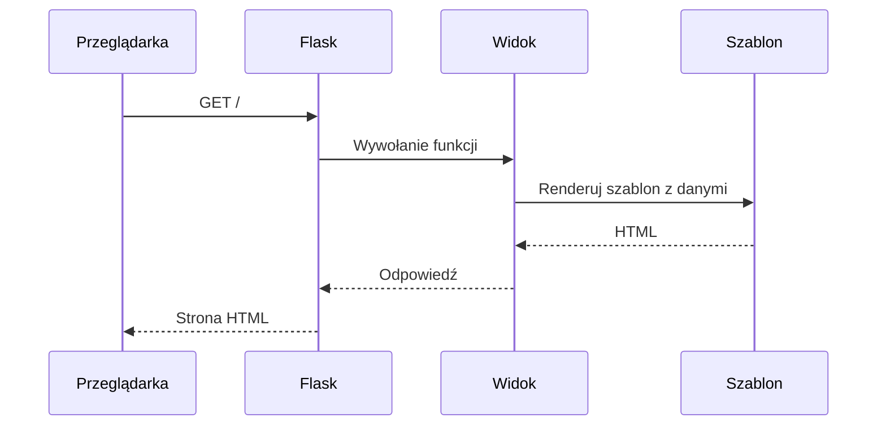

# Laboratorium 10: Flask – Tworzenie dynamicznych stron

## Cel zajęć

Uruchomienie lokalnego serwera WWW i renderowanie szablonów HTML.

## Teoria w pigułce

- **Routing** mapuje URL na funkcję (widok) w Pythonie.
- **Szablony Jinja2** pozwalają generować HTML z danymi.
- **Metody HTTP**: GET (pobierz), POST (wyślij dane formularza).

### Przykładowa struktura plików

Dla poprawnego działania aplikacji Flask, zachowaj następującą strukturę:

```text
moj_projekt/
├── app.py           # Główny plik aplikacji
├── templates/       # Folder na szablony HTML
│   ├── base.html    # Szablon bazowy (wspólny)
│   ├── index.html   # Strona główna
│   └── kontakt.html # Strona kontaktu
└── static/          # Pliki statyczne (CSS, obrazy)
    └── style.css
```

### Najczęstsze filtry Jinja2

| Filtr        | Przykład     | Wynik               |
| :----------- | :----------- | :------------------ |
| `upper`      | \`{{ "ala"   | upper }}\`          |
| `lower`      | \`{{ "ALA"   | lower }}\`          |
| `capitalize` | \`{{ "ala"   | capitalize }}\`     |
| `length`     | \`{{ [1,2,3] | length }}\`         |
| `default`    | \`{{ brak    | default('N/A') }}\` |

### Komunikacja Klient-Serwer


```mermaid
sequenceDiagram
  participant U as Przeglądarka
  participant F as Flask
  participant V as Widok
  participant T as Szablon
  U->>F: GET /
  F->>V: Wywołanie funkcji
  V->>T: Renderuj szablon z danymi
  T-->>V: HTML
  V-->>F: Odpowiedź
  F-->>U: Strona HTML
```

## Zadania

*Poniższe zadania są zadaniami sugerowanymi i mogą ulec modyfikacji przez prowadzącego zajęcia.*

### Przygotowanie środowiska

1. Zainstaluj bibliotekę Flask: `pip install flask`.
1. Stwórz strukturę katalogów opisaną w sekcji "Teoria".

### Zadania do wykonania

1. Stwórz minimalną aplikację `app.py`, która wyświetla "Witaj w aplikacji Flask" na stronie głównej.

1. Stwórz plik `templates/index.html`. Użyj funkcji `render_template`, aby wyświetlić ten plik we Flasku.

1. Przekaż do szablonu zmienną `tytul` i wyświetl ją za pomocą składni Jinja2: `{{ tytul }}`.

1. Stwórz listę swoich ulubionych filmów w Pythonie i przekaż ją do szablonu. Wyświetl listę za pomocą pętli `` w HTML.

   *Wskazówka (HTML):*

   ```html
   <ul>
     
       <li>{{ film }}</li>
     
   </ul>
   ```

1. Dodaj drugi widok pod adresem `/kontakt`, który wyświetli prosty formularz HTML w pliku `kontakt.html`.

   *Przykład formularza:*

   ```html
   <form method="POST">
       <input type="text" name="imie" placeholder="Twoje imię">
       <button type="submit">Wyślij</button>
   </form>
   ```

1. Dodaj do aplikacji obsługę metody `POST` dla widoku `/kontakt`. Po przesłaniu formularza, aplikacja powinna pobrać imię z `request.form.get('imie')` i wyświetlić komunikat: "Dziękujemy za kontakt, [imię]!".

1. Stwórz bazowy szablon `base.html` z blokami `` i użyj dziedziczenia szablonów w plikach `index.html` oraz `kontakt.html`.

1. Dodaj obsługę błędów (np. błąd 404), wyświetlając własną stronę błędu `404.html`.

1. Dodaj do aplikacji obsługę parametrów w URL (np. `/uzytkownik/<nazwa>`) i wyświetl powitanie dla konkretnego użytkownika.

1. **Zadanie dodatkowe:** Użyj filtra `length`, aby wyświetlić informację, ile filmów znajduje się na Twojej liście (np. "Masz 5 ulubionych filmów").
