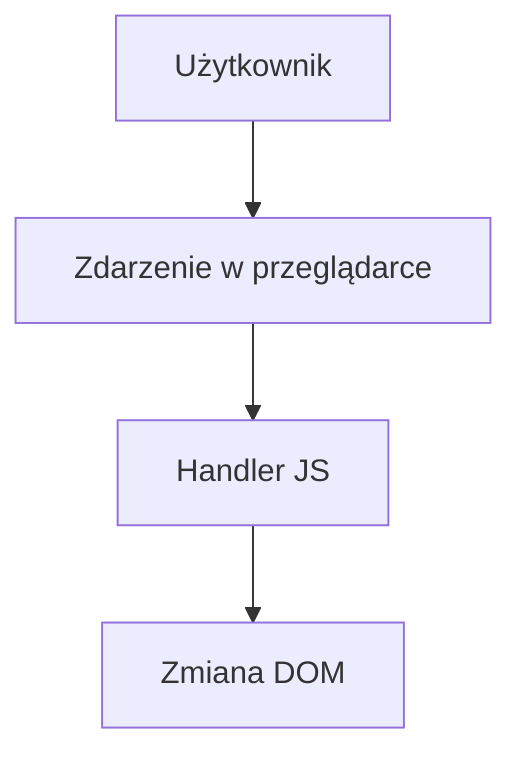

# Laboratorium 11: Podstawy JavaScript

## Cel zajęć
Wprowadzenie interaktywności na stronie za pomocą skryptów JS.

## Teoria w pigułce
- `const`/`let` — nowoczesne deklaracje zmiennych (unikaj `var`).
- DOM to drzewo elementów HTML, które JS może modyfikować.
- Zdarzenia (click, input) wywołują handler przypięty do elementu.

## Zadania
*Poniższe zadania są zadaniami sugerowanymi i mogą ulec modyfikacji przez prowadzącego zajęcia.*

1. Dodaj tag `<script>` na końcu swojej strony HTML.
2. Napisz funkcję w JavaScript, która po kliknięciu w przycisk wyświetli komunikat `alert("Cześć!")`.
3. Napisz skrypt, który po najechaniu myszką na obrazek zmieni jego źródło (`src`) na inne (efekt zmiany zdjęcia).
4. Stwórz prosty kalkulator: dwa pola tekstowe (`<input type="number">`) i przycisk, który po kliknięciu wypisze sumę tych liczb w elemencie ``.
5. Wykonaj walidację formularza: sprawdź, czy pole "Imię" nie jest puste przed wysłaniem. Jeśli jest puste, wyświetl komunikat błędu na czerwono pod polem.
6. Napisz skrypt, który dynamicznie zmienia kolor tła strony po kliknięciu wybranego przycisku.
7. Zaimplementuj funkcjonalność "Listy zadań" (To-Do List): pole tekstowe do wpisywania zadania oraz przycisk "Dodaj", który dopisuje nową pozycję do listy `<ul>` na stronie.
8. Dodaj do każdego elementu listy zadań przycisk "Usuń", który po kliknięciu usunie dane zadanie z listy.
9. Napisz skrypt, który wyświetla aktualną godzinę na stronie i aktualizuje ją co sekundę (użyj `setInterval`).
10. Zaimplementuj funkcję, która zmienia rozmiar czcionki w wybranym akapicie po kliknięciu w przyciski "+" i "-".
