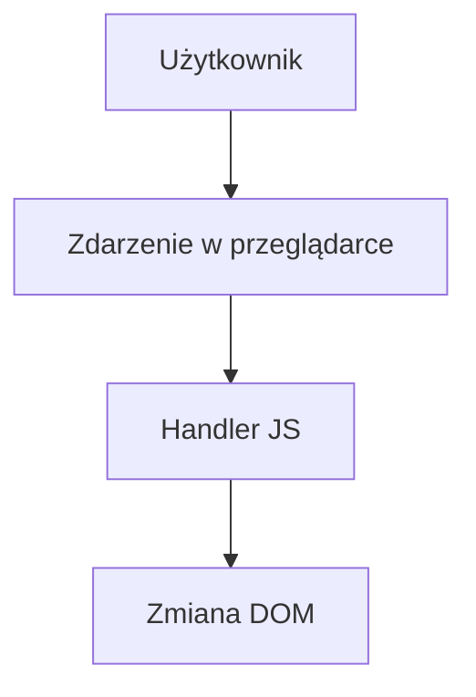
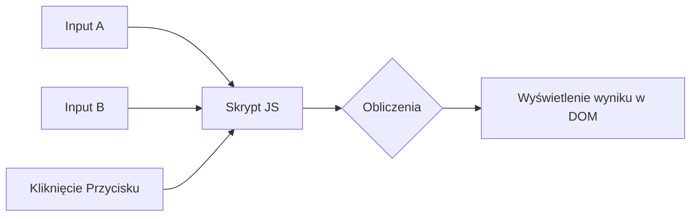

# Laboratorium 11: Podstawy JavaScript

## Cel zajęć

Wprowadzenie interaktywności na stronie za pomocą skryptów JS.

## Przygotowanie środowiska

Aby rozpocząć pracę z JavaScript:

1. Stwórz plik `index.html`.
1. Stwórz plik `script.js`.
1. Połącz je za pomocą tagu `<script src="script.js"></script>` umieszczonego przed zamykającym tagiem `</body>`.

## Teoria w pigułce

- `const`/`let` — nowoczesne deklaracje zmiennych.
- `DOM` (Document Object Model) — struktura obiektowa strony.
- `Zdarzenia` (np. `click`, `mouseover`, `submit`) — sposób na interakcję.

### Cykl obsługi zdarzenia


```mermaid
graph TD
  U[Użytkownik] --> E[Zdarzenie w przeglądarce]
  E --> H[Handler JS]
  H --> D[Zmiana DOM]
```

## Zadania i Przykłady

### Przykład 1: Pobieranie wartości z inputa

```html
<input type="text" id="imieInput" placeholder="Wpisz imię">
<button id="powitanieBtn">Przywitaj się</button>
<p id="wiadomosc"></p>

<script>
  const btn = document.getElementById('powitanieBtn');
  btn.addEventListener('click', () => {
    const imie = document.getElementById('imieInput').value;
    document.getElementById('wiadomosc').textContent = `Witaj, ${imie}!`;
  });
</script>
```

### Zadania do wykonania

*Poniższe zadania są zadaniami sugerowanymi i mogą ulec modyfikacji przez prowadzącego zajęcia.*

1. Dodaj tag `<script>` na końcu swojej strony HTML.
1. Napisz funkcję w JavaScript, która po kliknięciu w przycisk wyświetli komunikat `alert("Cześć!")`.
1. Napisz skrypt, który po najechaniu myszką na obrazek zmieni jego źródło (`src`) na inne (efekt zmiany zdjęcia).
1. **Kalkulator:** Stwórz dwa pola `<input type="number">` i przyciski dla operacji (+, -, \*, /). Wynik wyświetlaj w dedykowanym elemencie `<span>`.


```mermaid
graph LR
    In1[Input A] --> JS[Skrypt JS]
    In2[Input B] --> JS
    Btn[Kliknięcie Przycisku] --> JS
    JS --> Calc{Obliczenia}
    Calc --> Out[Wyświetlenie wyniku w DOM]
```

1. **Walidacja:** Sprawdź, czy pole "Imię" nie jest puste przed wysłaniem. Jeśli jest puste, wyświetl komunikat błędu na czerwono pod polem. Sprawdź również, czy e-mail zawiera znak `@`.
1. Napisz skrypt, który dynamicznie zmienia kolor tła strony po kliknięciu wybranego przycisku.
1. Zaimplementuj funkcjonalność "Listy zadań" (To-Do List): pole tekstowe do wpisywania zadania oraz przycisk "Dodaj", który dopisuje nową pozycję do listy `<ul>` na stronie.
1. Dodaj do każdego elementu listy zadań przycisk "Usuń", który po kliknięciu usunie dane zadanie z listy.
1. Napisz skrypt, który wyświetla aktualną godzinę na stronie i aktualizuje ją co sekundę (użyj `setInterval`).
1. Zaimplementuj funkcję, która zmienia rozmiar czcionki w wybranym akapicie po kliknięciu w przyciski "+" i "-".

## Wskazówki (Tips & Tricks)

- **Konsola to Twój przyjaciel:** Używaj `console.log()` do debugowania i sprawdzania, co przechowują Twoje zmienne.
- **`defer`:** Jeśli umieszczasz skrypt w `<head>`, dodaj atrybut `defer` do tagu `<script>`, aby skrypt wykonał się dopiero po załadowaniu całego dokumentu HTML.
- **Selektory:** `document.querySelector()` i `document.querySelectorAll()` są bardzo uniwersalne — pozwalają wybierać elementy tak jak w CSS (np. `.klasa`, `#id`, `div > p`).
- **Pojedynczy element vs Kolekcja:** `getElementById` i `querySelector` zwracają jeden element. `querySelectorAll` zwraca listę elementów, którą możesz przejść pętlą `forEach`.
