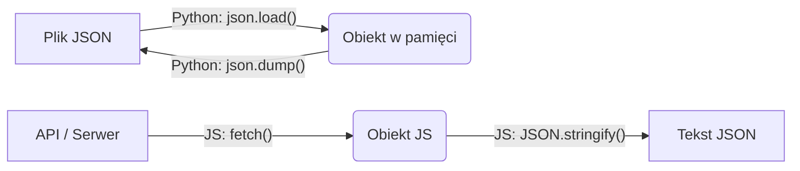

# Laboratorium 12: Praca z formatem JSON

## Cel zajęć

Wykorzystanie formatu JSON do przesyłania i przechowywania danych w językach Python i JavaScript.

## Teoria w pigułce

### JSON (JavaScript Object Notation)

- **Klucze:** zawsze w podwójnym cudzysłowie.
- **Wartości:** liczby, stringi, wartości logiczne, null, obiekty lub tablice.
- **Rozszerzenie pliku:** `.json`.

### Obsługa w różnych językach:

| Funkcja            | Python (`import json`)    | JavaScript (Natywne)             |
| :----------------- | :------------------------ | :------------------------------- |
| **Tekst → Obiekt** | `json.loads(tekst)`       | `JSON.parse(tekst)`              |
| **Obiekt → Tekst** | `json.dumps(obiekt)`      | `JSON.stringify(obiekt)`         |
| **Plik → Obiekt**  | `json.load(plik)`         | `fetch(url).then(r => r.json())` |
| **Obiekt → Plik**  | `json.dump(obiekt, plik)` | *Wymaga Node.js (fs)*            |



______________________________________________________________________

## Zadania

### Zadanie 1: Struktura danych

Stwórz plik `dane.json`, w którym zapiszesz informacje o 3 książkach. Każda książka powinna mieć: `tytuł`, `autor`, `rok_wydania` oraz listę `tagi`.

### Zadanie 2: JSON w JavaScript (Podstawy)

W konsoli przeglądarki (F12) wykonaj poniższe kroki:

1. Stwórz obiekt `auto` z polami `marka`, `model`.
1. Zamień go na string za pomocą `JSON.stringify()`.
1. Dodaj trzeci parametr do `stringify` (np. `2`), aby zobaczyć "ładne" formatowanie.

```javascript
const auto = { marka: "Tesla", model: "S" };
const jsonString = JSON.stringify(auto, null, 2);
console.log(jsonString);
```

### Zadanie 3: Odczyt z pliku (Python)

Napisz skrypt w Pythonie, który odczyta plik `dane.json` (z Zadania 1) i wypisze tylko tytuły książek w formie listy punktowanej.

### Zadanie 4: Praca z API (Fetch API)

Wykorzystaj darmowe API do pobrania danych. Wklej poniższy kod do konsoli przeglądarki i przeanalizuj jak działa:

```javascript
fetch('https://jsonplaceholder.typicode.com/users')
  .then(response => response.json())
  .then(users => {
    users.forEach(user => {
      console.log(`Użytkownik: ${user.name}, Miasto: ${user.address.city}`);
    });
  });
```

### Zadanie 5: Aktualizacja danych (Python)

Napisz program w Pythonie, który:

1. Wczyta plik `dane.json`.
1. Pobierze od użytkownika dane o nowej książce (`input()`).
1. Dopisze nową książkę do listy w obiekcie.
1. Zapisze zaktualizowaną listę z powrotem do pliku `dane.json`.

### Zadanie 6: Walidacja JSON

Napisz skrypt, który prosi użytkownika o wpisanie ciągu znaków JSON. Program ma sprawdzić, czy format jest poprawny. Użyj bloku `try-except` (Python) lub `try-catch` (JS).

### Zadanie 7: Dynamiczna tabela HTML (JS)

Stwórz prosty plik `index.html`. Napisz skrypt, który weźmie tablicę obiektów (np. listę studentów) i wygeneruje na jej podstawie tabelę `<table>` w dokumencie HTML.

### Zadanie 8: Porównywanie plików (Dla chętnych)

Napisz program, który wczytuje dwa pliki JSON i sprawdza, czy mają one te same klucze na głównym poziomie.

______________________________________________________________________

## Przydatne narzędzia

- [JSONLint](https://jsonlint.com/) – walidator online.
- [JSON Formatter](https://jsonformatter.curiousconcept.com/) – formatowanie i weryfikacja.
