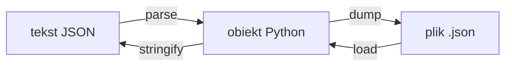

# Laboratorium 12: Praca z formatem JSON

## Cel zajęć

Wykorzystanie formatu JSON do przesyłania i przechowywania danych.

## Teoria w pigułce

- JSON: klucze w cudzysłowie, wartości: liczby, string, bool, null, obiekty, tablice.
- W Pythonie: `json.loads/loads` (tekst↔obiekt), `json.dump/dumps` (plik↔obiekt).
- Walidacja i obsługa błędów: `try/except` przy parsowaniu.

## Zadania

*Poniższe zadania są zadaniami sugerowanymi i mogą ulec modyfikacji przez prowadzącego zajęcia.*

1. Stwórz plik `dane.json`, w którym zapiszesz informacje o 3 książkach (tytuł, autor, rok wydania).
1. W języku JavaScript stwórz obiekt reprezentujący samochód. Użyj `JSON.stringify()`, aby zamienić go na tekst i wyświetlić w konsoli przeglądarki.
1. Napisz skrypt w Pythonie, który odczyta plik `dane.json` i wypisze tylko tytuły książek.
1. Użyj darmowego API (np. [JSONPlaceholder](https://jsonplaceholder.typicode.com/todos/1)), aby pobrać dane w formacie JSON (użyj modułu `requests` w Pythonie lub `fetch` w JavaScript).
1. Napisz program w Pythonie, który pobiera od użytkownika dane o nowej książce i dopisuje je do istniejącego pliku `dane.json`.
1. Stwórz skrypt, który parsuje złożony obiekt JSON zawierający zagnieżdżone listy i słowniki, a następnie wyciąga z niego konkretną informację (np. nazwę drugiego tagu u trzeciego użytkownika).
1. Napisz program, który konwertuje listę słowników w Pythonie na ładnie sformatowany (z wcięciami) ciąg znaków JSON i zapisuje go do pliku.
1. Napisz walidator JSON w Pythonie, który sprawdza, czy dany plik ma poprawną strukturę JSON (użyj `try-except`).
1. Stwórz skrypt w JavaScript, który wczytuje dane JSON (np. listę osób) i dynamicznie tworzy tabelę HTML na ich podstawie.
1. Napisz program, który porównuje dwa pliki JSON i wypisuje różnice między nimi (np. brakujące klucze).
