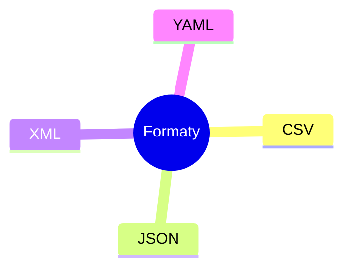

# Laboratorium 13: Ekstrakcja danych

## Cel zajęć
Poznanie różnych formatów danych (XML, YAML, CSV, JSON) oraz nabycie umiejętności ich przetwarzania i konwersji przy użyciu języka Python.

## Teoria w pigułce
- CSV: dane tabelaryczne; dobre do arkuszy, brak zagnieżdżeń.
- JSON: lekki, zagnieżdżone struktury, standard dla API.
- XML: rozbudowany, walidacja XSD, atrybuty.
- YAML: czytelny, idealny do konfiguracji; wrażliwy na wcięcia.

## Zadania
*Poniższe zadania są zadaniami sugerowanymi i mogą ulec modyfikacji przez prowadzącego zajęcia.*

### Część 1: Formaty znaczników i konfiguracji
1. Stwórz plik `konfiguracja.xml`, który opisuje ustawienia serwera (port, host, baza_danych, czy_debugowanie).
2. Przepisz zawartość pliku `konfiguracja.xml` na format `konfiguracja.yaml`. Porównaj liczbę linii i czytelność obu plików.
3. Stwórz plik YAML, który definiuje strukturę menu dla strony internetowej, zawierający elementy główne oraz podmenu.
4. Napisz program, który odczytuje plik `konfiguracja.xml` i wypisuje wartość atrybutu `port`.
5. Napisz skrypt, który wczytuje plik `konfiguracja.yaml` (używając biblioteki `PyYAML`) i zmienia w nim wartość `czy_debugowanie` na `false`, a następnie zapisuje zmiany do nowego pliku `config_prod.yaml`.

### Część 2: Przetwarzanie danych tabelarycznych i obiektowych
6. Stwórz plik `produkty.csv` z kolumnami: `id, nazwa, cena, ilosc`. Dodaj co najmniej 5 produktów.
7. Napisz program, który wczyta plik `produkty.csv`, a następnie:
   - Obliczy łączną wartość wszystkich produktów w magazynie (cena * ilość).
   - Wyfiltruje produkty, których cena jest wyższa niż 50 zł i zapisze je do nowego pliku `drogie_produkty.csv`.
8. Napisz skrypt, który zamieni plik `produkty.csv` na format JSON i zapisze go jako `produkty.json`.
9. Mając plik JSON z listą użytkowników, napisz program, który wypisze imiona użytkowników posortowane alfabetycznie.
10. Napisz skrypt, który odczytuje plik CSV i zlicza, ile razy każda wartość występuje w określonej kolumnie (np. ile produktów należy do danej kategorii).
11. **Zadanie zaawansowane:** Napisz uniwersalny konwerter, który przyjmuje plik CSV i konwertuje go na JSON lub YAML w zależności od wyboru użytkownika.
