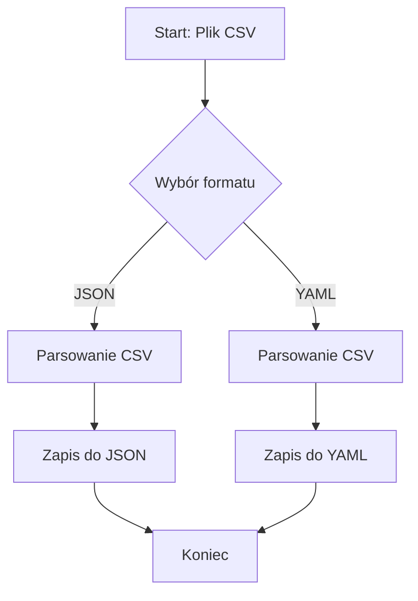

# Laboratorium 13: Ekstrakcja danych

## Cel zajęć

Poznanie różnych formatów danych (XML, YAML, CSV, JSON) oraz nabycie umiejętności ich przetwarzania i konwersji przy użyciu języka Python.

## Teoria w pigułce

| Format   | Rozszerzenie     | Główne zastosowanie          | Cecha charakterystyczna              |
| :------- | :--------------- | :--------------------------- | :----------------------------------- |
| **CSV**  | `.csv`           | Tabele, Arkusze kalkulacyjne | Separatory (przecinek, średnik)      |
| **JSON** | `.json`          | API, Aplikacje webowe        | Struktura klucz-wartość, lekkość     |
| **XML**  | `.xml`           | Dokumenty, Enterprise        | Tagi, atrybuty, ścisła struktura     |
| **YAML** | `.yaml` / `.yml` | Konfiguracja, DevOps         | Czytelność, wcięcia zamiast nawiasów |

### Szybka ściąga (Python):

- **CSV:** `import csv` -> `csv.DictReader(f)` / `csv.writer(f)`
- **JSON:** `import json` -> `json.load(f)` / `json.dump(d, f)`
- **XML:** `import xml.etree.ElementTree as ET` -> `ET.parse(file)`
- **YAML:** `import yaml` -> `yaml.safe_load(f)` (wymaga `pip install pyyaml`)

## Zadania

*Poniższe zadania są zadaniami sugerowanymi i mogą ulec modyfikacji przez prowadzącego zajęcia.*

### Część 1: Formaty znaczników i konfiguracji

1. Stwórz plik `konfiguracja.xml`, który opisuje ustawienia serwera.
   **Wymagana struktura:**
   ```xml
   <server>
       <connection port="8080" host="127.0.0.1" />
       <database>users_db</database>
       <debug>true</debug>
   </server>
   ```
1. Przepisz zawartość pliku `konfiguracja.xml` na format `konfiguracja.yaml`. Porównaj liczbę linii i czytelność obu plików.
1. Stwórz plik YAML, który definiuje strukturę menu dla strony internetowej, zawierający elementy główne oraz podmenu (użyj list i słowników).
1. Napisz program, który odczytuje plik `konfiguracja.xml` i wypisuje wartość atrybutu `port`.
1. Napisz skrypt, który wczytuje plik `konfiguracja.yaml` (używając biblioteki `PyYAML`) i zmienia w nim wartość `debug` na `false`, a następnie zapisuje zmiany do nowego pliku `config_prod.yaml`.

### Część 2: Przetwarzanie danych tabelarycznych i obiektowych

6. Stwórz plik `produkty.csv` z kolumnami: `id, nazwa, cena, ilosc`. Dodaj co najmniej 5 produktów.
1. Napisz program, który wczyta plik `produkty.csv`, a następnie:
   - Obliczy łączną wartość wszystkich produktów w magazynie (suma: `cena * ilosc`).
   - Wyfiltruje produkty, których cena jest wyższa niż 50 zł i zapisze je do nowego pliku `drogie_produkty.csv`.
1. Napisz skrypt, który zamieni plik `produkty.csv` na format JSON i zapisze go jako `produkty.json`. Postaraj się, aby wynikowy JSON był listą obiektów.
1. Mając plik JSON z listą użytkowników, napisz program, który wypisze imiona użytkowników posortowane alfabetycznie.
   **Przykładowy JSON:**
   ```json
   [
     {"id": 1, "imie": "Zofia"},
     {"id": 2, "imie": "Adam"}
   ]
   ```
1. Napisz skrypt, który odczytuje plik CSV i zlicza, ile razy każda wartość występuje w określonej kolumnie (np. ile produktów należy do danej kategorii).
1. **Zadanie zaawansowane (Konwerter):** Napisz uniwersalny konwerter, który przyjmuje plik CSV i konwertuje go na JSON lub YAML w zależności od wyboru użytkownika.


```mermaid
graph TD
    A[Start: Plik CSV] --> B{Wybór formatu}
    B -- "JSON" --> C[Parsowanie CSV]
    C --> D[Zapis do JSON]
    B -- "YAML" --> E[Parsowanie CSV]
    E --> F[Zapis do YAML]
    D --> G[Koniec]
    F --> G
```
