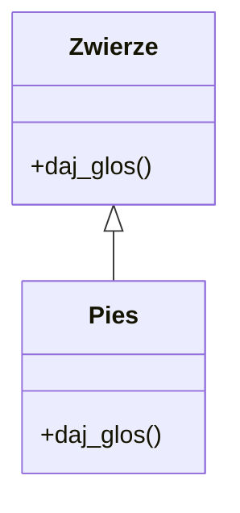

# Laboratorium 14: Sprawdzian z podstaw Pythona i OOP + Sprawdzian z technologii webowych

Poniżej znajdują się przykładowe zadania na kolokwium. Podobne zadania mogą wystąpić na właściwym kolokwium sprawdzającym umiejętności praktyczne. Poniższe zadania są zadaniami sugerowanymi i mogą ulec modyfikacji przez prowadzącego zajęcia.

## Cel
Sprawdzenie umiejętności z zakresu podstaw programowania w języku Python, pracy z kolekcjami, funkcjami oraz programowania obiektowego.

## Teoria w pigułce (zakres)
- Python: typy, instrukcje warunkowe, pętle, funkcje (parametry domyślne, `*args`, `**kwargs`), moduły, pliki, wyjątki.
- Kolekcje: listy, krotki, zbiory, słowniki + podstawowe metody.
- OOP: klasy, `__init__`, dziedziczenie, nadpisywanie metod, `__str__`.



## Przykładowe zadania

### Zadanie 1: Przetwarzanie danych liczbowych (Podstawy)
Napisz skrypt, który pobierze od użytkownika 5 liczb całkowitych i zapisze je na liście. Następnie program powinien wypisać:
- Sumę wszystkich liczb.
- Średnią arytmetyczną.
- Największą i najmniejszą wartość.

### Zadanie 2: Analiza tekstu (Ciągi znaków i Słowniki)
Napisz funkcję `licz_znaki(tekst)`, która przyjmuje ciąg znaków i zwraca słownik, w którym kluczami są poszczególne litery, a wartościami liczba ich wystąpień w tekście. Zignoruj wielkość liter i spacje.

### Zadanie 3: Zarządzanie biblioteką (OOP)
Stwórz klasę `Ksiazka` z atrybutami: `tytul`, `autor`, `rok_wydania`, `czy_wypozyczona` (domyślnie `False`).
- Dodaj metodę `wypozycz()`, która zmienia status na `True` (lub wypisuje komunikat, jeśli już jest wypożyczona).
- Dodaj metodę `__str__`, która zwraca czytelny opis książki.
- Stwórz listę kilku obiektów klasy `Ksiazka` i napisz pętlę, która wypisze tylko te książki, które zostały wydane po 2010 roku.

### Zadanie 4: Logika i kolekcje
Mając listę słowników reprezentujących pracowników:
```python
pracownicy = [
    {"imie": "Jan", "pensja": 4500},
    {"imie": "Anna", "pensja": 5500},
    {"imie": "Marek", "pensja": 3800}
]
```
Napisz program, który obliczy średnią pensję i wypisze imiona osób zarabiających powyżej średniej.

### Zadanie 5: Obsługa plików i wyjątków
Napisz program, który spróbuje otworzyć plik wskazany przez użytkownika. Jeśli plik nie istnieje, program powinien wyświetlić przyjazny komunikat o błędzie (użyj `try-except`). Jeśli plik istnieje, program powinien policzyć liczbę słów w tym pliku.

### Zadania 6-10 (Dodatkowe ćwiczenia)

### Zadanie 6: Generator haseł
Napisz funkcję `generuj_haslo(dlugosc)`, która zwraca losowy ciąg znaków o podanej długości, składający się z liter i cyfr.

### Zadanie 7: System ocen
Stwórz słownik, gdzie kluczami są nazwy przedmiotów, a wartościami listy ocen. Napisz program, który obliczy średnią ocen z każdego przedmiotu i wypisze przedmiot z najwyższą średnią.

### Zadanie 8: Dziedziczenie i pojazdy
Stwórz klasę `Pojazd` oraz klasy pochodne `Rower` i `Autobus`. Dodaj atrybuty specyficzne dla każdego pojazdu (np. liczba przerzutek, liczba miejsc siedzących) i nadpisz metodę `info()`.

### Zadanie 9: Filtrowanie plików tekstowych
Napisz skrypt, który odczytuje plik tekstowy i zapisuje do nowego pliku tylko te linie, które zawierają określone słowo kluczowe podane przez użytkownika.

### Zadanie 10: Suma liczb w tekście
Napisz program, który wyodrębni wszystkie liczby z podanego napisu (np. "W 2024 roku mam 2 koty") i obliczy ich sumę.
