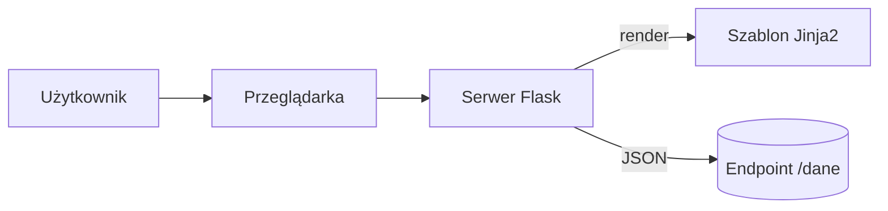

# Laboratorium 15 (poprawkowy) - Sprawdzian z podstaw Pythona i OOP + Sprawdzian z technologii webowych

Poniżej znajdują się przykładowe zadania na kolokwium. Podobne zadania mogą wystąpić na właściwym kolokwium sprawdzającym umiejętności praktyczne. Poniższe zadania są zadaniami sugerowanymi i mogą ulec modyfikacji przez prowadzącego zajęcia.

## Cel
Sprawdzenie umiejętności z zakresu technologii webowych (HTML, CSS, JS, Flask) oraz przetwarzania różnych formatów danych (JSON, XML, CSV, YAML).

## Teoria w pigułce (zakres)
- HTML/CSS: semantyka HTML5, box model, specyficzność, RWD (media queries, flex/grid).
- JS: `const`/`let`, funkcje strzałkowe, manipulacja DOM, zdarzenia.
- Flask: routing, szablony Jinja2, metody GET/POST.
- Dane: JSON/CSV/XML/YAML – podstawowe operacje konwersji.

## Przykładowe zadania

### Zadanie 1: HTML i CSS (Struktura i Styl)
Stwórz prostą stronę HTML zawierającą:
- Nagłówek poziomu 1.
- Tabelę z danymi trzech osób (Imię, Nazwisko, E-mail).
- Formularz kontaktowy z polami: Imię (text), E-mail (email) oraz Przycisk (submit).
Za pomocą CSS nadaj tabeli obramowanie, a nagłówek wycentruj i zmień jego kolor na granatowy.

### Zadanie 2: JavaScript (Interaktywność)
Napisz skrypt w JS, który:
- Pobierze tekst z pola input (z poprzedniego zadania).
- Po kliknięciu przycisku sprawdzi, czy pole nie jest puste.
- Jeśli jest puste, wyświetli alert z ostrzeżeniem.
- Jeśli nie jest puste, dopisze ten tekst jako nowy element listy <li> pod formularzem.

### Zadanie 3: Flask (Routing i Szablony)
Stwórz prostą aplikację we Flasku, która:
- Pod adresem / wyświetla powitanie "Witaj w aplikacji!".
- Pod adresem /uzytkownik/<name> wyświetla stronę HTML (używając Jinja2), która wita użytkownika podanym imieniem.
- Pod adresem /dane zwraca listę trzech miast w formacie JSON.

### Zadanie 4: Formaty danych (CSV i JSON)
Napisz skrypt w Pythonie, który wczyta plik osoby.csv, a następnie zapisze te same dane do pliku osoby.json w formacie listy słowników.

### Zadanie 5: Przetwarzanie plików konfiguracyjnych (YAML)
Stwórz plik config.yaml z ustawieniami bazy danych (host, port, user). Napisz program w Pythonie, który odczyta ten plik i wypisze sformatowany komunikat: "Łączenie z bazą [user] na host [host]...".

### Zadania 6-10 (Dodatkowe ćwiczenia)

### Zadanie 6: Flask i Formularze (Metoda POST)
Rozbuduj aplikację z zadania 3 o obsługę formularza przesłanego metodą POST. Po przesłaniu imienia i wieku, aplikacja powinna zwrócić stronę z informacją, czy użytkownik jest pełnoletni.

### Zadanie 7: JavaScript i Style
Napisz skrypt w JS, który po kliknięciu przycisku zmieni kolor tła całej strony na losowy kolor HEX.

### Zadanie 8: Przetwarzanie XML
Stwórz plik `pracownicy.xml` z listą pracowników. Napisz skrypt w Pythonie (używając `xml.etree.ElementTree`), który wczyta ten plik i wypisze nazwiska wszystkich pracowników zarabiających powyżej 5000 zł.

### Zadanie 9: CSS Grid i RWD
Stwórz układ strony z trzema kolumnami za pomocą CSS Grid. Zastosuj Media Queries tak, aby na telefonach (poniżej 600px) kolumny układały się jedna pod drugą.

### Zadanie 10: Integracja (JSON + Flask)
Napisz aplikację Flask, która odczytuje dane z pliku `produkty.json` i wyświetla je w formie tabeli HTML na stronie głównej.
