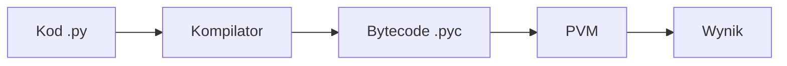

# Wykład 1: Wstęp do języka Python

## 1. Co to jest Python?
Python to język programowania wysokiego poziomu, ogólnego przeznaczenia, o dynamicznym typowaniu i interpretowalnym charakterze. Został stworzony przez Guido van Rossuma i wydany po raz pierwszy w 1991 roku.

### Kluczowe cechy Pythona:
- **Czytelność:** Składnia przypominająca język angielski.
- **Wieloparadygmatowość:** Wspiera programowanie obiektowe, strukturalne i funkcyjne.
- **Bogata biblioteka standardowa:** "Batteries included".
- **Przenośność:** Działa na Windows, Linux, macOS.

## 2. Historia i wersje
| Wersja | Data wydania | Kluczowe zmiany |
|--------|--------------|-----------------|
| Python 1.0 | 1994 | Pierwsza stabilna wersja |
| Python 2.0 | 2000 | List comprehensions, garbage collection |
| Python 3.0 | 2008 | Brak kompatybilności wstecznej, poprawa obsługi Unicode |

> **Ważne:** Obecnie standardem jest Python 3.x. Wsparcie dla Pythona 2 zakończyło się 1 stycznia 2020 roku.

## 3. Proces wykonywania kodu
Python jest językiem interpretowanym, ale kod przechodzi przez etap pośredni:
1. Kod źródłowy (`.py`)
2. Kompilacja do kodu bajtowego (Bytecode, `.pyc`)
3. Wykonanie przez maszynę wirtualną Pythona (PVM)



## 4. Instalacja
- Oficjalna strona: [python.org](https://www.python.org/)
- Zalecane środowiska (IDE): PyCharm, VS Code, Jupyter Notebook.

## 5. Pierwszy skrypt
```python
print("Witaj w świecie Pythona!")
```
