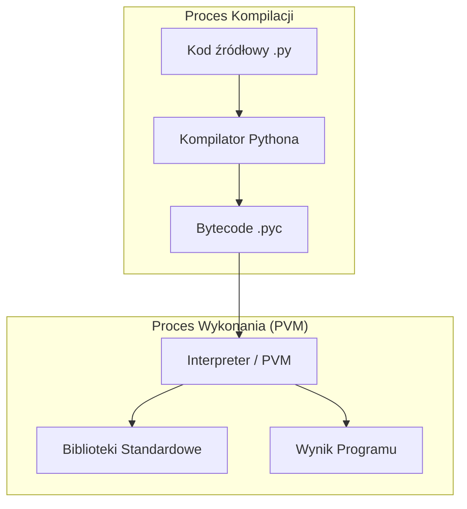
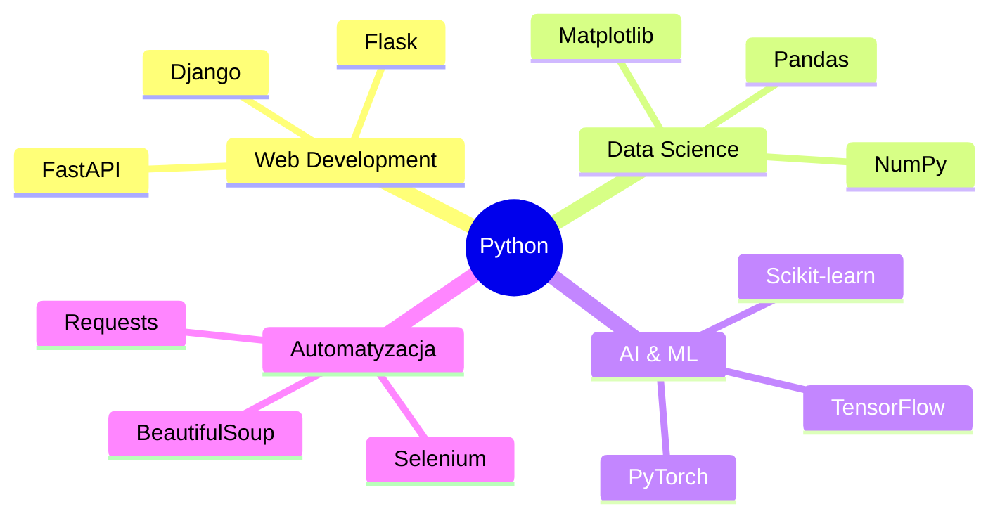

# Wykład 1: Wstęp do języka Python

## 1. Co to jest Python?
Python to język programowania wysokiego poziomu, ogólnego przeznaczenia, o dynamicznym typowaniu i interpretowalnym charakterze. Został stworzony przez Guido van Rossuma i wydany po raz pierwszy w 1991 roku. Nazwa języka nie pochodzi od węża, lecz od brytyjskiej grupy komediowej Monty Python.

### Dlaczego Python?
- **Łatwość nauki:** Składnia jest prosta i intuicyjna, co sprawia, że jest to idealny język dla początkujących.
- **Wszechstronność:** Stosowany w web developmencie (Django, Flask), nauce o danych (Pandas, NumPy), sztucznej inteligencji (TensorFlow, PyTorch), automatyzacji i wielu innych dziedzinach.
- **Ogromna społeczność:** Tysiące bibliotek i gotowych rozwiązań dostępnych w repozytorium PyPI.

### Kluczowe cechy Pythona:
- **Czytelność:** Składnia przypominająca język angielski, kładąca nacisk na czytelność kodu (PEP 8).
- **Dynamiczne typowanie:** Typ zmiennej jest określany w czasie wykonywania programu.
- **Zarządzanie pamięcią:** Automatyczne odśmiecanie pamięci (Garbage Collection).
- **Wieloparadygmatowość:** Wspiera programowanie obiektowe, strukturalne i funkcyjne.
- **Bogata biblioteka standardowa:** "Batteries included" – gotowe narzędzia do wielu zadań wbudowane w język.
- **Przenośność:** Działa na Windows, Linux, macOS.

## 2. Filozofia Pythona - Zen of Python
Python ma wbudowaną swoją filozofię, którą można wyświetlić wpisując w interpreterze:
```python
import this
```

Oto kilka kluczowych zasad:
- **Piękne jest lepsze niż brzydkie.**
- **Wyraźne jest lepsze niż domyślne.**
- **Proste jest lepsze niż złożone.**
- **Czytelność ma znaczenie.**

## 3. Unikalne cechy i "sztuczki" Pythona
Python oferuje wiele mechanizmów, które sprawiają, że kod jest bardziej zwięzły (tzw. "Pythonic way").

### 3.1. Wielokrotne przypisanie i zamiana zmiennych
W Pythonie można przypisać wiele wartości naraz, a zamiana wartości zmiennych nie wymaga zmiennej pomocniczej:
```python
a, b = 1, 2
a, b = b, a  # Zamiana: a=2, b=1
```

### 3.2. Rozpakowywanie (Unpacking)
```python
lista = [1, 2, 3]
x, y, z = lista  # x=1, y=2, z=3

# Rozszerzone rozpakowywanie
pierwszy, *reszta, ostatni = [1, 2, 3, 4, 5]
# pierwszy=1, reszta=[2, 3, 4], ostatni=5
```

### 3.3. Składanie list (List Comprehensions)
Elegancki sposób na tworzenie list:
```python
kwadraty = [x**2 for x in range(10) if x % 2 == 0]
# [0, 4, 16, 36, 64]
```

### 3.4. F-strings (Formatowanie napisów)
Najbardziej czytelny sposób łączenia tekstu ze zmiennymi:
```python
imie = "Anna"
print(f"Witaj, {imie.upper()}!")
```

## 4. Historia i wersje
| Wersja | Data wydania | Kluczowe zmiany |
|--------|--------------|-----------------|
| Python 1.0 | 1994 | Pierwsza stabilna wersja |
| Python 2.0 | 2000 | List comprehensions, garbage collection |
| Python 3.0 | 2008 | Brak kompatybilności wstecznej, poprawa obsługi Unicode |

> **Ważne:** Obecnie standardem jest Python 3.x. Wsparcie dla Pythona 2 zakończyło się 1 stycznia 2020 roku.

## 5. Proces wykonywania kodu
Python jest językiem interpretowanym, ale kod przechodzi przez etap pośredni:
1. Kod źródłowy (`.py`)
2. Kompilacja do kodu bajtowego (Bytecode, `.pyc`)
3. Wykonanie przez maszynę wirtualną Pythona (PVM)



## 6. Ekosystem Pythona
Python to nie tylko język, to cała infrastruktura:



## 7. Instalacja
- Oficjalna strona: [python.org](https://www.python.org/)
- Zalecane środowiska (IDE): PyCharm, VS Code, Jupyter Notebook.

## 8. Pierwszy skrypt
Poniżej znajduje się klasyczny przykład programu "Hello World" oraz nieco bardziej rozbudowany przykład interaktywny.

```python
# Klasyczny przykład
print("Witaj w świecie Pythona!")

# Przykład interaktywny
imie = input("Jak masz na imię? ")
rok_urodzenia = int(input("W którym roku się urodziłeś? "))
wiek = 2026 - rok_urodzenia

print(f"Cześć {imie}! Masz (lub będziesz mieć w tym roku) {wiek} lat.")
```

### Tryb interaktywny (REPL)
Python oferuje również tryb interaktywny, w którym można wpisywać polecenia bezpośrednio w konsoli i natychmiast otrzymywać wynik. Jest to doskonałe narzędzie do testowania krótkich fragmentów kodu.

```bash
$ python
>>> 2 + 2
4
>>> print("Test REPL")
Test REPL
```
