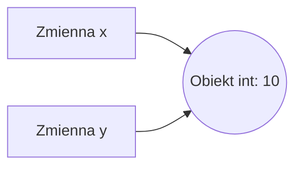

# Wykład 2: Podstawowe typy danych i operatory

## 1. Zmienne i dynamiczne typowanie
W Pythonie zmienna jest etykietą przypisaną do obiektu w pamięci. Nie musimy deklarować typu zmiennej przy jej tworzeniu – typ jest określany automatycznie na podstawie przypisanej wartości. Możemy również zmienić typ zmiennej w trakcie działania programu (choć zazwyczaj nie jest to zalecane).

### Referencje do obiektów
Warto zrozumieć, że w Pythonie zmienne nie "przechowują" wartości, lecz "wskazują" na obiekty.


Jeśli wykonamy `y = x`, obie zmienne wskazują na ten sam obiekt w pamięci.

### Zasady nazewnictwa zmiennych:
- Nazwy mogą zawierać litery, cyfry i podkreślenia (`_`).
- Nie mogą zaczynać się od cyfry.
- Są wrażliwe na wielkość liter (`wiek` i `Wiek` to dwie różne zmienne).
- Nie mogą być słowami kluczowymi Pythona (np. `if`, `for`, `class`).
- Zaleca się stosowanie stylu `snake_case` (np. `moje_imie`).

## 2. Podstawowe typy danych
| Typ | Opis | Przykład |
|-----|------|----------|
| `int` | Liczby całkowite o nieograniczonej precyzji | `5`, `-2`, `10**100` |
| `float` | Liczby zmiennoprzecinkowe (zgodne z IEEE 754) | `2.5`, `1.2e-3` |
| `complex` | Liczby zespolone | `3+5j` |
| `str` | Ciągi znaków (Unicode) | `"Cześć"`, `'Python'` |
| `bool` | Wartości logiczne | `True`, `False` |
| `NoneType` | Reprezentuje brak wartości (odpowiednik `null`) | `None` |

### Przykład z typami:
```python
liczba = 42
pi = 3.14159
tekst = "Python jest super"
czy_pada = False
pusta_zmienna = None

print(type(liczba)) # <class 'int'>
print(type(pi))     # <class 'float'>
```

## 3. Operatory arytmetyczne
- `+` dodawanie
- `-` odejmowanie
- `*` mnożenie
- `/` dzielenie (zawsze zwraca `float`)
- `//` dzielenie całkowite (obcina część ułamkową)
- `%` reszta z dzielenia (modulo)
- `**` potęgowanie

### Przykład:
```python
a = 10
b = 3

print(a + b)  # 13
print(a / b)  # 3.3333333333333335
print(a // b) # 3
print(a % b)  # 1
print(a ** b) # 1000
```

## 4. Operatory porównania i logiczne
| Operator | Opis | Przykład |
|----------|------|----------|
| `==` | Równe | `5 == 5` (True) |
| `!=` | Różne | `5 != 3` (True) |
| `>` , `<` | Większe, mniejsze | `10 > 2` (True) |
| `>=` , `<=` | Większe/równe, mniejsze/równe | `5 >= 5` (True) |
| `and` | Koniunkcja (I) | `True and False` (False) |
| `or` | Alternatywa (LUB) | `True or False` (True) |
| `not` | Negacja (NIE) | `not True` (False) |
| `is` | Identyczność obiektów | `x is y` |
| `in` | Sprawdzenie przynależności | `'a' in 'auto'` (True) |

### Skrócone operatory przypisania:
```python
x = 5
x += 3 # odpowiednik x = x + 3
x *= 2 # odpowiednik x = x * 2
```

### Priorytety operatorów (od najwyższego):
1. Nawiasy `()`
2. Potęgowanie `**`
3. Jednoargumentowe `+`, `-`, `~`
4. Mnożenie, dzielenie, reszta `*`, `/`, `//`, `%`
5. Dodawanie, odejmowanie `+`, `-`
6. Operatory porównania, `is`, `in`
7. Logiczne `not`, `and`, `or`

## 6. Praca z tekstami (Stringi)
Stringi w Pythonie są niemutowalne (nie można ich zmienić po utworzeniu, każda operacja tworzy nowy obiekt).

### Formatowanie f-string (od Python 3.6+):
```python
imie = "Anna"
wiek = 20
# Najwygodniejszy sposób formatowania
print(f"Cześć, mam na imię {imie} i mam {wiek} lat.")
# Można też wykonywać operacje wewnątrz nawiasów
print(f"Za rok będę mieć {wiek + 1} lat.")
```

### Metody klasy `str`:
- `strip()` – usuwa białe znaki z początku i końca.
- `split(separator)` – dzieli tekst na listę według separatora (domyślnie spacja).
- `join(iterable)` – łączy elementy listy w jeden tekst za pomocą separatora.
- `replace(stary, nowy)` – zamienia fragmenty tekstu.
- `upper()`, `lower()`, `capitalize()` – zmiana wielkości liter.

### Znaki ucieczki (Escape characters):
- `\n` – nowa linia.
- `\t` – tabulacja.
- `\\` – odwrotny ukośnik (backslash).
- `\"` , `\'` – cudzysłów i apostrof wewnątrz tekstu.

## 7. Biblioteka `math`
Dla bardziej zaawansowanych obliczeń Python dostarcza moduł `math`.

```python
import math

print(math.pi)       # 3.141592653589793
print(math.sqrt(16)) # 4.0 (pierwiastek)
print(math.ceil(2.1))# 3 (zaokrąglenie w górę)
print(math.floor(2.9))# 2 (zaokrąglenie w dół)
```
