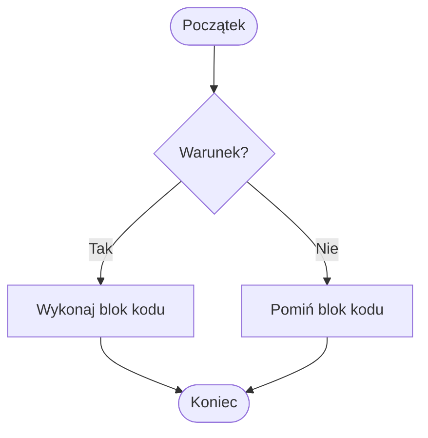
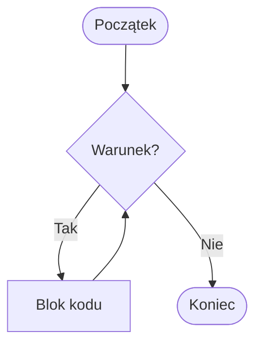

# Wykład 3: Struktury kontrolne

## 1. Instrukcje warunkowe
Instrukcja `if` pozwala na wykonywanie kodu tylko wtedy, gdy spełniony jest określony warunek. W Pythonie kluczowe jest stosowanie wcięć (zazwyczaj 4 spacje) do definiowania bloków kodu.



```python
wiek = 18

if wiek >= 18:
    print("Jesteś pełnoletni")
    print("Możesz głosować.")
elif wiek > 12:
    print("Jesteś nastolatkiem")
else:
    print("Jesteś dzieckiem")
```

### Złożone warunki:
Możemy łączyć warunki za pomocą operatorów `and`, `or` oraz `not`.

```python
temp = 25
czy_pada = False

if temp > 20 and not czy_pada:
    print("Idziemy na spacer!")
```

## 2. Pętla `while`
Wykonuje się dopóki warunek jest prawdziwy.



```python
licznik = 5
while licznik > 0:
    print(f"Odliczanie: {licznik}")
    licznik -= 1
print("Start!")
```

### Triki: Operator "Mors" (Walrus Operator `:=`)
Wprowadzony w Pythonie 3.8, pozwala na przypisanie wartości do zmiennej wewnątrz wyrażenia.
```python
# Zamiast:
# linia = input()
# while linia != "stop":
#     ...

# Można:
while (linia := input("Wpisz coś: ")) != "stop":
    print(f"Wpisałeś: {linia}")
```

## 3. Pętla `for`
Służy do iteracji po sekwencjach (listach, ciągach znaków, zakresach). W Pythonie pętla `for` działa bardziej jak *foreach* z innych języków.

### Funkcja `range()`:
`range(start, stop, step)` generuje sekwencję liczb.
- `range(5)` -> 0, 1, 2, 3, 4
- `range(2, 6)` -> 2, 3, 4, 5
- `range(0, 10, 2)` -> 0, 2, 4, 6, 8

```python
# Iteracja po zakresie
for x in range(5):
    print(f"Liczba: {x}")

# Iteracja po stringu
slowo = "Python"
for litera in slowo:
    print(litera.upper())
```

## 4. Instrukcje `break`, `continue` i `pass`
- `break`: Natychmiast przerywa działanie całej pętli.
- `continue`: Pomija resztę kodu w bieżącej iteracji i przechodzi do sprawdzenia warunku pętli.
- `pass`: Instrukcja pusta, używana jako wypełniacz (np. gdy składnia wymaga bloku kodu, ale nie chcemy jeszcze nic tam wpisywać).

```python
for i in range(10):
    if i == 3:
        continue # pominie wypisanie 3
    if i == 7:
        break    # zakończy pętlę na 7
    print(i)
```

## 5. Porównanie pętli
| Pętla | Zastosowanie |
|-------|--------------|
| `for` | Gdy znamy liczbę iteracji lub iterujemy po zbiorze |
| `while` | Gdy pętla ma trwać do spełnienia warunku |
