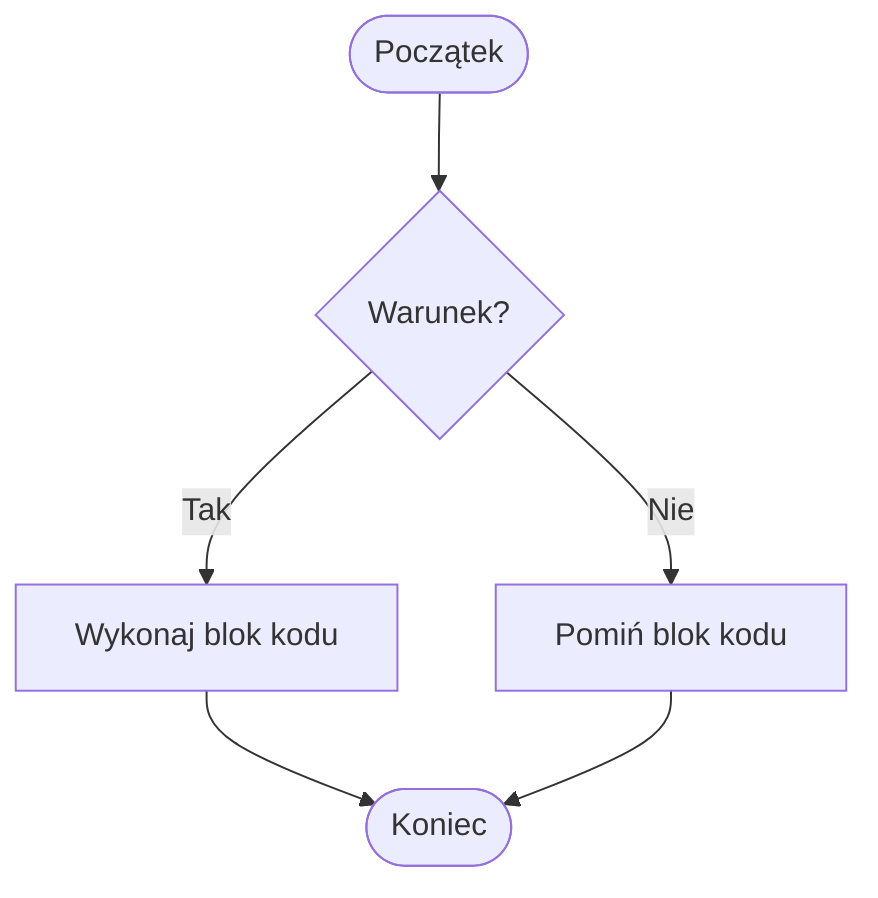
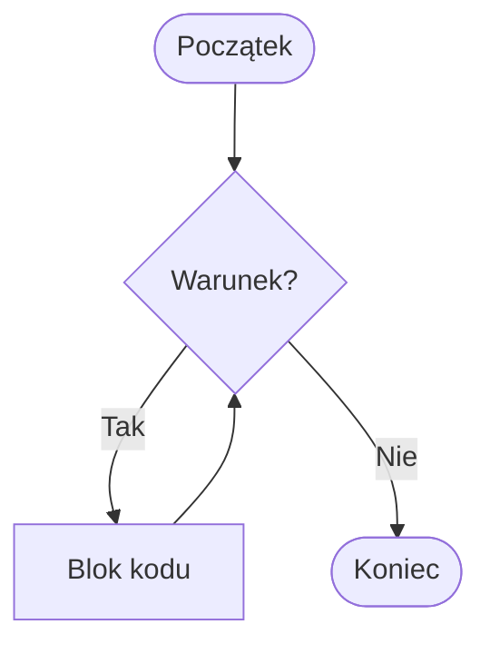

# Wykład 3: Struktury kontrolne

## 1. Instrukcje warunkowe

Instrukcja `if` pozwala na wykonywanie kodu tylko wtedy, gdy spełniony jest określony warunek. W Pythonie kluczowe jest stosowanie wcięć (zazwyczaj 4 spacje) do definiowania bloków kodu.


```mermaid
flowchart TD
    Start([Początek]) --> Cond{Warunek?}
    Cond -- Tak --> Action1[Wykonaj blok kodu]
    Cond -- Nie --> Action2[Pomiń blok kodu]
    Action1 --> End([Koniec])
    Action2 --> End
```

```python
wiek = 18

if wiek >= 18:
    print("Jesteś pełnoletni")
    print("Możesz głosować.")
elif wiek > 12:
    print("Jesteś nastolatkiem")
else:
    print("Jesteś dzieckiem")
```

### Złożone warunki:

Możemy łączyć warunki za pomocą operatorów `and`, `or` oraz `not`.

```python
temp = 25
czy_pada = False

if temp > 20 and not czy_pada:
    print("Idziemy na spacer!")
```

### Operator trójargumentowy (Ternary operator)

To zwięzły sposób zapisu prostej instrukcji `if-else`. Jest przydatny przy przypisywaniu wartości w jednej linii.

```python
wiek = 17
status = "dorosły" if wiek >= 18 else "niepełnoletni"
print(status)  # "niepełnoletni"
```

### Zagnieżdżone instrukcje warunkowe

Możemy umieszczać instrukcje `if` wewnątrz innych instrukcji `if`. Należy jednak uważać, by kod pozostał czytelny.

```python
x = 10
y = 5

if x > 0:
    if y > 0:
        print("Obie liczby są dodatnie")
    else:
        print("x jest dodatnie, ale y nie")
```

## 2. Instrukcja `match-case` (Python 3.10+)

To nowoczesny odpowiednik instrukcji `switch` znanej z innych języków. Pozwala na dopasowywanie wzorców (Pattern Matching), co jest znacznie potężniejsze niż zwykłe sprawdzanie wartości.

```python
status_code = 404

match status_code:
    case 200:
        print("Sukces!")
    case 400 | 401 | 404:  # Operator | (lub) pozwala na dopasowanie wielu wartości
        print("Błąd klienta")
    case 500:
        print("Błąd serwera")
    case _:  # Podkreślnik służy jako wzorzec domyślny (default)
        print("Nieznany kod statusu")
```

## 3. Pętla `while`

Wykonuje się dopóki warunek jest prawdziwy.


```mermaid
flowchart TD
    Start([Początek]) --> Cond{Warunek?}
    Cond -- Tak --> Action[Blok kodu]
    Action --> Cond
    Cond -- Nie --> End([Koniec])
```

```python
licznik = 5
while licznik > 0:
    print(f"Odliczanie: {licznik}")
    licznik -= 1
print("Start!")
```

### Triki: Operator "Mors" (Walrus Operator `:=`)

Wprowadzony w Pythonie 3.8, pozwala na przypisanie wartości do zmiennej wewnątrz wyrażenia.

```python
# Zamiast:
# linia = input()
# while linia != "stop":
#     ...

# Można:
while (linia := input("Wpisz coś: ")) != "stop":
    print(f"Wpisałeś: {linia}")
```

## 4. Pętla `for`

Służy do iteracji po sekwencjach (listach, ciągach znaków, zakresach). W Pythonie pętla `for` działa bardziej jak *foreach* z innych języków.

### Funkcja `range()`:

`range(start, stop, step)` generuje sekwencję liczb.

- `range(5)` -> 0, 1, 2, 3, 4
- `range(2, 6)` -> 2, 3, 4, 5
- `range(0, 10, 2)` -> 0, 2, 4, 6, 8

```python
# Iteracja po zakresie
for x in range(5):
    print(f"Liczba: {x}")

# Iteracja po stringu
slowo = "Python"
for litera in slowo:
    print(litera.upper())
```

### Klauzula `else` w pętlach

To unikalna cecha Pythona. Blok `else` po pętli (`for` lub `while`) wykonuje się **tylko wtedy**, gdy pętla zakończyła się naturalnie (przeszła przez wszystkie elementy), a **nie** została przerwana instrukcją `break`.

```python
# Przykład: Szukanie liczby pierwszej
n = 7
for i in range(2, n):
    if n % i == 0:
        print(f"{n} nie jest liczbą pierwszą, bo dzieli się przez {i}")
        break
else:
    # Ten blok wykona się tylko jeśli pętla NIE napotkała break
    print(f"{n} jest liczbą pierwszą!")
```

## 5. Instrukcje `break`, `continue` i `pass`

- `break`: Natychmiast przerywa działanie całej pętli.
- `continue`: Pomija resztę kodu w bieżącej iteracji i przechodzi do sprawdzenia warunku pętli.
- `pass`: Instrukcja pusta, używana jako wypełniacz (np. gdy składnia wymaga bloku kodu, ale nie chcemy jeszcze nic tam wpisywać).

```python
for i in range(10):
    if i == 3:
        continue  # pominie wypisanie 3
    if i == 7:
        break  # zakończy pętlę na 7
    print(i)
```

## 6. Porównanie pętli

| Pętla   | Zastosowanie                                       |
| ------- | -------------------------------------------------- |
| `for`   | Gdy znamy liczbę iteracji lub iterujemy po zbiorze |
| `while` | Gdy pętla ma trwać do spełnienia warunku           |

## 7. Przykłady praktyczne

### Przykład A: Proste menu wyboru

```python
while True:
    print("\n--- MENU ---")
    print("1. Przywitaj się")
    print("2. Pokaż datę")
    print("3. Wyjdź")

    wybor = input("Wybierz opcję: ")

    if wybor == "1":
        print("Cześć!")
    elif wybor == "2":
        import datetime

        print(f"Dzisiaj jest: {datetime.date.today()}")
    elif wybor == "3":
        print("Koniec programu.")
        break
    else:
        print("Niepoprawny wybór, spróbuj ponownie.")
```

### Przykład B: Filtracja danych (pętla z warunkiem)

```python
dane = [1, -5, 10, 0, 23, -2, 8]
dodatnie = []

for liczba in dane:
    if liczba > 0:
        dodatnie.append(liczba)

print(f"Liczby dodatnie: {dodatnie}")
```

## 8. Dobre praktyki

1. **Unikaj głębokich zagnieżdżeń** – Jeśli masz więcej niż 3 poziomy wcięć, pomyśl o wydzieleniu kodu do funkcji lub zmianie logiki (np. użyciu `continue` lub `return` wcześniej).
1. **Czytelność warunków** – Zamiast `if (x > 0) == True:`, pisz po prostu `if x > 0:`.
1. **Pętle nieskończone** – Używając `while True:`, zawsze upewnij się, że wewnątrz jest warunek wyjścia (`break`).
