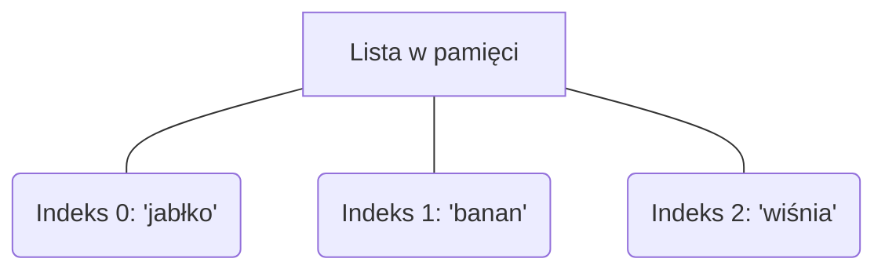

# Wykład 4: Kolekcje danych

## 1. Listy (`list`)
Uporządkowane, modyfikowalne kolekcje elementów. Pozwalają na przechowywanie elementów różnych typów oraz duplikatów. W pamięci listy są tablicami dynamicznymi, co oznacza, że dostęp do elementu po indeksie jest bardzo szybki (O(1)).



### Podstawowe metody list:
- **`append(x)`**: Dodaje element `x` na koniec listy.
- **`extend(iterable)`**: Rozszerza listę o elementy z podanego obiektu iterowalnego (np. innej listy).
- **`insert(i, x)`**: Wstawia element `x` na podaną pozycję `i`.
- **`remove(x)`**: Usuwa pierwszy napotkany element o wartości `x`.
- **`pop([i])`**: Usuwa i zwraca element z pozycji `i` (domyślnie ostatni).
- **`clear()`**: Usuwa wszystkie elementy z listy.
- **`index(x)`**: Zwraca indeks pierwszego elementu o wartości `x`.
- **`count(x)`**: Zwraca liczbę wystąpień wartości `x`.
- **`sort()`**: Sortuje listę w miejscu.
- **`reverse()`**: Odwraca kolejność elementów w miejscu.

### Praktyczne przykłady:

```python
owoce = ["jabłko", "banan", "wiśnia"]
owoce.extend(["mango", "granat"]) # dodanie wielu elementów
owoce.sort()                      # sortowanie alfabetyczne
print(owoce)                      # ['banan', 'granat', 'jabłko', 'mango', 'wiśnia']

liczby = [5, 2, 9, 1, 5, 6]
ile_piatek = liczby.count(5)      # 2
liczby.reverse()                  # odwrócenie listy
```

### List Comprehension (Listy składane):
Elegancki sposób na tworzenie nowych list na podstawie istniejących.
```python
# Tradycyjnie:
kwadraty = []
for x in range(10):
    kwadraty.append(x**2)

# List comprehension:
kwadraty = [x**2 for x in range(10)]

# Z warunkiem:
parzyste_kwadraty = [x**2 for x in range(10) if x % 2 == 0]
```

### Przydatne funkcje:
- **`enumerate()`**: Pobieranie indeksu i wartości jednocześnie.
- **`zip()`**: Łączenie dwóch list w pary.

```python
imiona = ["Adam", "Ewa"]
punkty = [10, 20]

for i, (imie, pkt) in enumerate(zip(imiona, punkty)):
    print(f"{i}. {imie} zdobył {pkt} pkt.")
```

## 2. Krotki (`tuple`)
Uporządkowane, **niemodyfikowalne** (immutable) kolekcje. Używamy ich, gdy chcemy mieć pewność, że dane nie zostaną zmienione w trakcie działania programu. Dzięki swojej niezmienności, krotki są nieco szybsze od list i mogą służyć jako klucze w słownikach.

### Metody krotek:
- **`count(x)`**: Zwraca liczbę wystąpień wartości `x`.
- **`index(x)`**: Zwraca indeks pierwszego wystąpienia wartości `x`.

### Przykłady i rozpakowywanie:
```python
wymiary = (1920, 1080)
# wymiary[0] = 800  # To wygeneruje błąd TypeError!

# Rozpakowywanie krotki
szerokosc, wysokosc = wymiary

# Rozpakowywanie z użyciem '*'
liczby = (1, 2, 3, 4, 5)
pierwszy, *reszta, ostatni = liczby
# pierwszy = 1, reszta = [2, 3, 4], ostatni = 5
```

## 3. Zbiory (`set`)
Nieuporządkowane kolekcje unikalnych elementów. Zbiory są implementowane za pomocą tablic mieszających (hash tables), co pozwala na sprawdzenie obecności elementu (`x in set`) w stałym czasie O(1).

### Metody zbiorów:
- **`add(x)`**: Dodaje element `x` do zbioru.
- **`remove(x)`**: Usuwa `x`. Jeśli nie istnieje, wyrzuca błąd.
- **`discard(x)`**: Usuwa `x`. Jeśli nie istnieje, nic nie robi.
- **`pop()`**: Usuwa i zwraca losowy element.
- **`clear()`**: Usuwa wszystkie elementy.

### Operacje matematyczne na zbiorach:
```python
A = {1, 2, 3, 4}
B = {3, 4, 5, 6}

print(A.union(B))            # Suma: {1, 2, 3, 4, 5, 6}  (alternatywa: A | B)
print(A.intersection(B))     # Część wspólna: {3, 4}     (alternatywa: A & B)
print(A.difference(B))       # Różnica (A-B): {1, 2}     (alternatywa: A - B)
print(A ^ B)                 # Różnica symetryczna: {1, 2, 5, 6}

# Sprawdzanie relacji:
C = {1, 2}
print(C.issubset(A))         # Czy C jest podzbiorem A? (True)
```

## 4. Słowniki (`dict`)
Bardzo wydajne kolekcje par klucz-wartość. Słowniki, podobnie jak zbiory, korzystają z tablic mieszających, co umożliwia dostęp do wartości po kluczu w czasie O(1).

### Metody słowników:
- **`get(key, default)`**: Bezpieczne pobieranie wartości. Zwraca `default`, jeśli klucza nie ma.
- **`keys()`**: Zwraca widok wszystkich kluczy.
- **`values()`**: Zwraca widok wszystkich wartości.
- **`items()`**: Zwraca widok par (klucz, wartość).
- **`pop(key)`**: Usuwa klucz i zwraca przypisaną mu wartość.
- **`update(other_dict)`**: Aktualizuje słownik o pary z innego słownika.
- **`clear()`**: Czyści słownik.

### Praktyczne przykłady:

```python
osoba = {
    "imię": "Anna",
    "wiek": 25,
    "miasto": "Kraków"
}

# Bezpieczne pobieranie klucza
print(osoba.get("zawód", "Nie podano")) # Nie podano

# Dodawanie/Aktualizacja
osoba["zawód"] = "Programistka"
osoba.update({"wiek": 26, "hobby": "góry"})

# Iteracja po słowniku
for klucz, wartosc in osoba.items():
    print(f"{klucz}: {wartosc}")
```

### Dictionary Comprehension (Słowniki składane):
```python
# Szybkie tworzenie słownika:
kwadraty = {x: x**2 for x in range(5)}
# {0: 0, 1: 1, 2: 4, 3: 9, 4: 16}
```

## 5. Podsumowanie kolekcji
| Cecha | Lista | Krotka | Zbiór | Słownik |
|-------|-------|--------|-------|---------|
| Uporządkowana | Tak | Tak | Nie | Tak (od 3.7) |
| Modyfikowalna | Tak | Nie | Tak | Tak |
| Duplikaty | Tak | Tak | Nie | Nie (klucze) |
| Indeksowanie | Tak | Tak | Nie | Tak (klucze) |

## 6. Slicing (wycinanie)
Działa na listach, stringach i krotkach. Składnia: `[start:stop:step]`.
- **`start`**: Indeks początkowy (włącznie).
- **`stop`**: Indeks końcowy (wyłącznie).
- **`step`**: Krok (co ile elementów wybierać).

### Przykłady:
```python
lista = [0, 1, 2, 3, 4, 5, 6, 7, 8, 9]

print(lista[1:4])      # [1, 2, 3]
print(lista[:3])       # [0, 1, 2]  (od początku)
print(lista[7:])       # [7, 8, 9]  (do końca)
print(lista[::2])      # [0, 2, 4, 6, 8] (co drugi)
print(lista[::-1])     # [9, 8, 7, 6, 5, 4, 3, 2, 1, 0] (odwrócenie)
print(lista[-3:])      # [7, 8, 9] (ostatnie trzy elementy)
```
