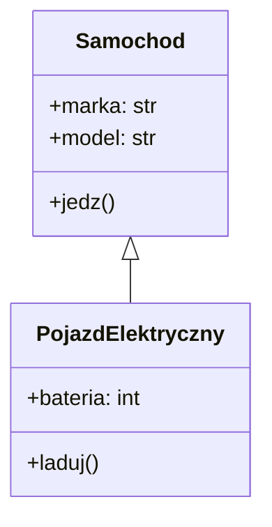

# Wykład 6: Programowanie obiektowe (OOP) w Pythonie

## 1. Klasy i Obiekty
Klasa to schemat (blueprint), a obiekt to konkretna instancja tej klasy.

```python
class Samochod:
    def __init__(self, marka, model):
        self.marka = marka
        self.model = model

    def jedz(self):
        print(f"{self.marka} {self.model} jedzie!")

moje_auto = Samochod("Toyota", "Corolla")
moje_auto.jedz()
```

## 2. Metoda `__init__`
Jest to konstruktor wywoływany automatycznie podczas tworzenia obiektu. Służy do inicjalizacji atrybutów.

## 3. Dziedziczenie
Pozwala klasie przejąć właściwości innej klasy.

```python
class PojazdElektryczny(Samochod):
    def __init__(self, marka, model, bateria):
        super().__init__(marka, model)
        self.bateria = bateria

    def laduj(self):
        print("Ładowanie baterii...")
```

## 4. Hermetyzacja (Enkapsulacja)
Python używa konwencji podkreślnika:
- `_atrybut` - chroniony (protected)
- `__atrybut` - prywatny (private)

## 5. Diagram Klas

