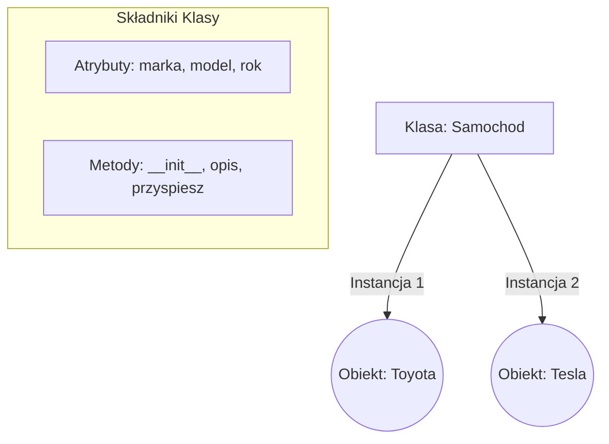
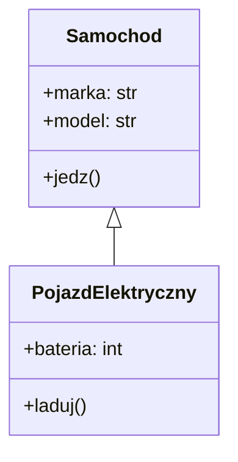

# Wykład 6: Programowanie obiektowe (OOP) w Pythonie

## 1. Klasy i Obiekty
Klasa to schemat (szablon), a obiekt to konkretna instancja tej klasy stworzona na jej podstawie. Programowanie obiektowe (OOP) pozwala na grupowanie danych i funkcji w logiczne jednostki.

### Koncepcja klasy i obiektu
Wyobraźmy sobie, że klasa to projekt architektoniczny domu, a obiekty to konkretne domy zbudowane według tego projektu.



```python
class Samochod:
    def __init__(self, marka, model, rok):
        self.marka = marka   # Atrybut instancji
        self.model = model
        self.rok = rok
        self.predkosc = 0    # Domyślny atrybut

    def opis(self):
        return f"{self.marka} {self.model} ({self.rok})"

    def przyspiesz(self, o_ile):
        self.predkosc += o_ile
        print(f"Prędkość: {self.predkosc} km/h")

# Tworzenie obiektów
auto1 = Samochod("Toyota", "Corolla", 2022)
auto2 = Samochod("Tesla", "Model 3", 2023)

print(auto1.opis())
auto1.przyspiesz(50)
```

## 2. Metoda `__init__` i `self`
- `__init__`: Specjalna metoda (konstruktor), wywoływana automatycznie przy tworzeniu obiektu.
- `self`: Reprezentuje bieżącą instancję klasy. Dzięki niemu mamy dostęp do atrybutów i metod danego obiektu. Musi być pierwszym argumentem każdej metody w klasie.

## 3. Dziedziczenie
Pozwala klasie (podklasie) przejąć właściwości i metody innej klasy (nadklasy). Służy do ponownego wykorzystania kodu i tworzenia hierarchii.

```python
class Samochod:
    def __init__(self, marka, model):
        self.marka = marka
        self.model = model

    def jedz(self):
        print(f"{self.marka} {self.model} jedzie!")

class PojazdElektryczny(Samochod):
    def __init__(self, marka, model, bateria_kwh):
        # Wywołanie konstruktora klasy nadrzędnej
        super().__init__(marka, model)
        self.bateria_kwh = bateria_kwh

    def laduj(self):
        print(f"Ładowanie baterii {self.bateria_kwh}kWh...")

tesla = PojazdElektryczny("Tesla", "S", 100)
tesla.jedz()  # Metoda odziedziczona
tesla.laduj() # Metoda własna
```

## 4. Hermetyzacja (Enkapsulacja) i Polimorfizm
Hermetyzacja to ukrywanie wewnętrznych szczegółów implementacji. W Pythonie stosuje się konwencję:
- `_atrybut`: Sugestia, że atrybut jest prywatny (tzw. *protected*).
- `__atrybut`: Powoduje *name mangling*, co utrudnia dostęp spoza klasy (tzw. *private*).

Polimorfizm pozwala różnym klasom posiadać metody o tej samej nazwie, które działają w specyficzny dla nich sposób.

```python
class Pies:
    def daj_glos(self):
        return "Hau hau!"

class Kot:
    def daj_glos(self):
        return "Miau!"

zwierzeta = [Pies(), Kot()]
for zwierze in zwierzeta:
    print(zwierze.daj_glos()) # Wywoła odpowiednią metodę dla każdego obiektu
```

## 5. Diagram Klas

