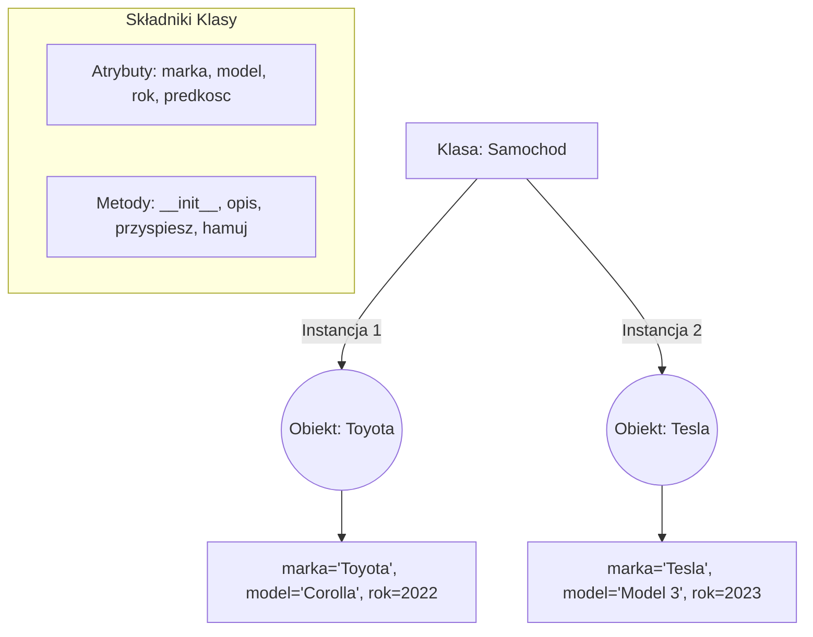
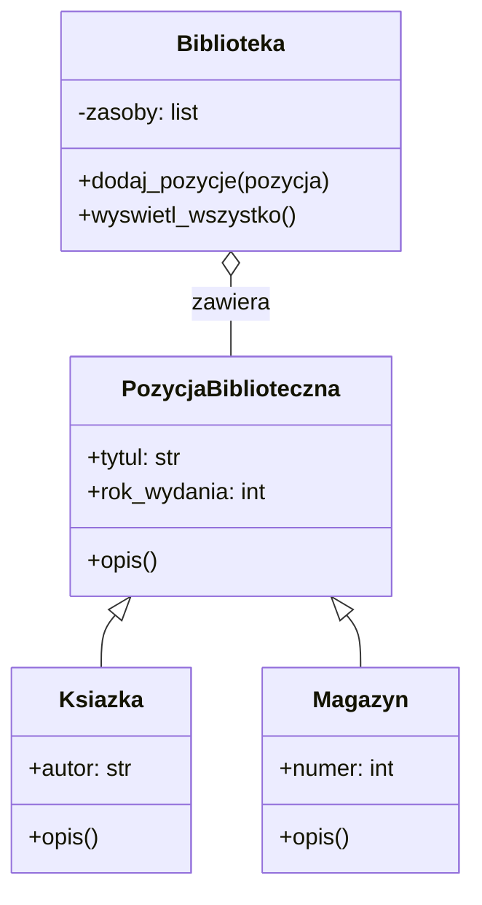

# Wykład 6: Programowanie obiektowe (OOP) w Pythonie

## 1. Klasy i Obiekty

Programowanie obiektowe (OOP) to paradygmat programowania, który opiera się na koncepcji "obiektów", które mogą zawierać dane (atrybuty) oraz kod (metody).

### Kluczowe pojęcia:

- **Klasa**: Szablon lub "przepis" na stworzenie obiektu. Definiuje, jakie dane i funkcje będzie posiadał obiekt.
- **Obiekt (Instancja)**: Konkretny byt stworzony na podstawie klasy. Każdy obiekt ma własny stan (wartości atrybutów).

### Koncepcja klasy i obiektu

Wyobraźmy sobie, że klasa to projekt architektoniczny domu, a obiekty to konkretne domy zbudowane według tego projektu. Każdy dom ma ten sam układ (atrybuty), ale może mieć inny kolor elewacji lub właściciela (wartości atrybutów).


```mermaid
graph TD
    Klasa[Klasa: Samochod] -- "Instancja 1" --> O1((Obiekt: Toyota))
    Klasa -- "Instancja 2" --> O2((Obiekt: Tesla))

    subgraph "Składniki Klasy"
    Atrybuty[Atrybuty: marka, model, rok, predkosc]
    Metody[Metody: __init__, opis, przyspiesz, hamuj]
    end

    O1 --> V1[marka='Toyota', model='Corolla', rok=2022]
    O2 --> V2[marka='Tesla', model='Model 3', rok=2023]
```

```python
class Samochod:
    """Klasa reprezentująca samochód."""

    def __init__(self, marka, model, rok):
        self.marka = marka  # Atrybut instancji
        self.model = model
        self.rok = rok
        self.predkosc = 0  # Domyślny atrybut
        print(f"Utworzono obiekt: {self.marka} {self.model}")

    def opis(self):
        """Zwraca sformatowany opis samochodu."""
        return f"{self.marka} {self.model} ({self.rok})"

    def przyspiesz(self, o_ile):
        """Zwiększa prędkość samochodu."""
        self.predkosc += o_ile
        print(f"Przyspieszanie... Aktualna prędkość: {self.predkosc} km/h")

    def hamuj(self):
        """Zatrzymuje samochód."""
        self.predkosc = 0
        print("Samochód się zatrzymał.")


# Tworzenie obiektów
auto1 = Samochod("Toyota", "Corolla", 2022)
auto2 = Samochod("Tesla", "Model 3", 2023)

print(auto1.opis())
auto1.przyspiesz(50)
auto1.hamuj()
```

## 2. Metoda `__init__`, `self` i metody specjalne

- **`__init__`**: Specjalna metoda (konstruktor), wywoływana automatycznie w momencie tworzenia nowej instancji klasy. Służy do inicjalizacji stanu obiektu.
- **`self`**: Reprezentuje bieżącą instancję klasy. Dzięki niemu mamy dostęp do atrybutów i metod danego obiektu wewnątrz definicji klasy. Musi być pierwszym argumentem każdej metody instancji.

### Metody specjalne (Magic Methods)

Python oferuje wiele metod zaczynających i kończących się podwójnym podkreśleniem (`__`), które pozwalają na definiowanie zachowań obiektów w specyficznych sytuacjach (np. wypisywanie, dodawanie).

- `__str__`: Definiuje, co ma zostać zwrócone, gdy obiekt jest zamieniany na napis (np. przez `print()`).
- `__repr__`: Bardziej techniczna reprezentacja obiektu, przydatna przy debugowaniu.

```python
class Ksiazka:
    def __init__(self, tytul, autor):
        self.tytul = tytul
        self.autor = autor

    def __str__(self):
        return f"'{self.tytul}' autorstwa {self.autor}"


ksiazka = Ksiazka("Wiedźmin", "Andrzej Sapkowski")
print(ksiazka)  # Wypisze: 'Wiedźmin' autorstwa Andrzej Sapkowski
```

## 3. Dziedziczenie

Dziedziczenie pozwala klasie (podklasie) przejąć właściwości i metody innej klasy (nadklasy). Jest to kluczowy mechanizm do ponownego wykorzystania kodu.

### Mechanizm `super()`

Funkcja `super()` pozwala na wywołanie metod z klasy nadrzędnej. Najczęściej używana jest wewnątrz `__init__`, aby zainicjalizować atrybuty zdefiniowane w klasie bazowej.

```python
class Pojazd:
    def __init__(self, marka):
        self.marka = marka
        print("Inicjalizacja Pojazdu")

    def poruszaj_sie(self):
        print(f"{self.marka} rusza z miejsca!")


class SamochodElektryczny(Pojazd):
    def __init__(self, marka, bateria_kwh):
        # Wywołanie konstruktora klasy nadrzędnej
        super().__init__(marka)
        self.bateria_kwh = bateria_kwh
        print("Inicjalizacja Samochodu Elektrycznego")

    def poruszaj_sie(self):
        # Nadpisywanie metody (Method Overriding)
        super().poruszaj_sie()  # Możemy wywołać wersję z klasy bazowej
        print("...i robi to bardzo cicho!")

    def laduj(self):
        print(f"Ładowanie baterii {self.bateria_kwh}kWh...")


tesla = SamochodElektryczny("Tesla", 100)
tesla.poruszaj_sie()
tesla.laduj()
```

## 4. Hermetyzacja (Enkapsulacja)

Hermetyzacja to ukrywanie wewnętrznych szczegółów implementacji obiektu i udostępnianie tylko niezbędnego interfejsu. W Pythonie nie ma ścisłych modyfikatorów dostępu (jak `private` w Java), ale stosuje się konwencje:

- `_atrybut`: (Protected) Sugestia dla programisty, że atrybut jest przeznaczony do użytku wewnętrznego.
- `__atrybut`: (Private) Powoduje tzw. *name mangling*, co utrudnia bezpośredni dostęp spoza klasy.

### Dekorator `@property` (Gettery i Settery)

Pozwala na definiowanie metod, które można wywoływać tak, jakby były atrybutami. Służy do kontrolowanego dostępu do danych.

```python
class KontoBankowe:
    def __init__(self, saldo_poczatkowe):
        self.__saldo = saldo_poczatkowe  # Atrybut prywatny

    @property
    def saldo(self):
        """Getter dla salda."""
        return f"{self.__saldo} PLN"

    @saldo.setter
    def saldo(self, kwota):
        """Setter dla salda z walidacją."""
        if kwota >= 0:
            self.__saldo = kwota
        else:
            print("Błąd: Saldo nie może być ujemne!")


konto = KontoBankowe(1000)
print(konto.saldo)  # Wywołuje getter
konto.saldo = 1500  # Wywołuje setter
konto.saldo = -100  # Wyświetli błąd
```

## 5. Polimorfizm

Polimorfizm pozwala różnym klasom posiadać metody o tej samej nazwie, które realizują to samo zadanie w różny sposób. Pozwala to na traktowanie obiektów różnych klas w jednolity sposób.

```python
class Ptak:
    def wydaj_dzwiek(self):
        pass


class Kaczka(Ptak):
    def wydaj_dzwiek(self):
        return "Kwa kwa!"


class Wrobel(Ptak):
    def wydaj_dzwiek(self):
        return "Ćwir ćwir!"


ptaki = [Kaczka(), Wrobel()]

for ptak in ptaki:
    print(ptak.wydaj_dzwiek())
```

## 6. Praktyczny przykład: System Biblioteczny

Poniżej znajduje się przykład łączący poznane koncepcje.


```mermaid
classDiagram
    class PozycjaBiblioteczna {
        +tytul: str
        +rok_wydania: int
        +opis()
    }
    class Ksiazka {
        +autor: str
        +opis()
    }
    class Magazyn {
        +numer: int
        +opis()
    }
    PozycjaBiblioteczna <|-- Ksiazka
    PozycjaBiblioteczna <|-- Magazyn

    class Biblioteka {
        -zasoby: list
        +dodaj_pozycje(pozycja)
        +wyswietl_wszystko()
    }
    Biblioteka o-- PozycjaBiblioteczna : zawiera
```

```python
class PozycjaBiblioteczna:
    def __init__(self, tytul, rok_wydania):
        self.tytul = tytul
        self.rok_wydania = rok_wydania

    def opis(self):
        return f"{self.tytul} ({self.rok_wydania})"


class Ksiazka(PozycjaBiblioteczna):
    def __init__(self, tytul, rok_wydania, autor):
        super().__init__(tytul, rok_wydania)
        self.autor = autor

    def opis(self):
        return f"Książka: {super().opis()}, Autor: {self.autor}"


class Magazyn(PozycjaBiblioteczna):
    def __init__(self, tytul, rok_wydania, numer):
        super().__init__(tytul, rok_wydania)
        self.numer = numer

    def opis(self):
        return f"Magazyn: {super().opis()}, Numer: {self.numer}"


class Biblioteka:
    def __init__(self):
        self.__zasoby = []

    def dodaj_pozycje(self, pozycja):
        if isinstance(pozycja, PozycjaBiblioteczna):
            self.__zasoby.append(pozycja)
        else:
            print("Błąd: To nie jest poprawna pozycja biblioteczna!")

    def wyswietl_wszystko(self):
        print("--- Zasoby Biblioteki ---")
        for p in self.__zasoby:
            print(p.opis())  # Polimorficzne wywołanie metody opis()


# Użycie systemu
moja_biblioteka = Biblioteka()
moja_biblioteka.dodaj_pozycje(Ksiazka("Hobbit", 1937, "J.R.R. Tolkien"))
moja_biblioteka.dodaj_pozycje(Magazyn("National Geographic", 2023, 12))

moja_biblioteka.wyswietl_wszystko()
```

## 7. Podsumowanie

- **Klasa** to szablon, **obiekt** to instancja.
- **`__init__`** to konstruktor, **`self`** to odwołanie do instancji.
- **Dziedziczenie** pozwala na hierarchię klas i reużywalność.
- **Hermetyzacja** chroni dane przed niepowołanym dostępem.
- **Polimorfizm** pozwala na wspólny interfejs dla różnych typów.
