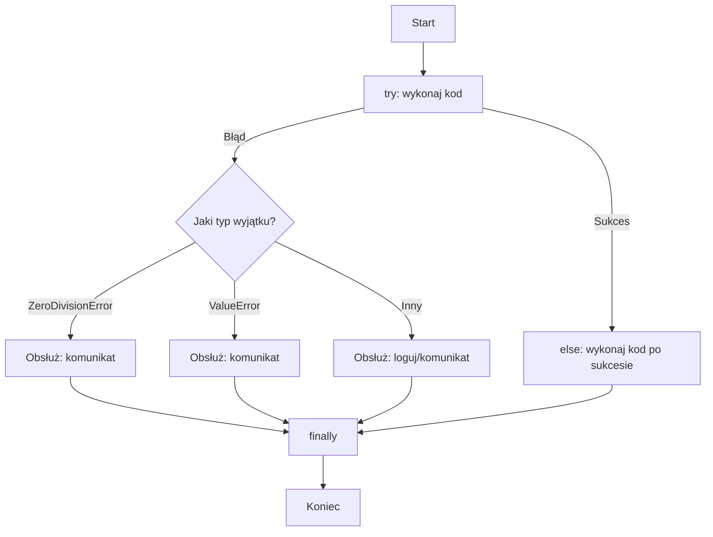

# Wykład 7: Obsługa wyjątków i praca z systemem plików

## 1. Obsługa wyjątków
Wyjątki to błędy wykryte podczas wykonywania programu (runtime errors). Blok `try-except` pozwala na przechwycenie błędu i zapobieganie nagłemu zakończeniu programu.



```python
try:
    liczba = int(input("Podaj liczbę: "))
    wynik = 10 / liczba
except ZeroDivisionError:
    print("Błąd: Nie można dzielić przez zero!")
except ValueError:
    print("Błąd: Musisz podać liczbę całkowitą!")
except Exception as e:
    print(f"Wystąpił nieoczekiwany błąd: {e}")
else:
    # Wykona się tylko, jeśli w try nie wystąpił błąd
    print(f"Wynik to: {wynik}")
finally:
    # Wykona się zawsze (np. do zamykania połączeń/plików)
    print("Koniec operacji.")
```

### Podnoszenie wyjątków:
Możemy sami wywołać błąd za pomocą słowa kluczowego `raise`.

```python
def sprawdz_wiek(wiek):
    if wiek < 0:
        raise ValueError("Wiek nie może być ujemny!")
    return wiek
```

## 2. Praca z plikami
Zawsze zaleca się używanie menadżera kontekstu `with`. Gwarantuje on poprawne zamknięcie pliku, nawet jeśli wystąpi błąd.

```mermaid
flowchart LR
    Open[open('dane.txt', 'w')] --> With[with ... as f]
    With --> Write[f.write / f.writelines]
    With --> AutoClose[automatyczne zamknięcie pliku]
```

### Zapisywanie do pliku (`w` - write, `a` - append):
```python
linie = ["Pierwsza linia\n", "Druga linia\n", "Trzecia linia\n"]

with open("dane.txt", "w", encoding="utf-8") as f:
    f.write("Nagłówek\n")
    f.writelines(linie)
```

### Odczytywanie z pliku (`r` - read):
```python
# Odczyt całego pliku
with open("dane.txt", "r", encoding="utf-8") as f:
    tresc = f.read()

# Odczyt linia po linii (bardziej wydajne dla dużych plików)
with open("dane.txt", "r", encoding="utf-8") as f:
    for linia in f:
        print(linia.strip()) # strip() usuwa znaki nowej linii
```

## 3. Moduł `os` i `pathlib`
Współczesny Python zaleca używanie biblioteki `pathlib` do pracy ze ścieżkami, ponieważ jest ona bardziej obiektowa i intuicyjna niż stary moduł `os`.

```python
from pathlib import Path

# Tworzenie obiektu ścieżki
p = Path("dane.txt")

if p.exists():
    print(f"Plik {p.name} istnieje")
    print(f"Rozmiar: {p.stat().st_size} bajtów")

# Tworzenie katalogu
nowy_folder = Path("moje_dane")
nowy_folder.mkdir(exist_ok=True)
```
