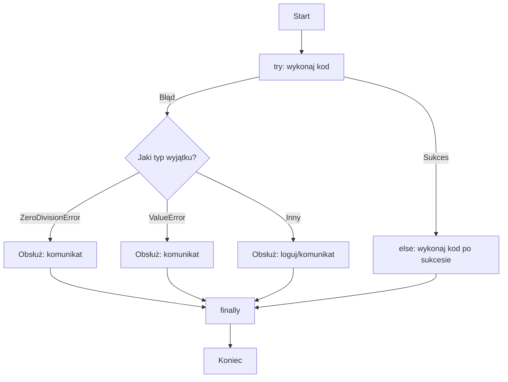
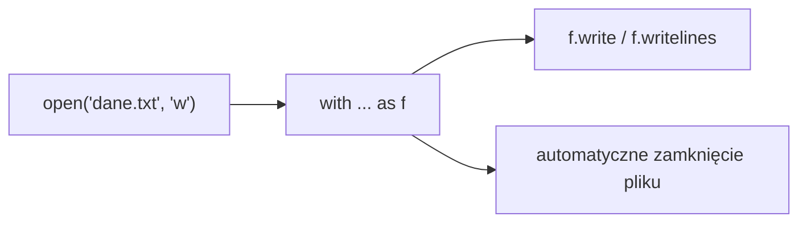
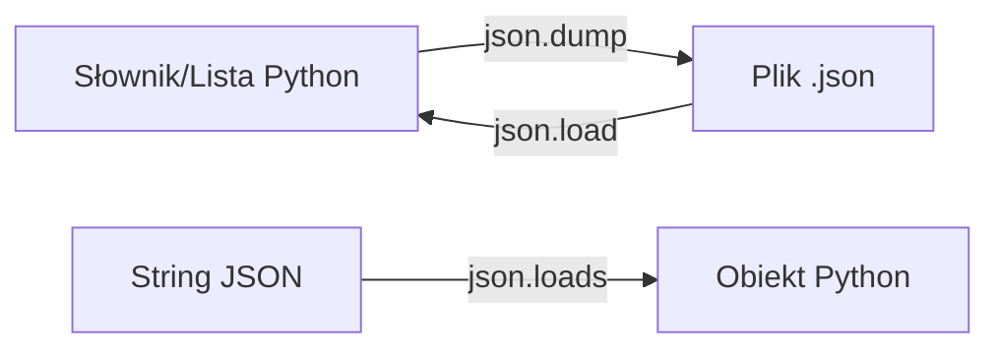

# Wykład 7: Obsługa wyjątków i praca z systemem plików

## 1. Obsługa wyjątków

Wyjątki to błędy wykryte podczas wykonywania programu (runtime errors). Blok `try-except` pozwala na przechwycenie błędu i zapobieganie nagłemu zakończeniu programu.


```mermaid
flowchart TD
    A[Start] --> T[try: wykonaj kod]
    T -->|Sukces| ELS[else: wykonaj kod po sukcesie]
    T -->|Błąd| EX{Jaki typ wyjątku?}
    EX -->|ZeroDivisionError| H1[Obsłuż: komunikat]
    EX -->|ValueError| H2[Obsłuż: komunikat]
    EX -->|Inny| H3[Obsłuż: loguj/komunikat]
    H1 --> FIN[finally]
    H2 --> FIN
    H3 --> FIN
    ELS --> FIN
    FIN --> END[Koniec]
```

```python
try:
    liczba = int(input("Podaj liczbę: "))
    wynik = 10 / liczba
except ZeroDivisionError:
    print("Błąd: Nie można dzielić przez zero!")
except ValueError:
    print("Błąd: Musisz podać liczbę całkowitą!")
except Exception as e:
    print(f"Wystąpił nieoczekiwany błąd: {e}")
else:
    # Wykona się tylko, jeśli w try nie wystąpił błąd
    print(f"Wynik to: {wynik}")
finally:
    # Wykona się zawsze (np. do zamykania połączeń/plików)
    print("Koniec operacji.")
```

### Podnoszenie wyjątków:

Możemy sami wywołać błąd za pomocą słowa kluczowego `raise`.

```python
def sprawdz_wiek(wiek):
    if wiek < 0:
        raise ValueError("Wiek nie może być ujemny!")
    return wiek
```

## 2. Praca z plikami

Zawsze zaleca się używanie menadżera kontekstu `with`. Gwarantuje on poprawne zamknięcie pliku, nawet jeśli wystąpi błąd.


```mermaid
flowchart LR
    Open["open('dane.txt', 'w')"] --> With["with ... as f"]
    With --> Write["f.write / f.writelines"]
    With --> AutoClose[automatyczne zamknięcie pliku]
```

### Zapisywanie do pliku (`w` - write, `a` - append):

```python
linie = ["Pierwsza linia\n", "Druga linia\n", "Trzecia linia\n"]

with open("dane.txt", "w", encoding="utf-8") as f:
    f.write("Nagłówek\n")
    f.writelines(linie)
```

### Odczytywanie z pliku (`r` - read):

```python
# Odczyt całego pliku
with open("dane.txt", "r", encoding="utf-8") as f:
    tresc = f.read()

# Odczyt linia po linii (bardziej wydajne dla dużych plików)
with open("dane.txt", "r", encoding="utf-8") as f:
    for linia in f:
        print(linia.strip())  # strip() usuwa znaki nowej linii
```

## 3. Formaty danych: CSV i JSON

### Format CSV (Comma Separated Values)

Służy do przechowywania danych tabelarycznych. Do obsługi używamy modułu `csv`.

```python
import csv

# Odczyt danych z pliku CSV (DictReader - wiersz jako słownik)
with open("produkty.csv", mode="r", encoding="utf-8") as f:
    czytelnik = csv.DictReader(f)
    for wiersz in czytelnik:
        print(f"Produkt: {wiersz['nazwa']}, Cena: {wiersz['cena']}")

# Zapis danych do pliku CSV
dane = [{"nazwa": "Chleb", "cena": 4.50}, {"nazwa": "Mleko", "cena": 3.20}]
with open("nowe_produkty.csv", mode="w", newline="", encoding="utf-8") as f:
    naglowki = ["nazwa", "cena"]
    pisarz = csv.DictWriter(f, fieldnames=naglowki)
    pisarz.writeheader()
    pisarz.writerows(dane)
```

### Format JSON (JavaScript Object Notation)

Lekki format wymiany danych, mapowany na słowniki i listy w Pythonie.


```mermaid
flowchart LR
    Dict[Słownik/Lista Python] -- json.dump --> JSONFile[Plik .json]
    JSONFile -- json.load --> Dict
    String[String JSON] -- json.loads --> PythonObj[Obiekt Python]
```

```python
import json

dane_osoby = {
    "imie": "Jan",
    "wiek": 30,
    "miasto": "Warszawa",
    "umiejetnosci": ["Python", "SQL"],
}

# Serializacja (Zapis do pliku)
with open("dane.json", "w", encoding="utf-8") as f:
    json.dump(dane_osoby, f, indent=4, ensure_ascii=False)

# Deserializacja (Odczyt z pliku)
with open("dane.json", "r", encoding="utf-8") as f:
    wczytane_dane = json.load(f)
    print(wczytane_dane["imie"])  # Jan
```

## 4. Moduły systemowe: pathlib, os, shutil, glob

### Pathlib i OS

Współczesny Python zaleca używanie biblioteki `pathlib` do pracy ze ścieżkami.

```python
from pathlib import Path
import os

# Tworzenie obiektu ścieżki
p = Path("dane.txt")

if p.exists():
    print(f"Plik {p.name} istnieje")
    print(f"Rozmiar: {p.stat().st_size} bajtów")

# Tworzenie katalogu
nowy_folder = Path("moje_dane")
nowy_folder.mkdir(exist_ok=True)
```

### Moduł `shutil` (operacje wysokopoziomowe)

Służy do kopiowania, przenoszenia i usuwania plików/folderów.

```python
import shutil

# Kopiowanie pliku
shutil.copy("dane.txt", "kopia_danych.txt")

# Usuwanie całego drzewa katalogów (ostrożnie!)
# shutil.rmtree("moje_dane")
```

### Moduł `glob` (wyszukiwanie plików)

Pomaga w znajdowaniu plików pasujących do wzorca (wildcards).

```python
import glob

# Znajdź wszystkie pliki .txt w bieżącym folderze
pliki_txt = glob.glob("*.txt")
print(f"Znalezione pliki tekstowe: {pliki_txt}")

# Rekurencyjne szukanie (Python 3.5+)
wszystkie_py = glob.glob("**/*.py", recursive=True)
```
