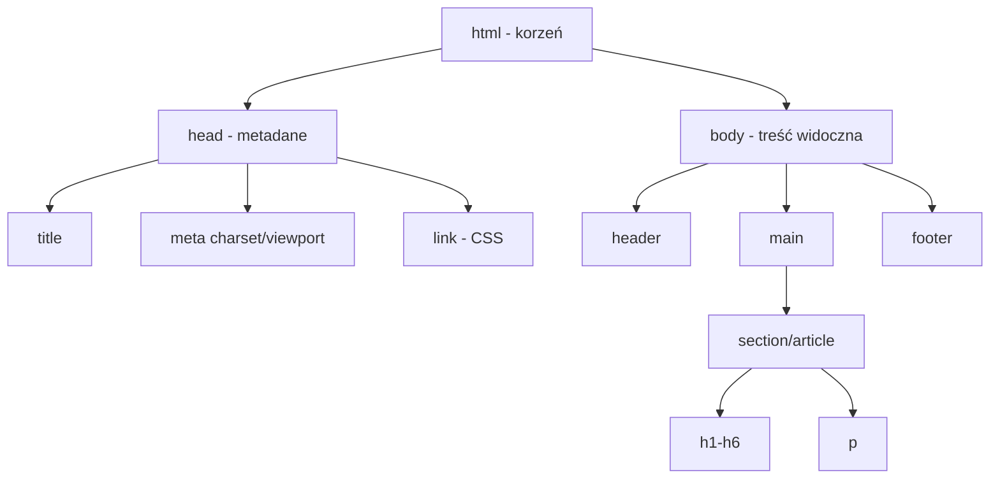
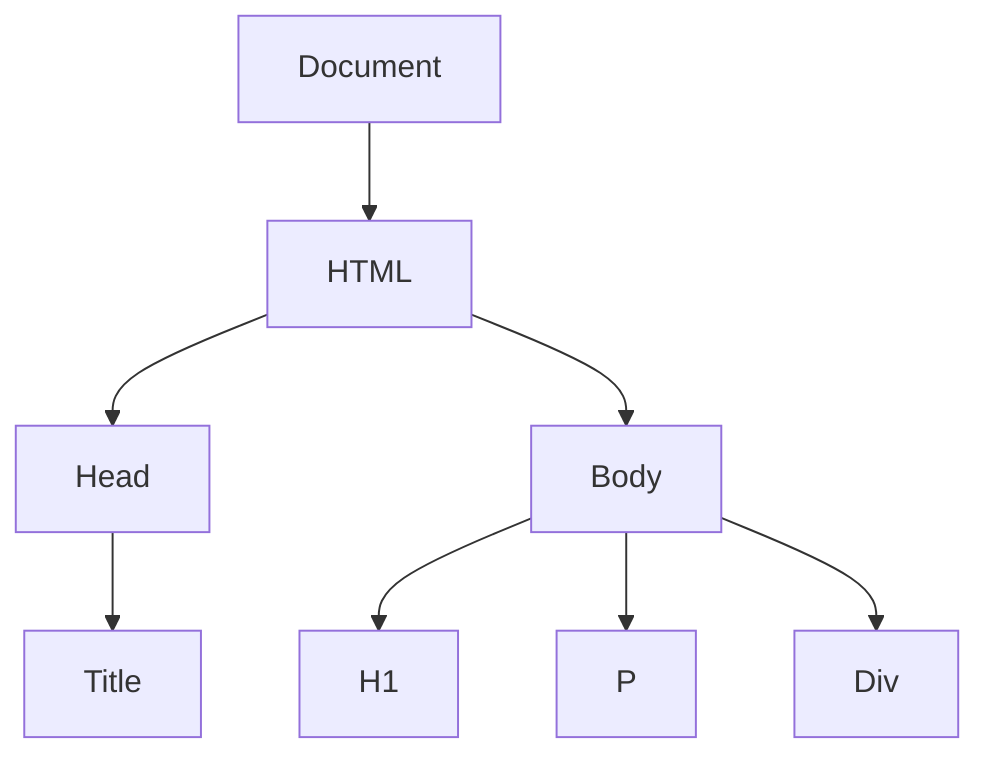

# Wykład 8: Wstęp do HTML i Markdown

## 1. Język Markdown
Markdown to lekki język znaczników służący do formatowania tekstu za pomocą prostej składni tekstowej. Jest szeroko stosowany w dokumentacji (np. README na GitHubie), na forach (StackOverflow) oraz w komunikatorach (Slack, Discord).

### Rozszerzona składnia Markdown:
| Efekt | Składnia |
|-------|----------|
| Nagłówek 2 | `## Nagłówek` |
| Przekreślenie | `~~tekst~~` |
| Cytat | `> tekst` |
| Blok kodu | ` ```python ... ``` ` |
| Tabela | `| nagłówek | ... |` |
| Lista numerowana | `1. element` |
| Zadanie (Checkbox) | `- [x] zadanie` |

### Trik: Skróty klawiszowe i szybkie generowanie
Wiele edytorów (jak VS Code czy Obsidian) wspiera szybkie tworzenie list i tabel. W VS Code można użyć rozszerzeń takich jak "Markdown All in One", aby automatycznie generować spisy treści i formatować tabele jednym skrótem klawiszowym.

### Przykład tabeli w Markdown:
```markdown
| Produkt | Cena | Dostępność |
|---------|------|------------|
| Chleb   | 5.00 | Tak        |
| Mleko   | 3.50 | Nie        |
```

---

## 2. Język HTML (HyperText Markup Language)
HTML jest szkieletem strony internetowej. Definiuje on strukturę i semantykę treści, ale nie jej wygląd (tym zajmuje się CSS).

### Diagram struktury dokumentu HTML:


### Semantyka w HTML5:
Współczesny HTML stawia na semantykę, czyli używanie tagów, które opisują swoją rolę w dokumencie:
- `<header>`: Nagłówek strony/sekcji.
- `<nav>`: Menu nawigacyjne.
- `<main>`: Główna treść dokumentu.
- `<article>`: Samodzielna treść (np. wpis na blogu).
- `<section>`: Tematyczna sekcja dokumentu.
- `<footer>`: Stopka strony.

### Przykład listy i linku:
```html
<nav>
    <ul>
        <li><a href="index.html">Strona główna</a></li>
        <li><a href="o-nas.html">O nas</a></li>
        <li><a href="kontakt.html" target="_blank">Kontakt (nowa karta)</a></li>
    </ul>
</nav>
```

### Formularze w HTML:
```html
<form action="/submit" method="POST">
    <label for="name">Imię:</label>
    <input type="text" id="name" name="user_name" required>
    
    <label>Płeć:</label>
    <input type="radio" name="gender" value="m"> M
    <input type="radio" name="gender" value="k"> K
    
    <button type="submit">Wyślij</button>
</form>
```

## 3. Drzewo DOM (Document Object Model)
Przeglądarka interpretuje kod HTML jako strukturę drzewiastą.


