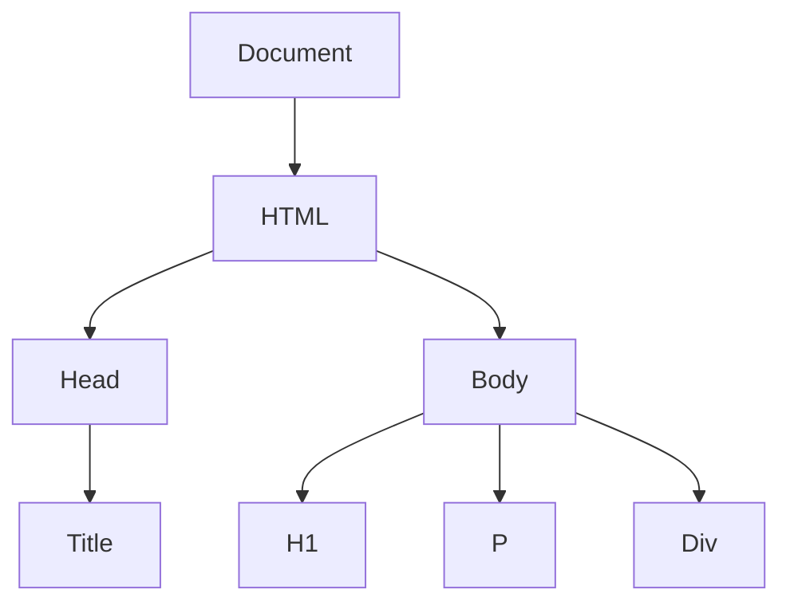

# Wykład 8: Wstęp do HTML i Markdown

## 1. Język Markdown
Markdown to lekki język znaczników służący do formatowania tekstu za pomocą prostej składni tekstowej. Został stworzony, aby być maksymalnie czytelnym dla człowieka nawet w formie nieprzetworzonej.

### Podstawowa składnia Markdown:
| Efekt | Składnia |
|-------|----------|
| Nagłówek 1 | `# Nagłówek` |
| Pogrubienie | `**tekst**` |
| Kursywa | `*tekst*` |
| Lista punktowana | `- element` |
| Link | `[tekst](url)` |
| Kod inline | `` `kod` `` |

---

## 2. Język HTML (HyperText Markup Language)
HTML jest standardowym językiem znaczników służącym do tworzenia struktury stron internetowych.

### Struktura dokumentu HTML5:
```html
<!DOCTYPE html>
<html lang="pl">
<head>
    <meta charset="UTF-8">
    <title>Moja Strona</title>
</head>
<body>
    <h1>Witaj Świecie!</h1>
    <p>To jest akapit tekstu.</p>
</body>
</html>
```

### Podstawowe tagi:
- `<h1>` do `<h6>`: Nagłówki.
- `<p>`: Akapit.
- `<a>`: Hiperłącze.
- ``: Obraz.
- `<ul>`, `<li>`: Listy wypunktowane.
- `<div>`, `<span>`: Kontenery.

## 3. Drzewo DOM (Document Object Model)
Przeglądarka interpretuje kod HTML jako strukturę drzewiastą.


