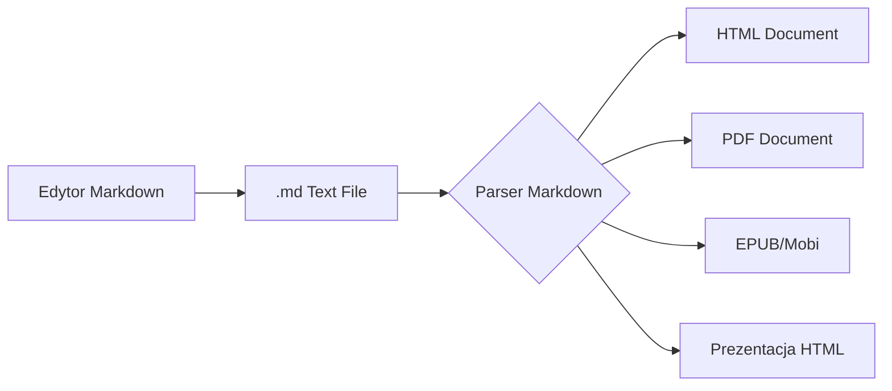
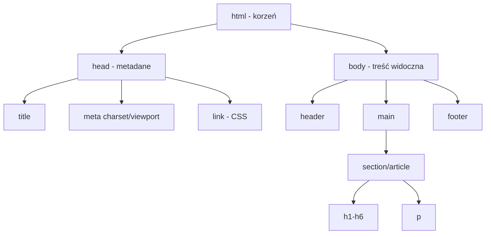
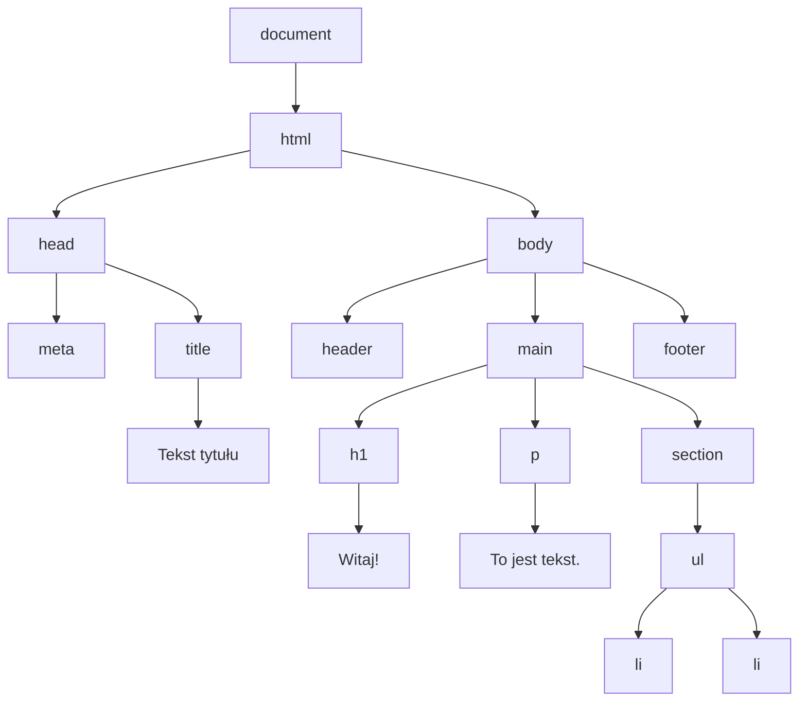

# Wykład 8: Wstęp do HTML i Markdown

## 1. Język Markdown

Markdown to lekki język znaczników służący do formatowania tekstu za pomocą prostej składni tekstowej. Jest szeroko stosowany w dokumentacji (np. README na GitHubie), na forach (StackOverflow) oraz w komunikatorach (Slack, Discord).

### Rozszerzona składnia Markdown:

| Efekt              | Składnia                   | Uwagi                      |
| ------------------ | -------------------------- | -------------------------- |
| Nagłówek 2         | `## Nagłówek`              | Skala od 1 do 6            |
| Przekreślenie      | `~~tekst~~`                | Podwójna tylda             |
| Cytat              | `> tekst`                  | Można zagnieżdżać `>>`     |
| Blok kodu          | ```` ```język ... ``` ```` | Kolorowanie składni        |
| Inline code        | `` `kod` ``                | Wewnątrz akapitu           |
| Tabela             | \`                         | nagłówek                   |
| Lista numerowana   | `1. element`               | Cyfra z kropką             |
| Zadanie (Checkbox) | `- [x] zadanie`            | `[ ]` dla niewykonanego    |
| Przypis            | `[^1]` i `[^1]: treść`     | Wsparcie zależy od silnika |
| Matematyka (LaTeX) | `$...$` lub `$$...$$`      | Np. `$E=mc^2$`             |

### Zaawansowane funkcje i rozszerzenia:

Markdown sam w sobie jest prosty, ale jego dialekty (np. GitHub Flavored Markdown - GFM) wprowadzają:

- **Tabele Mermaid**: Tworzenie diagramów bezpośrednio w tekście.
- **Auto-linki**: Automatyczna zamiana URL na aktywne łącza.
- **Emoji**: Używanie kodów takich jak `:smile:` (zależne od platformy).

### Diagram przepływu pracy z Markdown:


```mermaid
graph LR
    Editor[Edytor Markdown] --> Raw[.md Text File]
    Raw --> Parser{Parser Markdown}
    Parser --> HTML[HTML Document]
    Parser --> PDF[PDF Document]
    Parser --> Ebook[EPUB/Mobi]
    Parser --> Slides[Prezentacja HTML]
```

### Trik: Skróty klawiszowe i szybkie generowanie

Wiele edytorów (jak VS Code czy Obsidian) wspiera szybkie tworzenie list i tabel. W VS Code można użyć rozszerzeń takich jak "Markdown All in One", aby automatycznie generować spisy treści i formatować tabele jednym skrótem klawiszowym.

### Przykład tabeli w Markdown:

```markdown
| Produkt | Cena | Dostępność |
|---------|------|------------|
| Chleb   | 5.00 | Tak        |
| Mleko   | 3.50 | Nie        |
```

______________________________________________________________________

## 2. Język HTML (HyperText Markup Language)

HTML jest szkieletem strony internetowej. Definiuje on strukturę i semantykę treści, ale nie jej wygląd (tym zajmuje się CSS).

### Diagram struktury dokumentu HTML:


```mermaid
graph TD
    HTML[html - korzeń] --> HEAD[head - metadane]
    HTML --> BODY[body - treść widoczna]
    HEAD --> TITLE[title]
    HEAD --> META[meta charset/viewport]
    HEAD --> LINK[link - CSS]
    BODY --> HEADER[header]
    BODY --> MAIN[main]
    BODY --> FOOTER[footer]
    MAIN --> SECTION[section/article]
    SECTION --> H1[h1-h6]
    SECTION --> P[p]
```

### Semantyka w HTML5:

Współczesny HTML stawia na semantykę, czyli używanie tagów, które opisują swoją rolę w dokumencie. Pomaga to technologiom wspomagającym (np. czytnikom ekranu dla osób niewidomych) oraz robotom wyszukiwarek (SEO).

- `<header>`: Nagłówek strony/sekcji (logo, nawigacja).
- `<nav>`: Zbiór linków nawigacyjnych.
- `<main>`: Unikalna, główna treść dokumentu (tylko jeden na stronę).
- `<article>`: Niezależna, samowystarczalna treść (np. artykuł, komentarz).
- `<section>`: Tematyczne grupowanie treści z nagłówkiem.
- `<aside>`: Treść poboczna, nie powiązana bezpośrednio z głównym nurtem.
- `<footer>`: Stopka (prawa autorskie, kontakt).
- `<figure>` i `<figcaption>`: Opakowanie dla mediów z podpisem.

### Multimedia i Atrybuty:

HTML to nie tylko tekst. Pozwala na osadzanie obrazów, dźwięków i wideo:

```html
<figure>
  
  <figcaption>Rysunek 1. Podpis pod obrazkiem.</figcaption>
</figure>

<video controls width="250">
    <source src="film.mp4" type="video/mp4">
    Twoja przeglądarka nie wspiera wideo.
</video>
```

**Atrybuty globalne (dostępne dla każdego tagu):**

- `id`: Unikalny identyfikator elementu (używany w CSS i JS).
- `class`: Klasa elementu (może być przypisana do wielu elementów).
- `style`: Bezpośrednie style CSS (niezalecane w produkcji).
- `title`: Tekst pojawiający się po najechaniu myszką.
- `lang`: Język elementu (np. `lang="pl"`).

### Przykład listy i linku:

```html
<nav>
    <ul>
        <li><a href="index.html">Strona główna</a></li>
        <li><a href="o-nas.html">O nas</a></li>
        <li><a href="kontakt.html" target="_blank">Kontakt (nowa karta)</a></li>
    </ul>
</nav>
```

### Formularze w HTML:

```html
<form action="/submit" method="POST">
    <label for="name">Imię:</label>
    <input type="text" id="name" name="user_name" required>

    <label>Płeć:</label>
    <input type="radio" name="gender" value="m"> M
    <input type="radio" name="gender" value="k"> K

    <button type="submit">Wyślij</button>
</form>
```

## 3. Drzewo DOM (Document Object Model)

Przeglądarka interpretuje kod HTML jako strukturę drzewiastą (DOM). Każdy tag staje się węzłem (node) w drzewie, co pozwala na dynamiczną manipulację stroną przez JavaScript.


```mermaid
graph TD
    Document[document] --> HTML[html]
    HTML --> Head[head]
    HTML --> Body[body]
    Head --> Meta[meta]
    Head --> Title[title]
    Title --> TextT[Tekst tytułu]
    Body --> Header[header]
    Body --> Main[main]
    Body --> Footer[footer]
    Main --> H1[h1]
    H1 --> TextH1[Witaj!]
    Main --> P[p]
    P --> TextP[To jest tekst.]
    Main --> Section[section]
    Section --> Ul[ul]
    Ul --> Li1[li]
    Ul --> Li2[li]
```

## 4. Przydatne moduły i narzędzia

### Narzędzia do edycji i konwersji:

1. **Pandoc**: "Szwajcarski scyzoryk" do konwersji między formatami (Markdown -> HTML, PDF, Word, LaTeX).
   - `pandoc plik.md -o plik.html`
1. **Emmet**: Skróty przyspieszające pisanie HTML (np. `ul>li*5` generuje listę z 5 elementami).
1. **Prettier**: Narzędzie do automatycznego formatowania kodu (Markdown, HTML, CSS).
1. **Lighthouse**: Narzędzie w Chrome DevTools do audytu wydajności i dostępności (Accessibility).

### Biblioteki do wizualizacji:

- **Mermaid.js**: Generowanie diagramów i wykresów z prostego tekstu (używane w tym wykładzie).
- **MathJax / KaTeX**: Silniki do renderowania skomplikowanych wzorów matematycznych w przeglądarce.
- **Prism.js / Highlight.js**: Skrypty do kolorowania składni kodu na stronach HTML.

### Porównanie Markdown vs HTML:

| Cecha             | Markdown                     | HTML                         |
| ----------------- | ---------------------------- | ---------------------------- |
| Czytelność źródła | Bardzo wysoka                | Niska (dużo tagów)           |
| Stopień trudności | Bardzo niski                 | Średni                       |
| Elastyczność      | Ograniczona                  | Bardzo duża                  |
| Zastosowanie      | Dokumentacja, notatki, blogi | Strony www, aplikacje webowe |
| Wsparcie mediów   | Podstawowe                   | Pełne (wideo, audio, canvas) |
