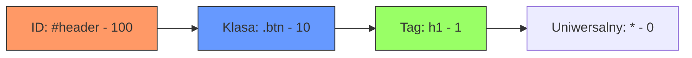

# Wykład 9: Podstawy CSS

## 1. Co to jest CSS?
CSS (Cascading Style Sheets) to kaskadowe arkusze stylów używane do opisu prezentacji dokumentu HTML. Pozwalają one na zmianę kolorów, czcionek, układu elementów (layoutu) oraz dodawanie animacji.

### Kaskadowość i Specyficzność:
- **Kaskadowość:** Jeśli do tego samego elementu odnoszą się sprzeczne reguły, CSS rozstrzyga, która ma pierwszeństwo na podstawie źródła i ważności.
- **Specyficzność:** Selektory mają różną "wagę". Identyfikator (`#`) jest ważniejszy niż klasa (`.`), a klasa ważniejsza niż tag.

### Diagram specyficzności selektorów:


## 2. Selektory i kaskada
```css
/* Selektor elementu - dotyczy wszystkich <h2> */
h2 {
    color: #2c3e50;
    font-family: Arial, sans-serif;
}

/* Selektor klasy - można używać wielokrotnie */
.highlight {
    background-color: yellow;
    font-weight: bold;
}

/* Selektor identyfikatora - unikalny na stronie */
#main-header {
    border-bottom: 2px solid black;
}

/* Pseudoklasy - style zależne od stanu */
a:hover {
    color: red;
    text-decoration: underline;
}
```

## 3. Model Pudełkowy (Box Model)
Zrozumienie modelu pudełkowego jest kluczowe dla poprawnego układania elementów.

- **Content:** Sama treść (tekst, obraz).
- **Padding:** Przezroczysty obszar wokół treści, wewnątrz obramowania.
- **Border:** Obramowanie wokół paddingu.
- **Margin:** Przezroczysty obszar na zewnątrz obramowania, oddzielający element od innych.

### Box-sizing:
Domyślnie `width` i `height` dotyczą tylko treści. Użycie `box-sizing: border-box;` sprawia, że padding i border są wliczane w podaną szerokość, co ułatwia projektowanie.

```css
div {
    width: 300px;
    padding: 20px;
    border: 5px solid gray;
    margin: 10px;
    box-sizing: border-box; /* Szerokość całkowita to nadal 300px */
}
```

## 4. Układanie elementów (Layout)
Współczesny CSS oferuje potężne narzędzia do tworzenia layoutów:

### Flexbox (Flexible Box Layout):
Idealny do jednowymiarowych układów (rzędy lub kolumny).
```css
.container {
    display: flex;
    justify-content: space-between; /* Rozmieszczenie w poziomie */
    align-items: center;            /* Centrowanie w pionie */
}
```

### CSS Grid:
Idealny do dwuwymiarowych, bardziej złożonych układów.
```css
.grid-container {
    display: grid;
    grid-template-columns: 1fr 2fr 1fr; /* Trzy kolumny o różnych proporcjach */
    gap: 10px;
}
```

## 5. Kolory i jednostki
### Trik: Zmienne CSS (Custom Properties)
Zmienne pozwalają na definiowanie wartości w jednym miejscu i używanie ich w całym arkuszu. Ułatwia to zmianę motywu strony.
```css
:root {
    --primary-color: #3498db;
    --font-size-base: 16px;
}

button {
    background-color: var(--primary-color);
    font-size: var(--font-size-base);
}
```

### Kolory:
- Nazwane: `red`, `blue`
- Hex: `#ff0000`, `#333`
- RGB/RGBA: `rgb(255, 0, 0)`, `rgba(0, 0, 0, 0.5)` (z przezroczystością)

### Jednostki:
| Jednostka | Typ | Opis |
|-----------|-----|------|
| `px` | Stała | Piksele |
| `%` | Relatywna | Procent elementu nadrzędnego |
| `em` | Relatywna | Zależna od rozmiaru czcionki elementu |
| `rem` | Relatywna | Zależna od rozmiaru czcionki elementu `<html>` |
| `vh` / `vw` | Relatywna | 1% wysokości/szerokości okna (viewport) |
