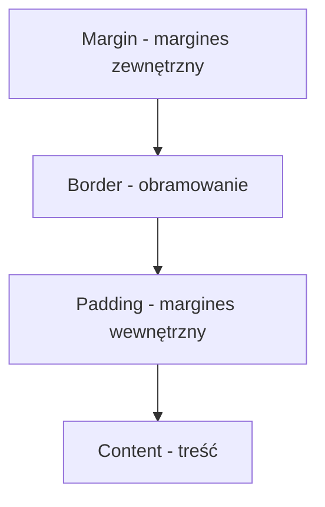

# Wykład 9: Podstawy CSS

## 1. Co to jest CSS?
CSS (Cascading Style Sheets) to kaskadowe arkusze stylów używane do opisu wyglądu dokumentu HTML. Rozdzielają strukturę (HTML) od prezentacji (CSS).

## 2. Metody dołączania stylów
1. **Zewnętrzne:** `<link rel="stylesheet" href="style.css">`
2. **Wewnętrzne:** `<style> p { color: red; } </style>`
3. **Liniowe (Inline):** `<p style="color: blue;">`

## 3. Selektory, właściwości i wartości
```css
/* Selektor */
h1 {
    /* Właściwość: wartość; */
    color: darkblue;
    font-size: 24px;
    text-align: center;
}
```

### Typy selektorów:
- **Elementu:** `p { ... }` (wszystkie akapity)
- **Klasy:** `.moja-klasa { ... }` (elementy z `class="moja-klasa"`)
- **Identyfikatora:** `#moje-id { ... }` (element z `id="moje-id"`)

## 4. Model Pudełkowy (Box Model)
Każdy element HTML jest traktowany jako prostokątne pudełko.



## 5. Przykładowa tabela jednostek
| Jednostka | Opis |
|-----------|------|
| `px` | Piksele (wartość stała) |
| `%` | Procent rodzica |
| `em` | Wielokrotność rozmiaru czcionki rodzica |
| `rem` | Wielokrotność rozmiaru czcionki elementu głównego (`<html>`) |
| `vh` / `vw` | Procent wysokości/szerokości okna przeglądarki |
