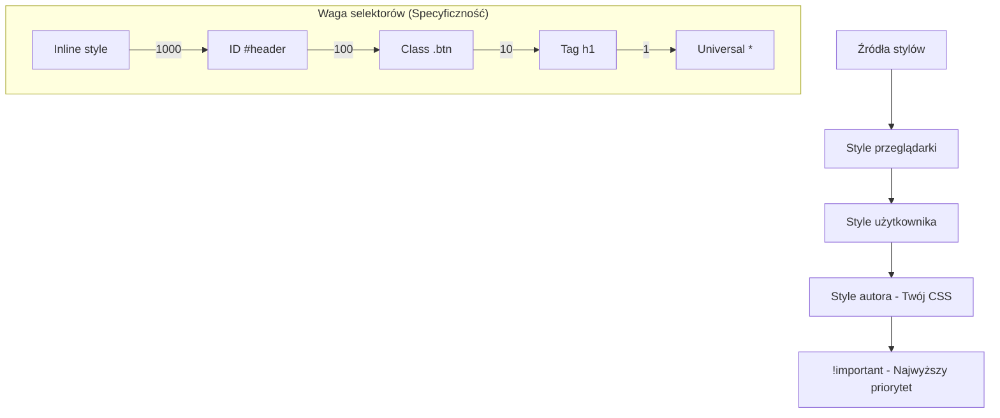
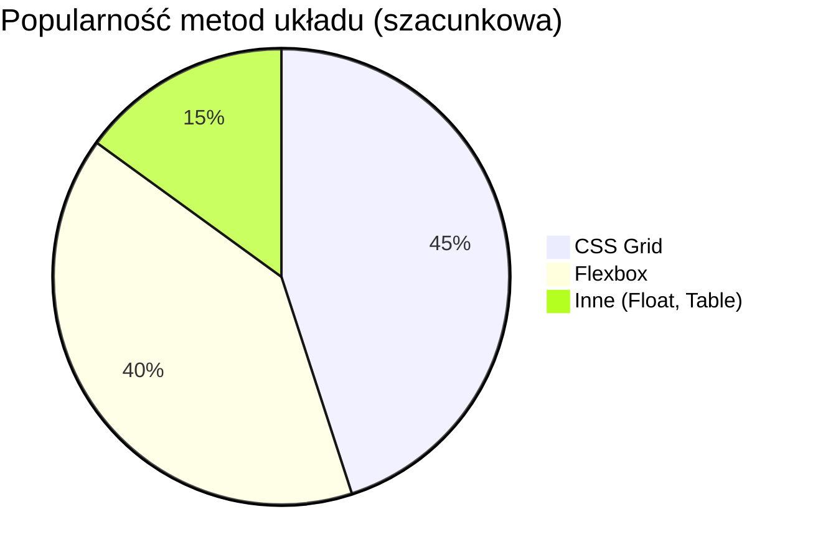

# Wykład 9: Podstawy CSS

## 1. Co to jest CSS?

CSS (Cascading Style Sheets) to kaskadowe arkusze stylów używane do opisu prezentacji dokumentu HTML. Pozwalają one na zmianę kolorów, czcionek, układu elementów (layoutu) oraz dodawanie animacji.

### Gdzie umieszczać odnośniki do plików CSS?

Istnieją trzy główne sposoby dodawania stylów CSS do dokumentu HTML:

1. **Zewnętrzny arkusz stylów (External CSS):** Najlepsza praktyka. Style znajdują się w osobnym pliku `.css`.
   ```html
   <head>
       <link rel="stylesheet" href="style.css">
   </head>
   ```
1. **Wewnętrzny arkusz stylów (Internal CSS):** Style umieszczone w sekcji `<head>` wewnątrz tagu `<style>`.
   ```html
   <head>
       <style>
           body { background-color: linen; }
       </style>
   </head>
   ```
1. **Style liniowe (Inline CSS):** Styl dopisany bezpośrednio do atrybutu `style` elementu. Niezalecane przy większych projektach.
   ```html
   <h1 style="color:blue;">To jest niebieski nagłówek</h1>
   ```

### Wybór CSS na podstawie urządzenia (Media Queries w <link>)

Możemy określić, który plik CSS ma zostać załadowany w zależności od typu urządzenia lub parametrów ekranu bezpośrednio w tagu `<link>`:

```html
<!-- Domyślny styl dla wszystkich urządzeń -->
<link rel="stylesheet" href="main.css">

<!-- Styl tylko do druku -->
<link rel="stylesheet" href="print.css" media="print">

<!-- Styl dla urządzeń o szerokości ekranu mniejszej niż 600px (telefony) -->
<link rel="stylesheet" href="mobile.css" media="screen and (max-width: 600px)">
```

## 2. Selektory, kaskada i specyficzność

### Kaskadowość i Specyficzność:

- **Kaskadowość:** Jeśli do tego samego elementu odnoszą się sprzeczne reguły, CSS rozstrzyga, która ma pierwszeństwo na podstawie źródła i ważności.
- **Specyficzność:** Selektory mają różną "wagę". Identyfikator (`#`) jest ważniejszy niż klasa (`.`), a klasa ważniejsza niż tag.

### Diagram specyficzności selektorów:


```mermaid
graph TD
    Start[Źródła stylów] --> UA[Style przeglądarki]
    UA --> User[Style użytkownika]
    User --> Author[Style autora - Twój CSS]
    Author --> Important[!important - Najwyższy priorytet]

    subgraph "Waga selektorów (Specyficzność)"
    direction LR
    S1[Inline style] -- 1000 --> S2[ID #header]
    S2 -- 100 --> S3[Class .btn]
    S3 -- 10 --> S4[Tag h1]
    S4 -- 1 --> S5[Universal *]
    end
```

```css
/* Selektor elementu - dotyczy wszystkich <h2> */
h2 {
    color: #2c3e50;
    font-family: Arial, sans-serif;
}

/* Selektor klasy - można używać wielokrotnie */
.highlight {
    background-color: yellow;
    font-weight: bold;
}

/* Selektor identyfikatora - unikalny na stronie */
#main-header {
    border-bottom: 2px solid black;
}

/* Pseudoklasy - style zależne od stanu */
a:hover {
    color: red;
    text-decoration: underline;
}
```

## 3. Model Pudełkowy (Box Model)

Zrozumienie modelu pudełkowego jest kluczowe dla poprawnego układania elementów.

- **Content:** Sama treść (tekst, obraz).
- **Padding:** Przezroczysty obszar wokół treści, wewnątrz obramowania.
- **Border:** Obramowanie wokół paddingu.
- **Margin:** Przezroczysty obszar na zewnątrz obramowania, oddzielający element od innych.

### Box-sizing:

Domyślnie `width` i `height` dotyczą tylko treści. Użycie `box-sizing: border-box;` sprawia, że padding i border są wliczane w podaną szerokość, co ułatwia projektowanie.

```css
div {
    width: 300px;
    padding: 20px;
    border: 5px solid gray;
    margin: 10px;
    box-sizing: border-box; /* Szerokość całkowita to nadal 300px */
}
```

## 4. Układanie elementów (Layout)

Współczesny CSS oferuje potężne narzędzia do tworzenia layoutów:

### Flexbox (Flexible Box Layout):

Idealny do jednowymiarowych układów (rzędy lub kolumny).

```css
.container {
    display: flex;
    justify-content: space-between; /* Rozmieszczenie w poziomie */
    align-items: center;            /* Centrowanie w pionie */
}
```

### CSS Grid:

Idealny do dwuwymiarowych, bardziej złożonych układów.

```css
.grid-container {
    display: grid;
    grid-template-columns: 1fr 2fr 1fr; /* Trzy kolumny o różnych proporcjach */
    gap: 10px;
}
```

## 5. Kolory i jednostki

### Trik: Zmienne CSS (Custom Properties)

Zmienne pozwalają na definiowanie wartości w jednym miejscu i używanie ich w całym arkuszu. Ułatwia to zmianę motywu strony.

```css
:root {
    --primary-color: #3498db;
    --font-size-base: 16px;
}

button {
    background-color: var(--primary-color);
    font-size: var(--font-size-base);
}
```

### Kolory:

- Nazwane: `red`, `blue`
- Hex: `#ff0000`, `#333`
- RGB/RGBA: `rgb(255, 0, 0)`, `rgba(0, 0, 0, 0.5)` (z przezroczystością)

## 6. RWD i Media Queries (Adaptacja do urządzeń)

Media Queries to kluczowy element Responsive Web Design (RWD). Pozwalają one na zmianę wyglądu strony w zależności od cech urządzenia.

### Typowe punkty kontrolne (Breakpoints):

| Urządzenie | Przykładowa szerokość | Media Query                          |
| :--------- | :-------------------- | :----------------------------------- |
| Smartfony  | do 600px              | `@media (max-width: 600px) { ... }`  |
| Tablety    | 601px - 992px         | `@media (min-width: 601px) { ... }`  |
| Laptopy    | 993px - 1200px        | `@media (min-width: 993px) { ... }`  |
| Desktopy   | powyżej 1200px        | `@media (min-width: 1201px) { ... }` |

### Przykład wewnątrz pliku CSS:

```css
/* Style domyślne (np. dla komputerów) */
.sidebar { width: 25%; float: left; }
.main-content { width: 75%; float: left; }

/* Zmiana układu dla telefonów */
@media screen and (max-width: 600px) {
    .sidebar, .main-content {
        width: 100%; /* Elementy zajmują pełną szerokość */
        float: none;
    }
    body {
        font-size: 14px;
    }
}
```

### Porównanie metod układania treści:

| Cecha        | Float                   | Flexbox                    | CSS Grid                      |
| :----------- | :---------------------- | :------------------------- | :---------------------------- |
| Kierunek     | Horyzontalny            | 1D (Wiersz LUB Kolumna)    | 2D (Wiersz I Kolumna)         |
| Centrowanie  | Trudne                  | Bardzo łatwe               | Bardzo łatwe                  |
| Zastosowanie | Proste opływanie tekstu | Menu, nawigacja, przyciski | Cały szkielet strony, galerie |


```mermaid
pie title Popularność metod układu (szacunkowa)
    "CSS Grid" : 45
    "Flexbox" : 40
    "Inne (Float, Table)" : 15
```
