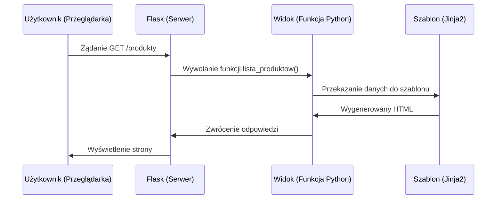

# Wykład 10: Flask – Tworzenie prostych aplikacji WWW

## 1. Co to jest Flask?
Flask to mikro-framework webowy dla Pythona. Jest lekki, elastyczny i łatwy w nauce. W przeciwieństwie do Django (który jest "pełnym" frameworkiem), Flask dostarcza tylko niezbędne minimum, a resztę funkcji (np. dostęp do bazy danych) dodaje się za pomocą rozszerzeń.

## 2. Podstawowe pojęcia
- **Routing:** Mapowanie adresów URL na funkcje Pythona (widoki).
- **Widok (View):** Funkcja zwracająca odpowiedź (tekst, HTML, JSON).
- **Szablony (Templates):** Pliki HTML z dynamicznymi polami.
- **Kontekst żądania:** Informacje o bieżącym zapytaniu od użytkownika.

### Cykl Żądanie-Odpowiedź (Request-Response Cycle):


## 3. Pierwsza aplikacja Flask
```python
from flask import Flask, render_template

app = Flask(__name__)

@app.route("/")
def home():
    return "<h1>Strona główna</h1>"

@app.route("/witaj/<imie>")
def powitanie(imie):
    # Dynamiczny adres URL
    return f"Witaj, {imie}!"

if __name__ == "__main__":
    app.run(debug=True) # debug=True automatycznie odświeża serwer po zmianie kodu
```

## 4. Praca z szablonami Jinja2
Silnik Jinja2 pozwala na używanie logiki Pythona bezpośrednio w plikach HTML.

### Składnia Jinja2:
- `{{ zmienna }}`: Wstawienie wartości zmiennej.
- ``: Instrukcja warunkowa.
- ``: Pętla.

### Przykład:
```python
# app.py
@app.route("/produkty")
def lista_produktow():
    produkty = ["Chleb", "Mleko", "Jajka"]
    return render_template("produkty.html", items=produkty)
```

```html
<!-- templates/produkty.html -->
<h1>Lista zakupów:</h1>
<ul>
    
        <li>{{ p }}</li>
    
        <li>Brak produktów na liście.</li>
    
</ul>
```

### Trik: Context Processors
Jeśli chcesz, aby jakaś zmienna była dostępna we wszystkich szablonach (np. nazwa strony lub rok w stopce), użyj dekoratora `@app.context_processor`.

```python
@app.context_processor
def inject_now():
    return {'rok': 2026}
```
W dowolnym pliku HTML możesz teraz użyć `{{ rok }}` bez przekazywania go w `render_template`.

## 5. Obsługa formularzy i metod HTTP
Domyślnie routing obsługuje tylko metodę **GET**. Aby przyjąć dane z formularza, musimy dodać metodę **POST**.

```python
from flask import request

@app.route("/kontakt", methods=["GET", "POST"])
def kontakt():
    if request.method == "POST":
        # Pobieranie danych z formularza
        email = request.form.get("email")
        wiadomosc = request.form.get("message")
        return f"Wiadomość od {email} została wysłana!"
    
    return render_template("kontakt.html")
```
