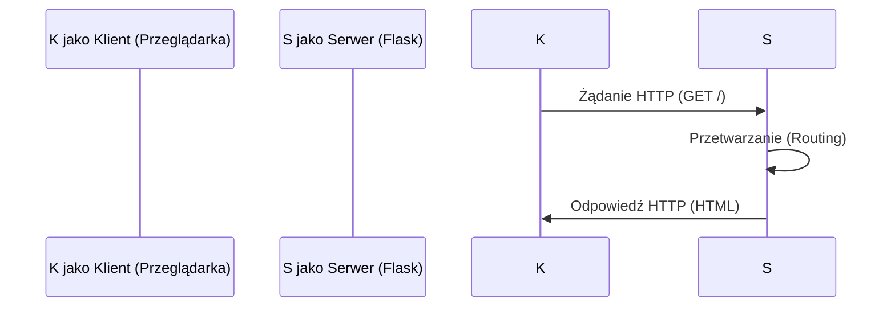

# Wykład 10: Flask – Tworzenie prostych aplikacji WWW

## 1. Co to jest Flask?
Flask to mikro-framework webowy dla Pythona. Jest określany jako "mikro", ponieważ nie wymaga konkretnych narzędzi ani bibliotek, dając programiście dużą swobodę.

## 2. Architektura Klient-Serwer


## 3. Pierwsza aplikacja Flask
```python
from flask import Flask

app = Flask(__name__)

@app.route("/")
def hello_world():
    return "<h1>Witaj we Flasku!</h1>"

if __name__ == "__main__":
    app.run(debug=True)
```

## 4. Routing
Routing pozwala na przypisanie adresów URL do konkretnych funkcji w Pythonie.
```python
@app.route("/uzytkownik/<nazwa>")
def profil(nazwa):
    return f"Profil użytkownika: {nazwa}"
```

## 5. Szablony Jinja2
Flask używa silnika Jinja2 do generowania dynamicznego kodu HTML. Pliki szablonów powinny znajdować się w folderze `templates/`.

```html
<!-- templates/index.html -->
<html>
<body>
    <h1>Cześć {{ imie }}!</h1>
    <ul>
    
        <li>{{ element }}</li>
    
    </ul>
</body>
</html>
```

## 6. Metody HTTP
- **GET:** Pobieranie danych.
- **POST:** Wysyłanie danych (np. formularze).
