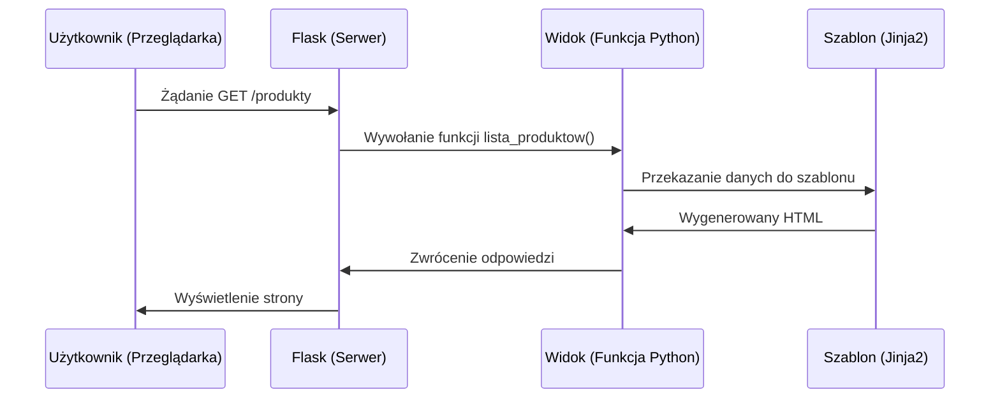
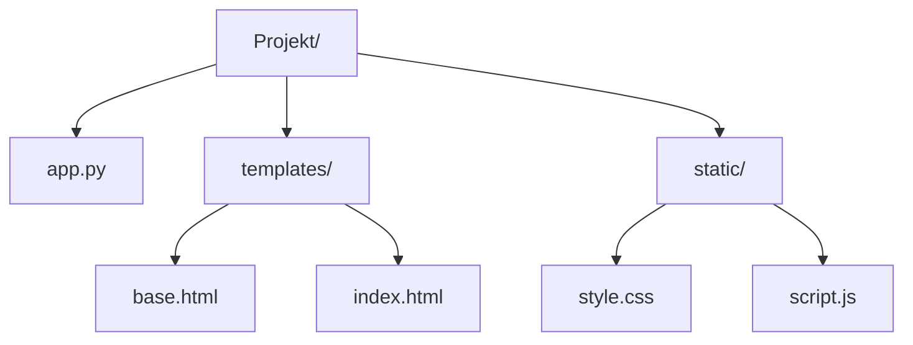

# Wykład 10: Flask – Tworzenie prostych aplikacji WWW

## 1. Co to jest Flask?

Flask to mikro-framework webowy dla Pythona. Jest lekki, elastyczny i łatwy w nauce. W przeciwieństwie do Django (który jest "pełnym" frameworkiem), Flask dostarcza tylko niezbędne minimum, a resztę funkcji (np. dostęp do bazy danych) dodaje się za pomocą rozszerzeń.

## 2. Podstawowe pojęcia

- **Routing:** Mapowanie adresów URL na funkcje Pythona (widoki).
- **Widok (View):** Funkcja zwracająca odpowiedź (tekst, HTML, JSON).
- **Szablony (Templates):** Pliki HTML z dynamicznymi polami.
- **Kontekst żądania:** Informacje o bieżącym zapytaniu od użytkownika.

### Porównanie metod HTTP

| Cecha                 | GET                          | POST                             |
| :-------------------- | :--------------------------- | :------------------------------- |
| **Cel**               | Pobieranie danych z serwera. | Przesyłanie danych do serwera.   |
| **Widoczność danych** | Dane widoczne w adresie URL. | Dane ukryte w treści żądania.    |
| **Bezpieczeństwo**    | Mniejsze (nie dla haseł).    | Większe (dla danych wrażliwych). |
| **Limit danych**      | Ograniczony (długość URL).   | Brak limitu.                     |
| **Cache'owanie**      | Możliwe.                     | Niemożliwe.                      |

### Cykl Żądanie-Odpowiedź (Request-Response Cycle):


```mermaid
sequenceDiagram
    participant U as Użytkownik (Przeglądarka)
    participant F as Flask (Serwer)
    participant V as Widok (Funkcja Python)
    participant T as Szablon (Jinja2)

    U->>F: Żądanie GET /produkty
    F->>V: Wywołanie funkcji lista_produktow()
    V->>T: Przekazanie danych do szablonu
    T->>V: Wygenerowany HTML
    V->>F: Zwrócenie odpowiedzi
    F->>U: Wyświetlenie strony
```

## 3. Pierwsza aplikacja Flask

Struktura typowego projektu Flask:


```mermaid
graph TD
    A[Projekt/] --> B[app.py]
    A --> C[templates/]
    A --> D[static/]
    C --> E[base.html]
    C --> F[index.html]
    D --> G[style.css]
    D --> H[script.js]
```

```python
from flask import Flask, render_template

app = Flask(__name__)


@app.route("/")
def home():
    return "<h1>Strona główna</h1>"


@app.route("/witaj/<imie>")
def powitanie(imie):
    # Dynamiczny adres URL
    return f"Witaj, {imie}!"


if __name__ == "__main__":
    app.run(debug=True)  # debug=True automatycznie odświeża serwer po zmianie kodu
```

## 4. Praca z szablonami Jinja2

Silnik Jinja2 pozwala na używanie logiki Pythona bezpośrednio w plikach HTML.

### Składnia Jinja2:

- `{{ zmienna }}`: Wstawienie wartości zmiennej.
- ``: Instrukcja warunkowa.
- ``: Pętla.
- `{# komentarz #}`: Komentarz wewnątrz szablonu.

### Filtry Jinja2

Filtry modyfikują zmienne i są oddzielone znakiem potoku (`|`).

| Filtr     | Opis                                                | Przykład                       |
| :-------- | :-------------------------------------------------- | :----------------------------- |
| `upper`   | Zamienia tekst na wielkie litery                    | `{{ imie\|upper }}`            |
| `lower`   | Zamienia tekst na małe litery                       | `{{ imie\|lower }}`            |
| `length`  | Zwraca długość kolekcji                             | `{{ produkty\|length }}`       |
| `default` | Zwraca wartość domyślną, jeśli zmienna nie istnieje | `{{ tytul\|default('Brak') }}` |

### Dziedziczenie szablonów

To jedna z najpotężniejszych funkcji Jinja2. Pozwala stworzyć bazowy układ strony (`base.html`), który jest rozszerzany przez inne pliki.

**Szablon bazowy (`templates/base.html`):**

```html
<!DOCTYPE html>
<html>
<head>
    <title>Moja Strona</title>
</head>
<body>
    <nav>
        <a href="/">Główna</a> | <a href="/kontakt">Kontakt</a>
    </nav>
    <main>
        
    </main>
    <footer>(c) 2026 Kurs Programowania</footer>
</body>
</html>
```

**Szablon pochodny (`templates/index.html`):**

```html


Strona Główna


    <h1>Witaj na naszej stronie!</h1>
    <p>To jest treść dynamiczna.</p>

```

### Przykład pętli:

```python
# app.py
@app.route("/produkty")
def lista_produktow():
    produkty = ["Chleb", "Mleko", "Jajka"]
    return render_template("produkty.html", items=produkty)
```

```html
<!-- templates/produkty.html -->
<h1>Lista zakupów:</h1>
<ul>
    
        <li>{{ p }}</li>
    
        <li>Brak produktów na liście.</li>
    
</ul>
```

### Trik: Context Processors

Jeśli chcesz, aby jakaś zmienna była dostępna we wszystkich szablonach (np. nazwa strony lub rok w stopce), użyj dekoratora `@app.context_processor`.

```python
@app.context_processor
def inject_now():
    return {"rok": 2026}
```

W dowolnym pliku HTML możesz teraz użyć `{{ rok }}` bez przekazywania go w `render_template`.

## 5. Obsługa formularzy i metod HTTP

Domyślnie routing obsługuje tylko metodę **GET**. Aby przyjąć dane z formularza, musimy dodać metodę **POST**.

````python
from flask import request


@app.route("/kontakt", methods=["GET", "POST"])
def kontakt():
    if request.method == "POST":
        # Pobieranie danych z formularza
        email = request.form.get("email")
        wiadomosc = request.form.get("message")
        return f"Wiadomość od {email} została wysłana!"

## 6. Przekierowania i obsługa błędów

### url_for i redirect
Funkcja `url_for` generuje adres URL dla danej funkcji widoku, co pozwala uniknąć "zahardkodowanych" ścieżek.

```python
from flask import redirect, url_for

@app.route("/stary-adres")
def stara_strona():
    return redirect(url_for("home")) # Przekierowanie na stronę główną
````

### Obsługa błędów

Możemy zdefiniować własne strony dla błędów HTTP, takich jak 404 (Not Found).

```python
@app.errorhandler(404)
def page_not_found(e):
    return render_template("404.html"), 404
```
