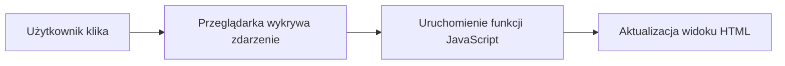

# Wykład 11: Wstęp do JavaScript

## 1. Co to jest JavaScript?
JavaScript (JS) to skryptowy język programowania, który umożliwia wprowadzanie interaktywności na stronach internetowych. Jest wykonywany głównie po stronie klienta (w przeglądarce).

## 2. Podstawowa składnia
Składnia JS jest podobna do języka C/C++ i Javy.

```javascript
// Zmienne
let imie = "Jan";
const PI = 3.14;

// Funkcja
function powitanie(osoba) {
    console.log("Witaj, " + osoba);
}

powitanie(imie);
```

## 3. Typy danych
- `Number`: Liczby (całkowite i zmiennoprzecinkowe).
- `String`: Ciągi znaków.
- `Boolean`: `true` / `false`.
- `Object`: Obiekty i tablice.
- `Undefined` i `Null`.

## 4. Manipulacja DOM
DOM (Document Object Model) pozwala JavaScriptowi na zmianę treści i stylów HTML.

```javascript
// Zmiana tekstu w elemencie o id="tytul"
document.getElementById("tytul").innerText = "Nowy Tytuł";

// Obsługa zdarzenia kliknięcia
document.querySelector("button").addEventListener("click", function() {
    alert("Kliknięto przycisk!");
});
```

## 5. Zdarzenia (Events)
Przykładowe zdarzenia:
- `click`: Kliknięcie myszą.
- `submit`: Wysłanie formularza.
- `load`: Załadowanie strony.
- `keydown`: Naciśnięcie klawisza.

## 6. Diagram przepływu zdarzenia

