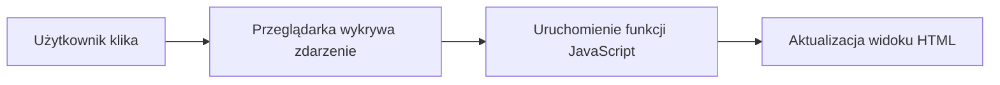

# Wykład 11: Wstęp do JavaScript

## 1. Co to jest JavaScript?
JavaScript (JS) to dynamiczny, interpretowany język programowania, który jest fundamentem współczesnych stron WWW (obok HTML i CSS). Mimo podobnej nazwy, JS nie ma nic wspólnego z językiem Java.

### Gdzie działa JavaScript?
- **Frontend:** W przeglądarce użytkownika (interakcje, animacje, pobieranie danych).
- **Backend:** Dzięki środowisku Node.js może działać również na serwerze.

## 2. Zmienne i typy danych
Współczesny JS (ES6+) używa trzech sposobów deklaracji zmiennych:
- `const`: Stała, której wartości nie można zmienić.
- `let`: Zmienna o zasięgu blokowym (zalecana).
- `var`: Stary sposób deklaracji (niezalecany).

```javascript
const nazwaSzkoly = "Uniwersytet";
let wiek = 20;
let czyStudent = true;
let oceny = [4, 5, 3, 5]; // Tablica (Array)
let osoba = {             // Obiekt (Object)
    imie: "Jan",
    nazwisko: "Kowalski"
};
```

## 3. Funkcje i strzałki
JavaScript oferuje klasyczne funkcje oraz nowoczesne funkcje strzałkowe (arrow functions).

```javascript
// Klasyczna funkcja
function dodaj(a, b) {
    return a + b;
}

// Funkcja strzałkowa (często używana w callbackach)
const pomnoz = (a, b) => a * b;

console.log(pomnoz(5, 4)); // 20
```

## 4. Manipulacja DOM i Zdarzenia
DOM (Document Object Model) to reprezentacja struktury HTML, którą JS może modyfikować w czasie rzeczywistym.

```javascript
// Pobieranie elementów
const przycisk = document.getElementById("moj-btn");
const wynik = document.querySelector(".wynik-kontener");

// Obsługa zdarzeń
przycisk.addEventListener("click", () => {
    wynik.style.color = "red";
    wynik.innerHTML = "<strong>Przycisk został kliknięty!</strong>";
    console.log("Zmieniono styl i treść");
});
```

## 5. Praca z danymi - JSON
JSON (JavaScript Object Notation) to format wymiany danych, niemal identyczny ze składnią obiektów JS.

```javascript
const daneUzytkownika = '{"id": 1, "login": "admin"}'; // Tekst JSON
const obiekt = JSON.parse(daneUzytkownika);          // Zamiana na obiekt JS
console.log(obiekt.login);

const nowyJSON = JSON.stringify(obiekt);            // Zamiana na tekst JSON
```

## 6. Diagram przepływu zdarzenia

