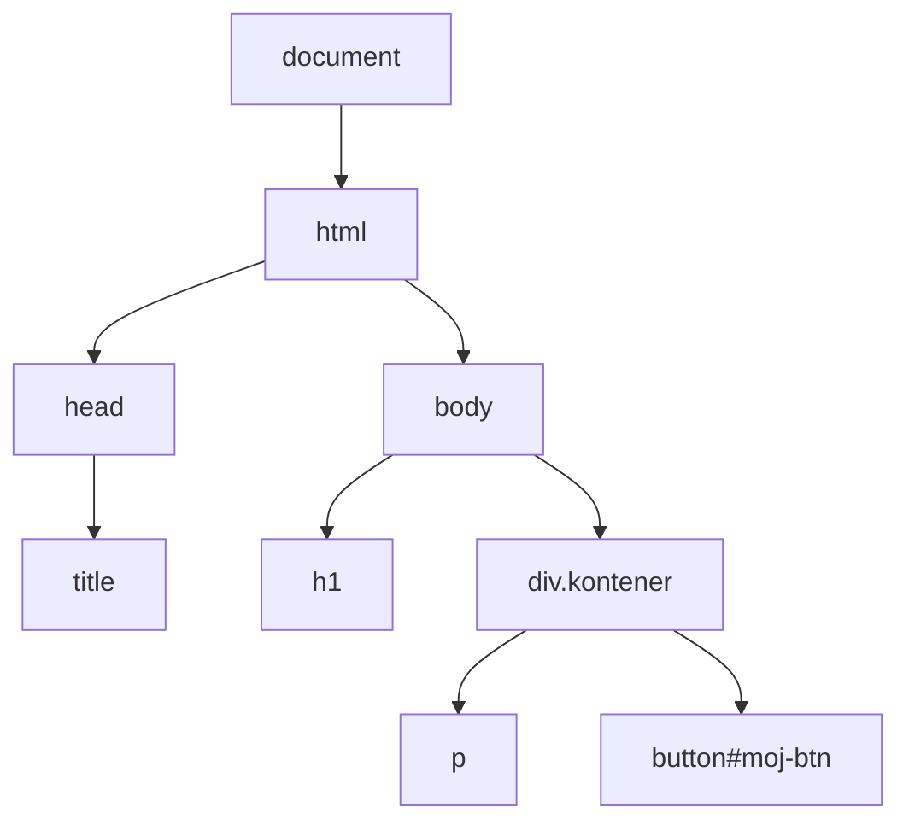
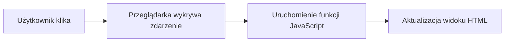
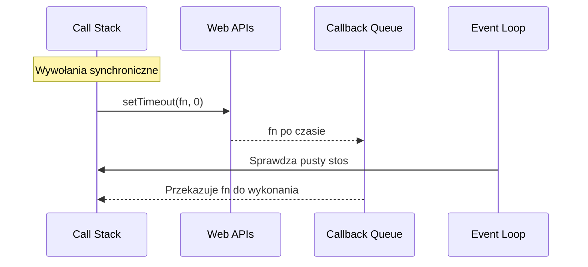

# Wykład 11: Wstęp do JavaScript

## 1. Co to jest JavaScript?

JavaScript (JS) to dynamiczny, interpretowany język programowania, który jest fundamentem współczesnych stron WWW (obok HTML i CSS). Mimo podobnej nazwy, JS nie ma nic wspólnego z językiem Java.

### Gdzie działa JavaScript?

- **Frontend:** W przeglądarce użytkownika (interakcje, animacje, pobieranie danych).
- **Backend:** Dzięki środowisku Node.js może działać również na serwerze.

## 2. Zmienne i typy danych

Współczesny JS (ES6+) używa trzech sposobów deklaracji zmiennych:

| Cecha               | `var`               | `let`     | `const`   |
| :------------------ | :------------------ | :-------- | :-------- |
| **Zasięg**          | Funkcyjny           | Blokowy   | Blokowy   |
| **Re-deklaracja**   | Tak                 | Nie       | Nie       |
| **Zmiana wartości** | Tak                 | Tak       | Nie       |
| **Hoisting**        | Tak (z `undefined`) | Tak (TDZ) | Tak (TDZ) |

- `const`: Stała, której wartości nie można zmienić (zalecana dla większości przypadków).
- `let`: Zmienna o zasięgu blokowym, której wartość może ulec zmianie.
- `var`: Stary sposób deklaracji (niezalecany, ma zasięg funkcyjny).

> **Hoisting** to mechanizm w JavaScript, w którym deklaracje zmiennych i funkcji są przenoszone na górę swojego zasięgu (globalnego lub funkcyjnego) przed wykonaniem kodu.
>
> - W przypadku `var`, zmienna jest inicjalizowana wartością `undefined`.
> - W przypadku `let` i `const`, zmienne są również "hoistowane", ale nie są inicjalizowane. Pozostają w tzw. **Temporal Dead Zone (TDZ)** do momentu faktycznej deklaracji w kodzie – próba użycia ich wcześniej skutkuje błędem `ReferenceError`.
> - Przykład: [tutaj](https://podstawyjs.pl/hoisting-javascript/).

```javascript
const nazwaSzkoly = "Uniwersytet";
let wiek = 20;
let czyStudent = true;
let oceny = [4, 5, 3, 5]; // Tablica (Array)
let osoba = {             // Obiekt (Object)
    imie: "Jan",
    nazwisko: "Kowalski"
};
```

### Typy danych (Data Types)

| Typ         | Opis                                    | Przykład          |
| :---------- | :-------------------------------------- | :---------------- |
| `String`    | Ciągi znaków                            | `"Cześć"`, `'JS'` |
| `Number`    | Liczby (całkowite i zmiennoprzecinkowe) | `10`, `3.14`      |
| `Boolean`   | Wartości logiczne                       | `true`, `false`   |
| `Array`     | Uporządkowane listy                     | `[1, 2, 3]`       |
| `Object`    | Zbiory par klucz-wartość                | `{ id: 1 }`       |
| `Undefined` | Zmienna zadeklarowana, ale bez wartości | `let x;`          |
| `Null`      | Zamierzone "puste" przypisanie          | `let y = null;`   |

### Triki ES6+: Destrukturyzacja i stringi szablonowe

```javascript
// Destrukturyzacja obiektu i tablicy
const { imie, nazwisko } = osoba;
const [pierwsza, druga] = oceny;

// String szablonowy (template literal)
console.log(`Witaj, ${imie} ${nazwisko}! Twoja pierwsza ocena to ${pierwsza}.`);
```

## 3. Funkcje i strzałki

JavaScript oferuje klasyczne funkcje oraz nowoczesne funkcje strzałkowe (arrow functions).

```javascript
// Klasyczna funkcja
function dodaj(a, b) {
    return a + b;
}

// Funkcja strzałkowa (często używana w callbackach)
const pomnoz = (a, b) => a * b;

console.log(pomnoz(5, 4)); // 20
```

## 4. Instrukcje sterujące i Pętle

JavaScript używa standardowych konstrukcji znanych z innych języków programowania.

### Instrukcja `if...else`

```javascript
if (wiek >= 18) {
    console.log("Jesteś pełnoletni.");
} else {
    console.log("Jesteś niepełnoletni.");
}
```

### Pętle: `for` oraz `forEach`

```javascript
const owoce = ["jabłko", "banan", "wiśnia"];

// Klasyczna pętla for
for (let i = 0; i < owoce.length; i++) {
    console.log(owoce[i]);
}

// Nowoczesna pętla forEach
owoce.forEach(owoc => console.log(owoc));
```

## 5. Manipulacja DOM i Zdarzenia

DOM (Document Object Model) to reprezentacja struktury HTML w formie drzewa obiektów.


```mermaid
graph TD
    Document[document] --> HTML[html]
    HTML --> Head[head]
    HTML --> Body[body]
    Head --> Title[title]
    Body --> H1[h1]
    Body --> Div[div.kontener]
    Div --> P[p]
    Div --> Button[button#moj-btn]
```

### Pobieranie elementów (Selektory)

Aby manipulować elementami strony, najpierw musimy je "znaleźć" w strukturze DOM.

| Metoda                            | Opis                                                        | Zwraca                              |
| :-------------------------------- | :---------------------------------------------------------- | :---------------------------------- |
| `getElementById("id")`            | Pobiera element po jego unikalnym ID.                       | Pojedynczy element                  |
| `getElementsByClassName("klasa")` | Pobiera wszystkie elementy z daną klasą.                    | Kolekcję elementów (HTMLCollection) |
| `getElementsByTagName("tag")`     | Pobiera wszystkie elementy o danej nazwie tagu (np. `div`). | Kolekcję elementów (HTMLCollection) |
| `querySelector("selektor")`       | Pobiera **pierwszy** element pasujący do selektora CSS.     | Pojedynczy element                  |
| `querySelectorAll("selektor")`    | Pobiera **wszystkie** elementy pasujące do selektora CSS.   | Listę węzłów (NodeList)             |

#### Przykłady użycia:

```javascript
// Po ID
const logo = document.getElementById("main-logo");

// Po klasie (zwraca kolekcję, dostęp przez indeks)
const menuItems = document.getElementsByClassName("nav-link");
console.log(menuItems[0]); // Pierwszy element z klasą nav-link

// querySelector - najbardziej uniwersalny (używa składni CSS)
const pierwszyAkapit = document.querySelector("div.kontener > p");
const przycisk = document.querySelector("#moj-btn");

// querySelectorAll - zwraca wszystkie pasujące elementy
const wszystkieObrazki = document.querySelectorAll(".galeria img");
wszystkieObrazki.forEach(img => img.style.border = "1px solid black");
```

### Modyfikacja elementów i Zdarzenia

```javascript
const przycisk = document.getElementById("moj-btn");
const wynik = document.querySelector(".wynik-kontener");

// Obsługa zdarzeń
przycisk.addEventListener("click", () => {
    wynik.style.color = "red";
    wynik.innerHTML = "<strong>Przycisk został kliknięty!</strong>";
    console.log("Zmieniono styl i treść");
});
```

## 6. Praca z danymi - JSON

JSON (JavaScript Object Notation) to format wymiany danych, niemal identyczny ze składnią obiektów JS.

```javascript
const daneUzytkownika = '{"id": 1, "login": "admin"}'; // Tekst JSON
const obiekt = JSON.parse(daneUzytkownika);          // Zamiana na obiekt JS
console.log(obiekt.login);

const nowyJSON = JSON.stringify(obiekt);            // Zamiana na tekst JSON
```

## 7. Diagram przepływu zdarzenia


```mermaid
graph LR
    A[Użytkownik klika] --> B[Przeglądarka wykrywa zdarzenie]
    B --> C[Uruchomienie funkcji JavaScript]
    C --> D[Aktualizacja widoku HTML]
```

### Uproszczona pętla zdarzeń (Event Loop)


```mermaid
sequenceDiagram
    participant C as Call Stack
    participant W as Web APIs
    participant Q as Callback Queue
    participant L as Event Loop

    Note over C: Wywołania synchroniczne
    C->>W: setTimeout(fn, 0)
    W-->>Q: fn po czasie
    L->>C: Sprawdza pusty stos
    Q-->>C: Przekazuje fn do wykonania
```
