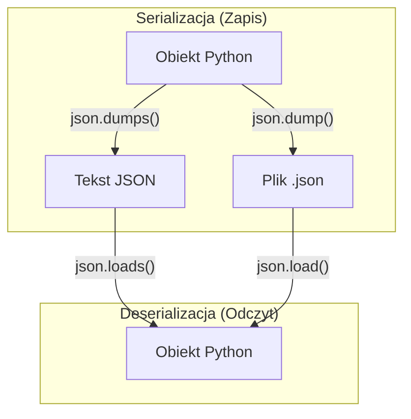
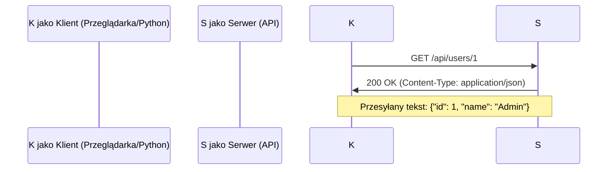

# Wykład 12: Format JSON

## 1. Co to jest JSON?

JSON (JavaScript Object Notation) to lekki format wymiany danych, niezależny od języka programowania. Stał się standardem w komunikacji między systemami (API) ze względu na swoją prostotę i czytelność.

### Zasady składni JSON:

- Dane są w parach **nazwa/wartość**.
- Nazwy (klucze) muszą być w **podwójnym cudzysłowie**.
- Dane są oddzielone **przecinkami**.
- Nawiasy klamrowe `{}` trzymają **obiekty**.
- Nawiasy kwadratowe `[]` trzymają **tablice**.

### Typy danych w JSON:

| Typ         | Opis                                    | Przykład         |
| :---------- | :-------------------------------------- | :--------------- |
| **String**  | Tekst w podwójnym cudzysłowie           | `"Jan Kowalski"` |
| **Number**  | Liczba całkowita lub zmiennoprzecinkowa | `42`, `3.14`     |
| **Object**  | Zbiór par klucz-wartość                 | `{"id": 1}`      |
| **Array**   | Uporządkowana lista wartości            | `[1, 2, 3]`      |
| **Boolean** | Wartość logiczna                        | `true`, `false`  |
| **Null**    | Pusta wartość                           | `null`           |

______________________________________________________________________

## 2. JSON vs XML

Dawniej standardem był XML, jednak JSON go wyparł w większości zastosowań webowych.

| Cecha          | JSON                          | XML                      |
| :------------- | :---------------------------- | :----------------------- |
| **Czytelność** | Wysoka (mniej "szumu")        | Średnia (dużo tagów)     |
| **Rozmiar**    | Mały                          | Większy                  |
| **Parsowanie** | Bardzo szybkie (natywne w JS) | Wolniejsze               |
| **Tablice**    | Obsługuje natywnie            | Wymaga powtarzania tagów |

______________________________________________________________________

## 3. Obsługa JSON w Pythonie

Python posiada wbudowany moduł `json`, który pozwala na łatwą konwersję między formatem JSON a słownikami/listami Pythona.

### Przepływ danych w Pythonie:



```python
import json

# Dane w formacie słownika Pythona
dane = {
    "imie": "Marek",
    "osiagniecia": [10, 25, 40],
    "premium": False,
    "adres": {"miasto": "Warszawa", "kod": "00-001"},
}

# 1. Serializacja: Słownik -> Tekst JSON
json_string = json.dumps(dane, indent=4, ensure_ascii=False)
print(json_string)

# 2. Deserializacja: Tekst JSON -> Słownik
slownik = json.loads(json_string)
print(slownik["adres"]["miasto"])  # Warszawa
```

______________________________________________________________________

## 4. Obsługa JSON w JavaScript

W JavaScript JSON jest formatem natywnym, co czyni go idealnym do pracy w przeglądarce.

### Kluczowe metody:

1. **`JSON.parse(text)`** – zamienia tekst JSON na obiekt JavaScript.
1. **`JSON.stringify(object)`** – zamienia obiekt JavaScript na tekst JSON.

```javascript
// 1. Tekst JSON
const jsonText = '{"name": "Alice", "age": 25, "city": "London"}';

// 2. Parsowanie do obiektu
const user = JSON.parse(jsonText);
console.log(user.name); // Alice

// 3. Obiekt do tekstu (z formatowaniem)
const backToJson = JSON.stringify(user, null, 2);
console.log(backToJson);
```

______________________________________________________________________

## 5. Praca z plikami JSON (Python)

Możemy zapisywać i odczytywać dane JSON bezpośrednio z plików za pomocą funkcji `dump` i `load`.

```python
# Zapis do pliku
with open("config.json", "w", encoding="utf-8") as f:
    json.dump(dane, f, indent=4)

# Odczyt z pliku
with open("config.json", "r", encoding="utf-8") as f:
    wczytane_dane = json.load(f)
```

### Trik: szybkie formatowanie JSON w terminalu

Jeśli masz surowy (nieczytelny) JSON w pliku:

```bash
# Wyświetlenie ładnie sformatowanego JSONa w terminalu
python -m json.tool config.json

# Zapisanie sformatowanego JSONa do nowego pliku
python -m json.tool config.json > config_pretty.json
```

______________________________________________________________________

## 6. JSON a REST API

Większość nowoczesnych usług internetowych komunikuje się za pomocą JSON.



```python
# Przykład użycia biblioteki requests
import requests

response = requests.get("https://api.github.com/users/python")
if response.status_code == 200:
    data = response.json()  # Automatyczna deserializacja
    print(f"Nazwa: {data['name']}")
    print(f"Liczba publicznych repo: {data['public_repos']}")
```
