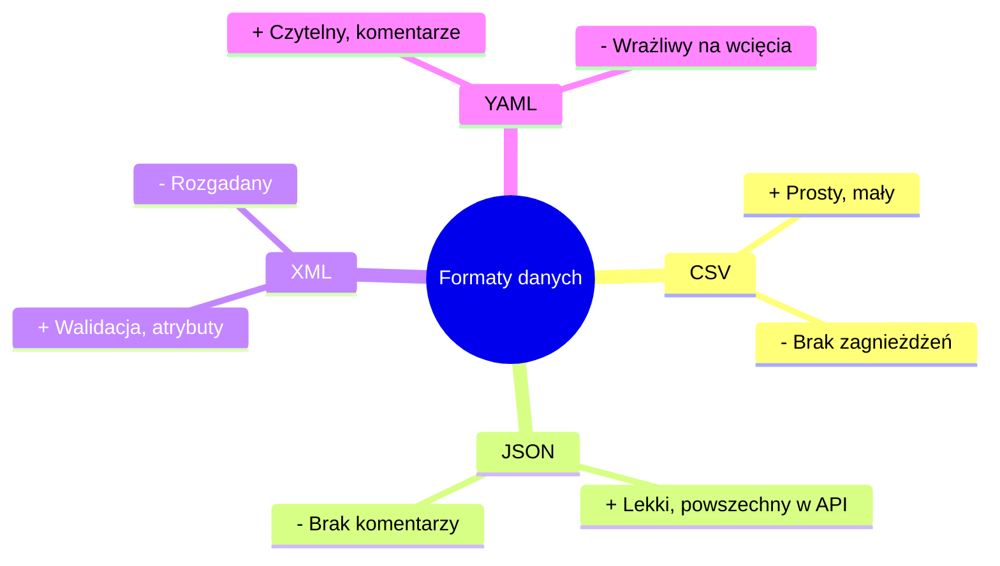

# Wykład 13: Formaty XML, CSV i YAML

## 1. CSV (Comma Separated Values)
Format tekstowy służący do przechowywania danych tabelarycznych. Każdy wiersz to rekord, a kolumny oddzielone są separatorem (przecinek, średnik, tabulator).

### Obsługa CSV w Pythonie:
Moduł `csv` pozwala na łatwe czytanie i zapisywanie plików tabelarycznych.

```python
import csv

# Odczyt pliku CSV jako słowniki
with open('dane.csv', mode='r', encoding='utf-8') as f:
    reader = csv.DictReader(f)
    for row in reader:
        print(f"{row['Imię']} {row['Nazwisko']}")

# Zapis do pliku CSV
with open('nowe_dane.csv', mode='w', newline='') as f:
    writer = csv.writer(f)
    writer.writerow(['ID', 'Produkt', 'Cena'])
    writer.writerow([1, 'Kawa', 15.50])
```

### Trik: szybka transformacja CSV -> słowniki z użyciem dict comprehension
```python
with open('produkty.csv', newline='') as f:
    reader = csv.DictReader(f)
    ceny = {row['nazwa']: float(row['cena']) for row in reader}
```

## 2. XML (eXtensible Markup Language)
XML jest bardziej rygorystyczny niż HTML. Każdy tag musi być zamknięty, a dokument musi mieć jeden element główny (root).

### Praca z XML w Pythonie (`xml.etree.ElementTree`):
```python
import xml.etree.ElementTree as ET

tree = ET.parse('pracownicy.xml')
root = tree.getroot()

for pracownik in root.findall('pracownik'):
    imie = pracownik.find('imie').text
    print(imie)
```

## 3. YAML (YAML Ain't Markup Language)
YAML jest obecnie najpopularniejszym formatem plików konfiguracyjnych ze względu na minimalizm. Brak nawiasów i cudzysłowów sprawia, że jest bardzo czytelny.

### Kluczowe cechy YAML:
- **Wcięcia:** Definiują strukturę (podobnie jak w Pythonie).
- **Listy:** Oznaczane myślnikiem `-`.
- **Komentarze:** Zaczynają się od `#`.

```yaml
# Przykład konfiguracji aplikacji
app:
  name: MyWebApp
  version: 1.0.2
  features:
    - login
    - registration
    - payments
```

## 4. Porównanie i wybór formatu


| Format | Zalety | Wady |
|--------|--------|------|
| **CSV** | Mały rozmiar, obsługa w Excelu | Brak wsparcia dla danych zagnieżdżonych |
| **XML** | Bardzo precyzyjny, walidacja (XSD) | Rozgadany (duży rozmiar pliku) |
| **JSON** | Standard w Internecie, lekkość | Brak komentarzy (oficjalnie) |
| **YAML** | Najbardziej czytelny, komentarze | Wrażliwy na błędy wcięć |
