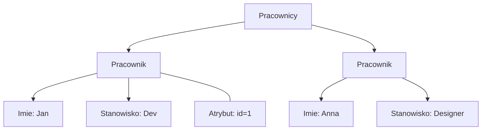
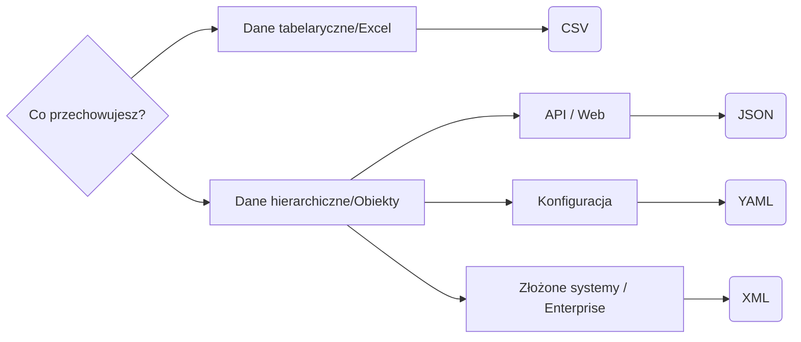

# Wykład 13: Formaty XML, CSV, YAML i JSON

Wykład omawia najpopularniejsze formaty wymiany danych i konfiguracji, ich strukturę oraz obsługę w języku Python.

## 1. CSV (Comma Separated Values)

Format tekstowy służący do przechowywania danych tabelarycznych. Każdy wiersz to rekord, a kolumny oddzielone są separatorem (przecinek, średnik, tabulator).

### Przykład pliku CSV (`produkty.csv`):

```csv
id,produkt,cena,dostepnosc
1,Kawa,15.50,true
2,Herbata,12.00,false
3,Cukier,4.50,true
```

### Obsługa CSV w Pythonie:

Moduł `csv` pozwala na łatwe czytanie i zapisywanie plików tabelarycznych.

```python
import csv

# Odczyt pliku CSV jako słowniki (klucze z nagłówka)
with open("produkty.csv", mode="r", encoding="utf-8") as f:
    reader = csv.DictReader(f)
    for row in reader:
        print(f"Produkt: {row['produkt']}, Cena: {row['cena']}")

# Zapis do pliku CSV (lista list)
with open("nowe_dane.csv", mode="w", newline="", encoding="utf-8") as f:
    writer = csv.writer(f)
    writer.writerow(["ID", "Produkt", "Cena"])
    writer.writerow([1, "Kawa", 15.50])
```

### Trik: szybka transformacja CSV -> słowniki z użyciem dict comprehension

```python
with open("produkty.csv", newline="", encoding="utf-8") as f:
    reader = csv.DictReader(f)
    # Tworzymy słownik, gdzie kluczem jest nazwa produktu, a wartością cena
    ceny = {row["produkt"]: float(row["cena"]) for row in reader}
```

## 2. JSON (JavaScript Object Notation)

Standard wymiany danych w Internecie (API). Jest lekki, czytelny dla ludzi i łatwy do parsowania przez maszyny.

### Struktura JSON:

- **Obiekty:** `{ "klucz": "wartosc" }`
- **Tablice:** `[1, 2, 3]`

```python
import json

# Konwersja słownika na string JSON
data = {"user": "admin", "active": True, "roles": ["staff", "editor"]}
json_string = json.dumps(data, indent=4)

# Zapis do pliku
with open("config.json", "w") as f:
    json.dump(data, f, indent=4)
```

## 3. XML (eXtensible Markup Language)

XML jest bardziej rygorystyczny niż HTML. Każdy tag musi być zamknięty, a dokument musi mieć dokładnie jeden element główny (root).

### Hierarchia XML (wizualizacja):


```mermaid
graph TD
    Root[Pracownicy] --> P1[Pracownik]
    Root --> P2[Pracownik]
    P1 --> N1[Imie: Jan]
    P1 --> S1[Stanowisko: Dev]
    P2 --> N2[Imie: Anna]
    P2 --> S2[Stanowisko: Designer]
    P1 --- A1[Atrybut: id=1]
```

### Przykład pliku XML (`pracownicy.xml`):

```xml
<?xml version="1.0" encoding="UTF-8"?>
<pracownicy>
    <pracownik id="1">
        <imie>Jan</imie>
        <stanowisko>Programista</stanowisko>
    </pracownik>
    <pracownik id="2">
        <imie>Anna</imie>
        <stanowisko>Manager</stanowisko>
    </pracownik>
</pracownicy>
```

### Praca z XML w Pythonie (`xml.etree.ElementTree`):

```python
import xml.etree.ElementTree as ET

tree = ET.parse("pracownicy.xml")
root = tree.getroot()

# Iteracja po elementach
for pracownik in root.findall("pracownik"):
    id_pracownika = pracownik.get("id")  # pobranie atrybutu
    imie = pracownik.find("imie").text
    print(f"ID: {id_pracownika}, Imię: {imie}")
```

## 4. YAML (YAML Ain't Markup Language)

YAML jest obecnie najpopularniejszym formatem plików konfiguracyjnych (Docker, Kubernetes, GitHub Actions).

### Kluczowe cechy YAML:

- **Wcięcia:** Definiują strukturę (obowiązkowe spacje, nie tabulatory).
- **Listy:** Oznaczane myślnikiem `-`.
- **Typy danych:** Automatyczne rozpoznawanie (liczby, booleany).

```yaml
# Przykład złożonej konfiguracji
server:
  host: 127.0.0.1
  port: 8080
  debug: yes
databases:
  - name: main_db
    engine: postgresql
  - name: cache
    engine: redis
```

### Obsługa w Pythonie (biblioteka `PyYAML`):

```python
import yaml

# Odczyt pliku YAML
with open("config.yaml", "r") as f:
    config = yaml.safe_load(f)

print(config["server"]["port"])
```

## 5. Porównanie i wybór formatu

### Drzewo decyzyjne wyboru formatu:


```mermaid
graph LR
    Start{Co przechowujesz?}
    Start --> Tab[Dane tabelaryczne/Excel]
    Tab --> CSV(CSV)
    Start --> Hier[Dane hierarchiczne/Obiekty]
    Hier --> Web[API / Web]
    Web --> JSON(JSON)
    Hier --> Conf[Konfiguracja]
    Conf --> YAML(YAML)
    Hier --> Legacy[Złożone systemy / Enterprise]
    Legacy --> XML(XML)
```

### Zestawienie bibliotek Pythona:

| Format   | Biblioteka standardowa  | Biblioteki zewnętrzne | Zastosowanie                  |
| :------- | :---------------------- | :-------------------- | :---------------------------- |
| **CSV**  | `csv`                   | `pandas`              | Dane statystyczne, arkusze    |
| **JSON** | `json`                  | `ujson`, `orjson`     | Komunikacja klient-serwer     |
| **XML**  | `xml.etree.ElementTree` | `lxml`                | Standardy branżowe, dokumenty |
| **YAML** | Brak                    | `PyYAML`              | Pliki konfiguracyjne          |

### Szczegółowe porównanie cech:

| Cecha                    | CSV       | JSON             | XML                 | YAML                  |
| :----------------------- | :-------- | :--------------- | :------------------ | :-------------------- |
| **Czytelność dla ludzi** | Średnia   | Wysoka           | Niska               | Bardzo wysoka         |
| **Obsługa zagnieżdżeń**  | Nie       | Tak              | Tak                 | Tak                   |
| **Komentarze**           | Nie       | Nie (oficjalnie) | Tak                 | Tak                   |
| **Rozmiar danych**       | Minimalny | Mały             | Duży                | Średni                |
| **Bezpieczeństwo**       | Wysokie   | Wysokie          | Średnie (ataki XXE) | Średnie (unsafe load) |
