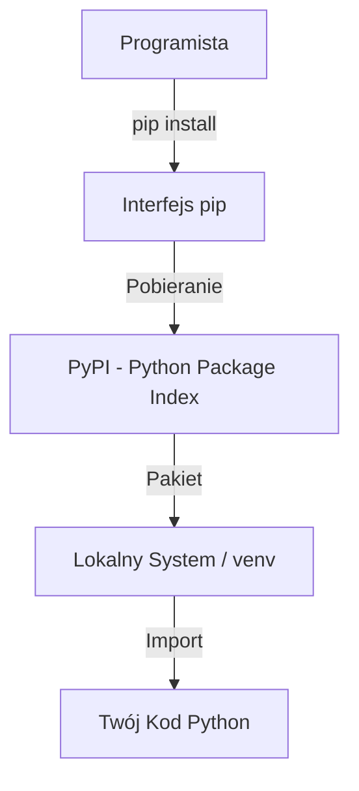
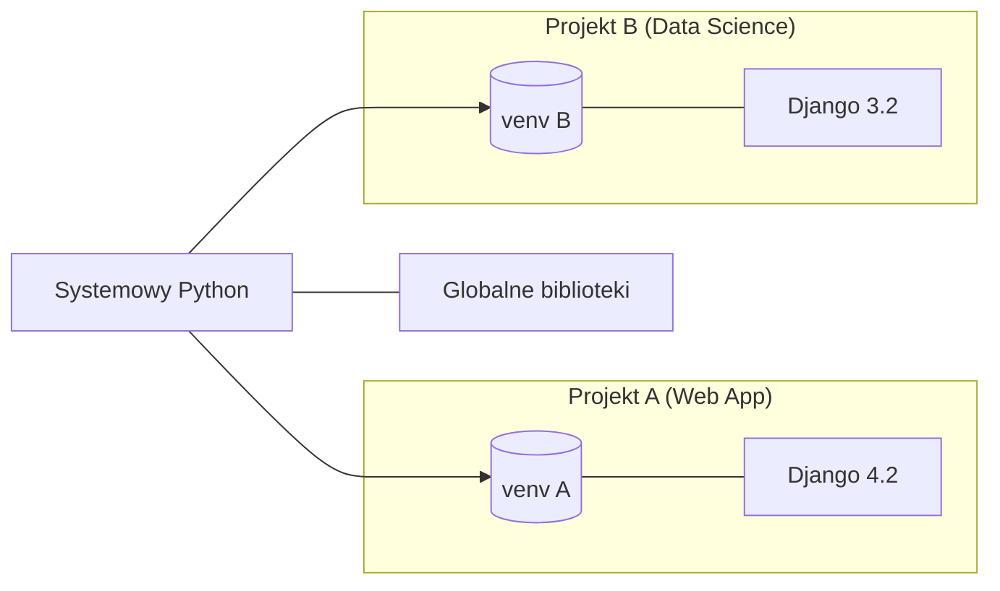
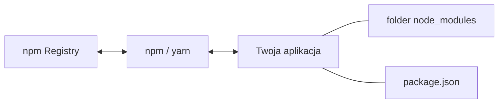

# Wykład 14: Zarządzanie pakietami i biblioteki zewnętrzne (Python & JavaScript)

## 1. Ekosystem Pythona: pip i venv

### 1.1. Co to jest pip?

`pip` (Package Installer for Python) to standardowy system zarządzania pakietami dla Pythona. Pozwala on na instalowanie i zarządzanie dodatkowymi bibliotekami, które nie są częścią biblioteki standardowej.



### Podstawowe komendy:

| Komenda     | Opis                            | Przykład                 |
| :---------- | :------------------------------ | :----------------------- |
| `install`   | Instaluje pakiet                | `pip install requests`   |
| `uninstall` | Usuwa pakiet                    | `pip uninstall requests` |
| `list`      | Wyświetla zainstalowane pakiety | `pip list`               |
| `show`      | Szczegóły o pakiecie            | `pip show pandas`        |
| `freeze`    | Eksportuje listę z wersjami     | `pip freeze > reqs.txt`  |

### 1.2. Plik `requirements.txt`

W profesjonalnych projektach listę wszystkich zależności zapisuje się w pliku `requirements.txt`. Dzięki temu inni programiści mogą zainstalować wszystkie potrzebne biblioteki jedną komendą.

**Przykład pliku `requirements.txt`:**

```text
requests==2.31.0
pandas>=2.0.0
numpy<=1.24.3
```

### 1.3. Środowiska wirtualne (`venv`)

Środowisko wirtualne pozwala na odizolowanie zależności różnych projektów. Zapobiega to konfliktom wersji.



**Cykl pracy z `venv`:**

1. **Tworzenie:** `python -m venv .venv`
1. **Aktywacja (Linux/macOS):** `source .venv/bin/activate`
1. **Aktywacja (Windows):** `.venv\Scripts\activate`
1. **Instalacja:** `pip install -r requirements.txt`
1. **Deaktywacja:** `deactivate`

### 1.4. Popularne biblioteki Pythona

| Biblioteka   | Kategoria  | Opis                                       |
| :----------- | :--------- | :----------------------------------------- |
| **requests** | HTTP       | Proste zapytania do API i stron WWW.       |
| **pandas**   | Dane       | Tabele danych (DataFrames) i ich analiza.  |
| **numpy**    | Matematyka | Macierze i zaawansowane operacje liczbowe. |
| **flask**    | Web        | Mikroframework do tworzenia stron i API.   |
| **pytest**   | Testy      | Automatyzacja testowania kodu.             |

______________________________________________________________________

## 2. Ekosystem JavaScript: npm i yarn

### 2.1. Menadżery pakietów (npm, yarn, pnpm)

W świecie JavaScript (Node.js) standardem jest **npm** (Node Package Manager). Istnieją również alternatywy jak **yarn** czy **pnpm**, które często oferują lepszą wydajność.



### 2.2. Plik `package.json`

To serce każdego projektu JS. Zawiera metadane (nazwa, wersja) oraz listę zależności podzieloną na:

- **dependencies**: Potrzebne do działania aplikacji (np. React, Express).
- **devDependencies**: Potrzebne tylko podczas programowania (np. testery, kompilatory).

**Przykład `package.json`:**

```json
{
  "name": "moj-projekt",
  "version": "1.0.0",
  "scripts": {
    "start": "node index.js",
    "test": "jest"
  },
  "dependencies": {
    "axios": "^1.4.0",
    "lodash": "^4.17.21"
  },
  "devDependencies": {
    "jest": "^29.5.0"
  }
}
```

### 2.3. Porównanie komend (npm vs pip)

| Akcja                | Python (pip)             | JavaScript (npm)                |
| :------------------- | :----------------------- | :------------------------------ |
| Inicjalizacja        | (brak standardu)         | `npm init`                      |
| Instalacja           | `pip install X`          | `npm install X`                 |
| Zapis zależności     | `pip freeze > req.txt`   | `npm install X` (automatycznie) |
| Instalacja z pliku   | `pip install -r req.txt` | `npm install`                   |
| Uruchomienie skryptu | `python main.py`         | `npm run start`                 |

### 2.4. Folder `node_modules`

W przeciwieństwie do Pythona, gdzie biblioteki są zazwyczaj w folderze środowiska wirtualnego, JavaScript domyślnie przechowuje je w folderze `node_modules` bezpośrednio w projekcie.
**Uwaga:** Nigdy nie przesyłaj `node_modules` do systemów kontroli wersji (np. Git)!

### 2.5. Popularne biblioteki JavaScript

| Biblioteka       | Opis                                                 |
| :--------------- | :--------------------------------------------------- |
| **Axios**        | Odpowiednik `requests` - zapytania HTTP.             |
| **Express**      | Najpopularniejszy framework webowy dla Node.js.      |
| **Lodash**       | Zbiór narzędzi do operacji na tablicach i obiektach. |
| **React / Vue**  | Biblioteki do budowy interfejsów użytkownika.        |
| **Jest / Mocha** | Frameworki do testowania.                            |

______________________________________________________________________

## 3. Przykłady praktyczne

### Python: Zapytanie do API (requests)

```python
import requests

try:
    # Pobranie danych o użytkowniku
    response = requests.get("https://jsonplaceholder.typicode.com/users/1")
    data = response.json()
    print(f"Użytkownik: {data['name']}, Email: {data['email']}")
except Exception as e:
    print(f"Błąd sieci: {e}")
```

### JavaScript: Zapytanie do API (Axios)

```javascript
const axios = require('axios');

axios.get('https://jsonplaceholder.typicode.com/users/1')
  .then(response => {
    console.log(`Użytkownik: ${response.data.name}, Email: ${response.data.email}`);
  })
  .catch(error => {
    console.error('Błąd:', error.message);
  });
```

## 4. Dobre praktyki

1. **Pliki `.gitignore`**: Zawsze ignoruj foldery `.venv`, `node_modules` oraz pliki `.env`.
1. **Pliki Lock**: Korzystaj z `package-lock.json` (JS) lub `requirements.txt` generowanych przez `pip freeze`, aby zapewnić, że każdy w zespole ma te same wersje bibliotek.
1. **Zasada minimalizmu**: Instaluj tylko te biblioteki, których naprawdę potrzebujesz.
